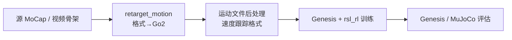

# Go2 Motion Imitation

**Go2 Motion Imitation**（<https://github.com/TSUITUENYUE/motion-imitation>）是针对 **Unitree Go2** 的 **运动模仿** 开源项目：在 **[Genesis](./genesis-world-10.md)** 仿真器中，把动物/论文 MoCap 经 **`retarget_motion`** 转为 Go2 格式，再以 **关节速度匹配** 奖励训练 RL 策略，支持周期性步态的高质量跟踪。

## 英文缩写速查

| 缩写 | 英文全称 | 简要说明 |
|------|----------|----------|
| MoCap | Motion Capture | 源运动数据 |
| RL | Reinforcement Learning | rsl_rl PPO 训练 |
| PD | Proportional–Derivative | 底层关节控制 |
| Retargeting | Motion Retargeting | PyBullet/文本格式→Go2 状态 |

## 为什么重要

- **Go2 专用重定向脚本**：`retarget_motion/retarget_motion.py` 明确承担「源格式 → Go2 机器人状态」映射，是四足机型定制管线的可复现样本。
- **Genesis 生态补充**：与 Isaac Gym + legged_gym 主流不同，展示新仿真器上的模仿学习闭环。

## 管线阶段



重定向命令：

```bash
python retarget_motion/retarget_motion.py --input_file=source_motion.txt --output_file=retargeted_motion.txt
```

## 关联页面

- [Motion Retargeting](../concepts/motion-retargeting.md)
- [legged_gym](./legged-gym.md)
- [Genesis World 1.0](./genesis-world-10.md)
- [Locomotion](../tasks/locomotion.md)

## 参考来源

- [Go2 Motion Imitation 仓库归档](../../sources/repos/go2_motion_imitation.md)

## 推荐继续阅读

- GitHub：<https://github.com/TSUITUENYUE/motion-imitation>
