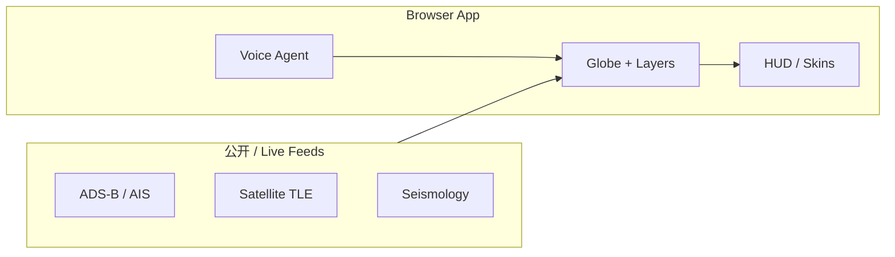

# God's Eye View

**God's Eye View**（[bilawalsidhu/gods-eye-view](https://github.com/bilawalsidhu/gods-eye-view)，入口 [maptheworld.ai](https://maptheworld.ai/)）是把 **公开空间信号** 叠在 **photorealistic 3D 地球** 上的开源 Web 应用：航班、船舶、卫星、地震、天气、摄像头等 layer 可组合；用户可 **click-to-track**、切换 FLIR/NVG 等传感器皮肤，并用 **实时语音 Agent** 做计数、过滤、标注与白板路线。

## 一句话定义

在 **可审查的前端代码** 里，把 **真实或公开 feed** 变成 **可交互、可分享 URL 的 3D 空间态势台**，并内置 **voice-first 分析 Agent**。

## 英文缩写速查

| 缩写 | 英文全称 | 简要说明 |
|------|----------|----------|
| ADS-B | Automatic Dependent Surveillance–Broadcast | 航空器广播位置，常见航班层数据源 |
| AIS | Automatic Identification System | 船舶识别广播，海事跟踪常用 |
| GLSL | OpenGL Shading Language | 传感器皮肤（FLIR、NVG 等）shader 语言 |
| HUD | Heads-Up Display | 军事/战术风格抬头显示 overlay |
| API | Application Programming Interface | 可选第三方天气/搜索等密钥配置 |

## 核心信息

| 字段 | 内容 |
|------|------|
| 开源状态 | **已开源** — GitHub 全栈；见 [sources 核查](../../sources/repos/gods-eye-view.md) |
| Stars（2026-10-01） | ~45.7k（Trendshift 叙事约 +33.3k/月） |
| 起步方式 | Pinokio 或本地终端；**可无 key 启动** |

## 为什么重要（对本知识库读者）

- **空间 + Agent 交叉：** 机器人/具身研究常要 **轨迹、传感器 overlay、态势理解**；本项目是 **消费级 UX + 模块化 layer** 的参考实现，不是 GIS 论文复现，但适合对照 **voice agent 如何绑定 3D 状态**。
- **与 Archify / HyperFrames 分工：** [Archify](archify.md) 产出 **校验 JSON→静态 HTML 系统图**；[HyperFrames](hyperframes.md) 产出 **HTML→MP4 视频**；God's Eye View 是 **长时间运行、多源 live 的 3D 前端**，三者可组合做 demo（Archify 讲架构，GEV 演示空间层，HyperFrames 导出讲解片）。
- **外网数据通道：** 扩展 layer 时可与 [Agent Reach](agent-reach.md) 等 **读搜工具** 互补（本项目本身已集成多 feed 模块）。

## 核心结构

| 层次 | 内容 |
|------|------|
| **Globe 渲染** | 3D 地球 + 相机导演（Cockpit、Scene Director、Share URL） |
| **Data layers** | 独立 module：航空、海事、卫星、地震、天气、摄像头等 |
| **Presentation** | GLSL 皮肤、检测框、军事 HUD、Global Context |
| **Voice Agent** | 实时语音：查询、计数、标注、卫星过境等 |
| **运维** | GitHub Actions CI；README 数据免责声明 |

## 局限与风险

- 部分轨迹/姿态为 **估计值**；traffic 为 aggregate 上的 **模拟**；README 要求读者读 `DATA_SOURCES.md`。
- 公开摄像头与 ALPR **仅位置/标签**，涉隐私与合规需自行判断。
- 语音与部分 feed 依赖 **可选 API key** 与网络可用性。

## 关联页面

- [Archify](archify.md) — 描述驱动的可校验架构 HTML
- [HyperFrames](hyperframes.md) — Agent 向 HTML→视频
- [Agent Reach](agent-reach.md) — 外网读搜脚手架
- [Hermes Agent](hermes-agent.md) — 常驻 Agent 运行时对照

## 参考来源

- [God's Eye View 仓库归档](../../sources/repos/gods-eye-view.md)
- [maptheworld.ai 站点归档](../../sources/sites/gods-eye-view-maptheworld.md)
- [bilawalsidhu/gods-eye-view（GitHub）](https://github.com/bilawalsidhu/gods-eye-view)

## 推荐继续阅读

- 上游 [Quick Start](https://github.com/bilawalsidhu/gods-eye-view#-quick-start) 与 [DATA_SOURCES.md](https://github.com/bilawalsidhu/gods-eye-view/blob/main/DATA_SOURCES.md)
- [Archify 实体页](archify.md) — 系统图工件对照
