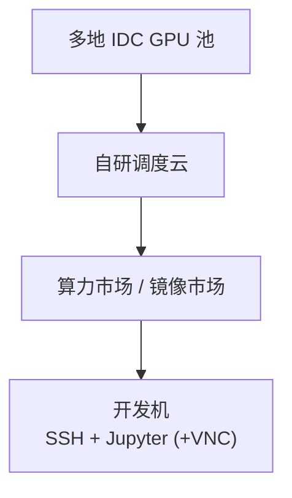

# 算力自由（GPUFree）

**算力自由**（[gpufree.cn](https://www.gpufree.cn/)，北京算力自由科技有限公司）是国内 **GPU 算力调度云**：整合多地 IDC 资源，用容器把物理 GPU 切成可租用的远程开发机，支持 **按需（运行中按秒计费）** 与 **包时长预付费**。

## 一句话定义

从算力市场或镜像市场创建带 SSH/Jupyter 的 Linux 开发机，按显存需求选 **L40/L40S、4090** 等卡型；官方文档对 **具身机器人仿真** 给出显式约束——须选带 **RT 核心** 的 GPU 与 **Vulkan 桌面镜像**，否则图形仿真无法实时渲染。

## 英文缩写速查

| 缩写 | 英文全称 | 简要说明 |
|------|----------|----------|
| GPU | Graphics Processing Unit | 平台调度与计费的核心资源 |
| RT | Ray Tracing | NVIDIA 光线追踪核心；图形仿真/Omniverse 显示依赖 |
| Vulkan | Vulkan Graphics API | 桌面镜像用于 GPU 图形栈远程显示 |
| SSH | Secure Shell | 远程登录、scp、VSCode 远程开发 |
| IDC | Internet Data Center | 平台整合的机房与运营商资源 |
| RL | Reinforcement Learning | 高算力租用的主要训练场景 |
| VNC | Virtual Network Computing | noVNC 浏览器远程桌面方案 |
| CUDA | Compute Unified Device Architecture | 基础镜像 tag 常按 CUDA 版本区分 |

## 为什么重要

- **仿真友好提示少见但关键**：文档写明 **A100/H100 等无 RT 核心** 不适合具身仿真显示——与 [Isaac Sim / Isaac Lab](./isaac-lab.md) 工程现实一致，避免「租到算力最强却开不了 GUI」的踩坑。
- **48GB 级企业卡**：主推 **L40 / L40S-48G**，适合大 batch 并行环境、VLA 微调等 **显存瓶颈**实验。
- **镜像市场双入口**：既可从卡型出发，也可从 **机器人仿真 / ComfyUI** 等成品镜像一键创建，降低环境拼装时间。

## 核心结构 / 机制

### 平台架构（简化）

### 实例与计费

| 维度 | 要点 |
|------|------|
| **计算计费** | **仅运行中**；按需为后付费，包时长为预占 |
| **存储计费** | 系统盘/数据盘/公共存储扩展按天计费；**关机仍收** |
| **释放策略** | 按需关机 **15 天**、包月到期 **15 天**后自动释放数据 |
| **资源配比** | 每 GPU 绑定固定 CPU/内存（随卡数倍增） |

### 存储路径

| 路径 | 说明 |
|------|------|
| `/` | 系统盘 30GB（镜像变更计入） |
| `/root/gpufree-data` | 数据盘 100GB 起 |
| `/root/gpufree-data/share` | 跨机公共存储（内网，较慢） |

### 机器人 / 仿真选型（官方指引）

1. **显存**：并行仿真环境数、相机分辨率、策略网络规模决定最低显存；48GB L40 系列适合「-env 数拉满」实验。
2. **GPU 架构**：图形仿真须 **RT 核心**；勿把纯计算卡当仿真工作站。
3. **镜像**：基础镜像按 **CUDA 版本**选 `开发` tag；仿真 GUI 搜 **noVNC-vulkan** 等桌面镜像。
4. **数据盘**：默认免费 50GB（快速开始文档）；大资产（USD、数据集）提前扩容。

## 常见误区或局限

- **关机不等于停止一切费用**：存储持续计费；不用须 **释放实例**。
- **公共存储性能**：跨机共享适合代码与中小文件，不适合高频 checkpoint IO。
- **平台较新**：生态与社区镜像数量可能少于老牌平台；需自行验证 Isaac/Omniverse 版本组合。
- **「算力算法交易市场」**：官网愿景包含模型/算法交易，当前主线仍是 **租卡开发**。

## 与其他页面的关系

- [AutoDL](./autodl.md) — 同类国内 GPU 云；社区文档与镜像生态更成熟
- [国内 GPU 云平台选型](../comparisons/china-gpu-cloud-platforms.md) — 六平台并列对比
- [Isaac Lab](./isaac-lab.md) — 常见高算力 + 图形仿真栈
- [Isaac Gym / Isaac Lab 总览](./isaac-gym-isaac-lab.md) — GPU 并行仿真背景
- [仿真选型指南](../queries/simulator-selection-guide.md) — 框架与算力协同决策

## 推荐继续阅读

- [算力自由快速开始](https://www.gpufree.cn/docs/guide/quick_start.html)
- [开发机实例说明](https://www.gpufree.cn/docs/guide/instance/)
- [计费规则](https://www.gpufree.cn/docs/guide/finance/billing_policy.html)

## 参考来源

- [算力自由官方文档](../../sources/sites/gpufree.md)
