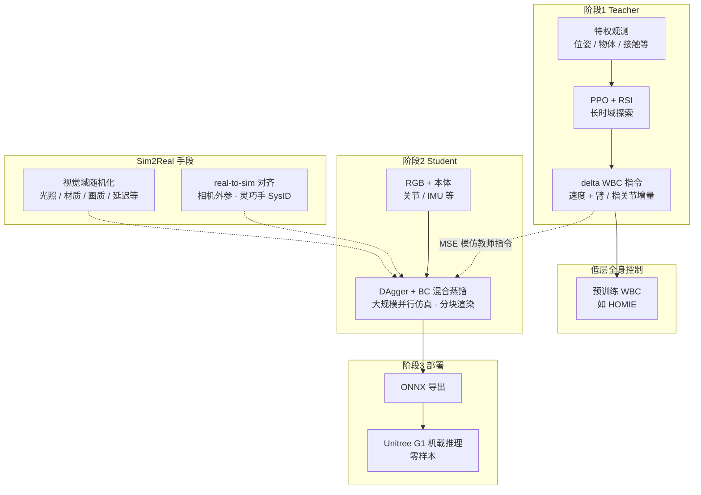

# GR00T-VisualSim2Real (NVIDIA 视觉 Sim2Real 框架)

**GR00T-VisualSim2Real** 是 NVIDIA NVlabs 发布的开源框架，囊括两项 CVPR 2026 研究：**VIRAL**（人形 Loco-Manipulation 的规模化视觉 Sim2Real）和 **DoorMan**（像素到动作的策略迁移）。核心方法是 **PPO Teacher（特权状态）→ DAgger Student（RGB 蒸馏）** 的两阶段 pipeline，最终以 ONNX 格式部署到 Unitree G1 真机。

## 为什么重要

视觉 Sim2Real 长期面临三重矛盾：

1. **样本效率**：直接用 RGB 做 RL 的样本效率极低，但真机不能无限试错
2. **视觉 domain gap**：仿真渲染与真实相机图像存在外观差异
3. **接触任务复杂性**：loco-manipulation 需同时控制平衡、抓取和力交互

GR00T-VisualSim2Real 用 **Teacher-Student 蒸馏** 解耦了这两个问题：Teacher 在仿真中用特权状态高效学习任务策略，Student 只需从 RGB 模仿 Teacher 的行为，避免了从像素直接训练 RL 的困难。

## 流程总览

下列流程图概括仓库默认管线（**VIRAL** 主路径）；**DoorMan** 在学生之后可再接 **GRPO** 微调，见下文专节。



## 两个研究项目

### VIRAL — Visual Sim-to-Real at Scale for Humanoid Loco-Manipulation

- **论文**：arXiv:2511.15200，CVPR 2026
- **独立知识节点**：[VIRAL（论文实体）](./paper-viral-humanoid-visual-sim2real.md) — 方法栈、算力 scaling 与消融归纳
- **目标**：人形机器人规模化 loco-manipulation 的视觉 Sim2Real
- **特点**：Isaac Lab 并行仿真，大规模采样，DAgger 蒸馏后零样本迁移

### DoorMan — Pixel-to-Action Policy Transfer for Door Opening

- **独立知识节点**：[DoorMan（论文实体）](./paper-doorman-opening-sim2real-door.md) — 分阶段重置、GRPO 自举与门随机化消融
- **论文**：arXiv:2512.01061，CVPR 2026
- **目标**：像素到动作（Pixel-to-Action）策略迁移，专注重型门开门
- **难点**：接触丰富（需要对抗门铰链阻力），仅靠 RGB 隐式推断接触力

## 核心方法：Teacher-Student Distillation（文字展开）

```
阶段 1：Teacher 训练（Isaac Sim + PPO）
  观测：特权状态（完整位姿、物体状态、接触力）
  算法：PPO
  产出：高性能状态策略 π_teacher

阶段 2：Student 蒸馏（DAgger）
  观测：RGB 相机 + 本体感知（关节角、IMU）
  目标：从 RGB 模仿 π_teacher 的动作分布
  产出：视觉策略 π_student（可零样本部署）

阶段 3：真机部署（Unitree G1）
  导出：ONNX 自动导出（eval 时触发）
  运行：实时 RGB + 本体感知 → 关节指令
```

与上图对应：上图强调 **数据与控制流边界**；本段保留 **分阶段文字说明** 便于检索。

### 为什么用 DAgger 而不是 BC？

DAgger（Dataset Aggregation）在学生执行过程中持续查询教师策略，避免了纯 BC 中的 **covariate shift** 问题——学生进入从未见过的状态时不会崩溃。

### DoorMan 的第三阶段：GRPO 微调

DoorMan 在 DAgger Student 之后额外增加了 **GRPO（Group Relative Policy Optimization）** 微调阶段，以二值成功信号在线强化，解决 RGB-only 下接触力隐式推断的偏差。

### Reference State Initialization (RSI)

Teacher 训练时使用 RSI：环境 reset 从 demo buffer 中随机采样中间状态，而不是固定从初始状态开始。RSI 让策略能直接从难状态探索，加速长时序任务的收敛。

## 技术栈

| 组件 | 选型 |
|------|------|
| 仿真 | Isaac Sim 5.1 + Isaac Lab |
| RL 框架 | TRL（HuggingFace） + Hydra |
| Teacher 算法 | PPO（特权状态观测） |
| Student 算法 | DAgger 蒸馏（RGB 观测） |
| 实验追踪 | Weights & Biases |
| 域随机化 | Isaac Lab 配置化 DR |
| 部署格式 | ONNX |
| 目标机器人 | Unitree G1（43-DOF） |

## 与同类框架对比

| 框架 | 视觉输入 | 方法 | 任务类型 | 部署机器人 |
|------|---------|------|---------|-----------|
| **GR00T-VisualSim2Real** | RGB 相机 | PPO + DAgger 蒸馏 | Loco-manipulation | Unitree G1 |
| [wbc_fsm](./wbc-fsm.md) | 无（本体感知） | WBC + FSM | Locomotion | Unitree G1 |
| [unitree_rl_mjlab](./unitree-rl-mjlab.md) | 无（本体感知） | PPO / AMP | Locomotion | Unitree 系列 |
| [GS-Playground](./gs-playground.md) | 3DGS 光真实感 | 视觉 RL | 操作 + 行走 | Go1/G1/Franka |

**核心差异**：GR00T-VisualSim2Real 是目前在 Unitree G1 上做 **真实 RGB 视觉 loco-manipulation** 的最完整 NVIDIA 官方框架，而 wbc_fsm / unitree_rl_mjlab 侧重状态空间 locomotion。

## 实测结果

| 项目 | 结果 |
|------|------|
| VIRAL 真机成功率 | **91.5%**（59 次连续真机试验，54/59） |
| DoorMan | 零样本泛化到多种真实门型；任务完成时间优于人类遥操作 **31.7%** |

## 工程要点

- **ONNX 导出**：在 `eval_agent_trl.py` 中使用 `--num_envs 1` 时自动触发导出，便于真机集成
- **域随机化**：通过 Isaac Lab 的 Hydra YAML 配置，可方便地调整 DR 参数（光照、纹理、动力学参数）
- **并行训练**：Isaac Lab 并行环境，大规模采样提升 Teacher 的策略质量
- **模块化配置**：Hydra 支持命令行覆盖，方便调整任务、DR 强度和超参

## 关联页面

- [Sim2Real](../concepts/sim2real.md) — 本框架是视觉 Sim2Real 的典型落地案例
- [Privileged Training](../concepts/privileged-training.md) — Teacher 阶段用的核心机制
- [Domain Randomization](../concepts/domain-randomization.md) — 视觉 domain gap 的主要应对手段
- [Unitree G1](./unitree-g1.md) — 目标部署平台
- [Isaac Gym / Isaac Lab](./isaac-gym-isaac-lab.md) — 训练仿真平台
- [GS-Playground](./gs-playground.md) — 另一种缩小视觉 domain gap 的方案（3DGS Real2Sim）
- [Imitation Learning](../methods/imitation-learning.md) — DAgger 是 IL 核心算法之一
- [Loco-Manipulation](../tasks/loco-manipulation.md) — 本框架的主要任务方向
- [Tairan He](./tairan-he.md) — VIRAL / DoorMan 等工作的作者侧论文与项目索引
- [DoorMan 论文实体](./paper-doorman-opening-sim2real-door.md) — arXiv:2512.01061 方法栈专页
- [VIRAL 论文实体](./paper-viral-humanoid-visual-sim2real.md) — arXiv:2511.15200 方法栈专页

## 参考来源

- [sources/repos/gr00t_visual_sim2real.md](../../sources/repos/gr00t_visual_sim2real.md) — 原始资料归档
- [sources/papers/doorman_opening_sim2real_arxiv_2512_01061.md](../../sources/papers/doorman_opening_sim2real_arxiv_2512_01061.md) — DoorMan 论文摘录与 wiki 映射
- [sources/sites/doorman-humanoid-github-io.md](../../sources/sites/doorman-humanoid-github-io.md) — DoorMan 项目页归档
- [sources/papers/viral-humanoid-visual-sim2real.md](../../sources/papers/viral-humanoid-visual-sim2real.md) — VIRAL 论文摘录与 wiki 映射
- [NVlabs/GR00T-VisualSim2Real](https://github.com/NVlabs/GR00T-VisualSim2Real) — GitHub 仓库（247 stars，Apache-2.0）
- VIRAL: *Visual Sim-to-Real at Scale for Humanoid Loco-Manipulation*, arXiv:2511.15200, CVPR 2026. 作者：Tairan He, Zi Wang, Haoru Xue et al.（CMU / NVIDIA GEAR Lab / UC Berkeley）
- DoorMan: *Opening the Sim-to-Real Door for Humanoid Pixel-to-Action Policy Transfer*, arXiv:2512.01061, CVPR 2026. 作者：Haoru Xue, Tairan He, Zi Wang et al.（NVIDIA GEAR Lab / CMU / UC Berkeley）

## 推荐继续阅读

- [VIRAL 项目页](https://viral-humanoid.github.io/)
- [DoorMan 项目页](https://doorman-humanoid.github.io/)
- [Isaac Lab 文档](https://isaac-sim.github.io/IsaacLab/)
