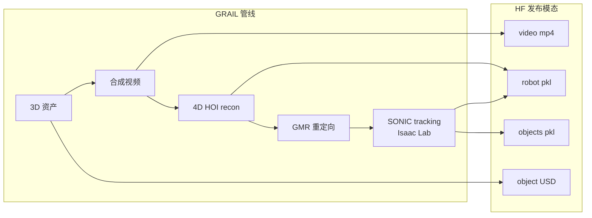

# GRAIL Loco-Manipulation Dataset（G1 合成轨迹）

**PhysicalAI-Robotics-Locomanipulation-GRAIL**（<https://huggingface.co/datasets/nvidia/PhysicalAI-Robotics-Locomanipulation-GRAIL>）是 NVIDIA 为 **[GRAIL](./paper-grail.md)** 论文发布的 **Unitree G1 人形 loco-manipulation 合成轨迹集**。每条运动是 GRAIL 五阶段管线（3D 资产 → VFM 合成视频 → 4D HOI 重建 → GMR 重定向 → **SONIC task-general tracking**）的确定性输出；发布的 `robot/` 与 `objects/` 轨迹为 **Isaac Lab 仿真中经接触动力学后物理可行** 的 post-RL 结果，而非纯运动学重定向。

## 英文缩写速查

| 缩写 | 英文全称 | 简要说明 |
|------|----------|----------|
| GRAIL | Generating Humanoid Loco-Manipulation from 3D Assets and Video Priors | 生成本数据集的论文管线 |
| HOI | Human-Object Interaction | 人-物交互；含 4D 重建与物体轨迹 |
| G1 | Unitree G1 Humanoid | 数据集目标机器人平台 |
| SMPL-X | Skinned Multi-Person Linear Model Extended | 重建阶段的人体参数化模型 |
| SONIC | Scalable Omnidirectional Immersive Control | NVIDIA 全身 tracking 基座，用于生成物理可行轨迹 |
| USD | Universal Scene Description | 每条运动附带的 OpenUSD 物体资产格式 |

## 为什么重要

- **机器人关节空间直出：** 与 AMASS/OMOMO 等人体 MoCap 不同，轨迹已在 **G1 关节空间**（29 body + 双手 DOF），可直接作 WBT / IL 参考，跳过重定向摩擦。
- **物理可行性由构造保证：** `robot/`、`objects/` 是 SONIC tracker 在 Isaac Lab 中 **实际跟出来的结果**，比纯 IK 重定向更接近可训练参考（论文 sim-to-real 叙事的基础）。
- **多模态配对：** 同一条 `seq` 下对齐 **mp4 视频、SMPL-X recon、G1 traj、物体 6-DoF、USD 资产**，适合 HOI 重建、视觉策略与 tracker 三条线共用。
- **规模：** 六类 HOI 合计 **~22k 运动 / ~5.5M 帧**（250 GB 级），覆盖 pick-up、sitting、楼梯/坡道/路缘。

## 子集与规模

| 类别 | 任务 | # 运动 | 总帧数 | 资产来源 |
|------|------|--------|--------|----------|
| `pickup_table` | 桌面拾取 | 2,991 | 747,750 | RoboCasa 衍生 |
| `pickup_ground` | 地面拾取 | 1,613 | 611,625 | RoboCasa 衍生 |
| `sitting` | 坐姿 | 1,748 | 218,500 | Hunyuan3D 生成 |
| `slope` | 坡道 | 1,880 | 470,000 | 程序化地形 |
| `curb` | 路缘 | 1,769 | 442,250 | 程序化地形 |
| `stair` | 楼梯 | 12,188 | 3,047,000 | 合成+真实楼梯 |

## 数据格式（每条运动）

| 文件 | 内容 |
|------|------|
| `video/<seq>.mp4` | 源合成 HOI 视频（24 fps） |
| `recon/<seq>.pkl` | 4D HOI：SMPL-X + 物体 6-DoF（世界系） |
| `robot/<seq>.pkl` | G1 轨迹 `(T, 29)` + `hand_dof_pos`（**25 Hz**） |
| `objects/<seq>.pkl` | 物体 6-DoF `(T, 7)`（xyz + quat） |
| `meta/<seq>.pkl` | 长度、接触标志、源 ID |
| `object_usd/<seq>.usd` | OpenUSD 物体 + textures |

仓库另含 `checkpoint/`（GEM-SMPL、FoundationPose、SONIC）供复现完整 GRAIL 管线。

## 流程总览

## 许可与局限

- **主许可：** GRAIL 原创轨迹与元数据为 **Apache 2.0**；RoboCasa / ComAsset 衍生物体须遵守 **CC BY 4.0 / ODC-By** 署名要求。
- **单平台：** 仅 **G1**；跨具身需额外重定向。
- **合成→真机鸿沟：** 源视频全合成，视觉条件策略可能需真机视频微调；数据集 **不含力/触觉标注**。
- **`.pkl` 安全：** 官方提醒 pickle 加载需在可信环境；验证 HF hash / commit 完整性。

## 与其他页面的关系

- **生成方法：** [GRAIL 论文实体](./paper-grail.md)
- **代码与可视化：** [NVlabs/GRAIL](../../sources/repos/grail_nvlabs.md)
- **低层 tracker：** [SONIC](../methods/sonic-motion-tracking.md)
- **对照数据集：** [OmniRetarget Dataset](./omniretarget-dataset.md)（运动学重定向 G1 轨迹）、[人形参考运动数据集对比](../comparisons/humanoid-reference-motion-datasets.md)

## 推荐继续阅读

- [机器人论文阅读笔记：GRAIL](https://imchong.github.io/Humanoid_Robot_Learning_Paper_Notebooks/papers/11_Simulation_Benchmark/GRAIL__Generating_Humanoid_Loco-Manipulation_from_3D_Assets_and_Video_Priors/GRAIL__Generating_Humanoid_Loco-Manipulation_from_3D_Assets_and_Video_Priors.html)
- 数据集：<https://huggingface.co/datasets/nvidia/PhysicalAI-Robotics-Locomanipulation-GRAIL>
- 论文：<https://arxiv.org/abs/2606.05160>
- 代码：<https://github.com/NVlabs/GRAIL>

## 参考来源

- [grail-locomanipulation-huggingface.md](../../sources/sites/grail-locomanipulation-huggingface.md) — Hugging Face 模型卡策展
- [grail_arxiv_2606_05160.md](../../sources/papers/grail_arxiv_2606_05160.md) — 论文与管线上下文
- [grail_nvlabs.md](../../sources/repos/grail_nvlabs.md) — 官方代码仓
