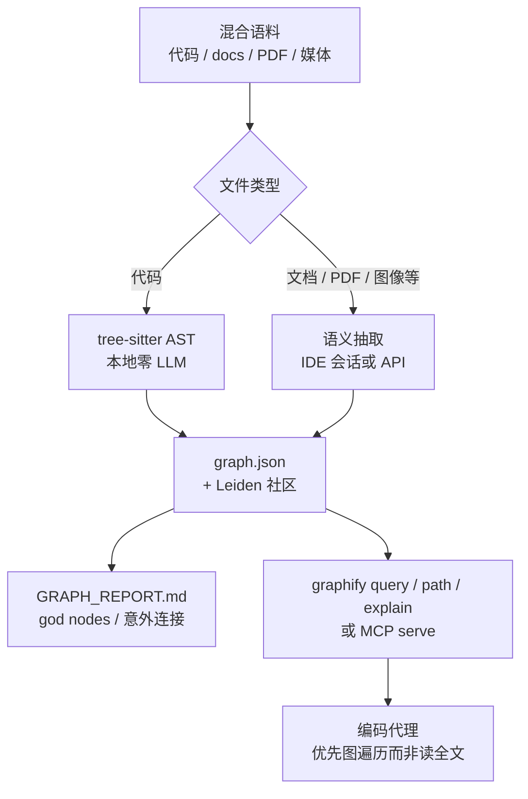

# graphify（Graphify Labs）

**graphify** 是 [Graphify-Labs/graphify](https://github.com/Graphify-Labs/graphify) 分发的 **编码代理技能 + 命令行工具**：在助手内输入 `/graphify .`（或终端 `graphify extract`）即可把项目内的 **代码、文档、论文 PDF、图片、音视频、SQL schema** 等编译成一张 **持久知识图**，随后用 `graphify query` / `path` / `explain` **沿边遍历** 回答问题，而不是每次 grep 或把整库塞进上下文。

PyPI 包名暂为 **`graphifyy`**（双 y），CLI 与技能命令仍为 **`graphify`**。

## 一句话定义

用 **本地 AST（tree-sitter）+ 可选语义抽取 + Leiden 社区聚类**，把混合语料变成 **带置信度标签的可查询图**，让编码代理 **用图遍历替代反复读文件**。

## 英文缩写速查

| 缩写 | 英文全称 | 简要说明 |
|------|----------|----------|
| AST | Abstract Syntax Tree | 抽象语法树；代码边的确定性来源 |
| MCP | Model Context Protocol | 代理工具协议；graphify 可 `python -m graphify.serve` 暴露图查询 |
| RAG | Retrieval-Augmented Generation | 检索增强生成；本工具强调 **显式图** 而非向量片段检索 |
| LLM | Large Language Model | 文档/PDF/图像语义通道所用模型（代码通道默认不用） |

## 为什么重要（对本知识库读者）

- **与 Karpathy LLM Wiki 形成互补对照：** [LLM Wiki（Karpathy 模式）](../references/llm-wiki-karpathy.md) 与本仓库 [Ingest Workflow](../../schema/ingest-workflow.md) 把机器人知识 **人工编译进 `wiki/`**，强调策展、溯源与 cross-reference；graphify 解决的是 **「刚 clone 一个 Isaac Lab 插件 / 人形控制仓库 / 论文+代码混合目录，如何快速建立可查询结构图」** —— 自动构图、边带 `EXTRACTED`/`INFERRED` 标签，适合 **探索期**，不替代本站的 ingest 质量门与 `## 参考来源` 契约。
- **机器人研发常见语料正好命中：** 仿真栈（MuJoCo / Isaac）、ROS2 包、Python 训练脚本、`.md` 实验笔记、arXiv PDF、架构截图混在同一 monorepo 时，graphify 把 **跨文件调用链 + 文档概念 + 论文术语** 放进同一图；上游 README 以 Karpathy 混合语料宣称 **~71.5×** 单次查询相对重读原文的 token 降幅（见上游 `worked/` 与 `BENCHMARKS.md`）。
- **与本站已有图谱不冲突：** `make graph` 生成的 `exports/link-graph.json` 统计 **wiki 页间 markdown 链接**；graphify 可覆盖 **`sources/`、脚本、未升格原文与多语言代码**，二者可并存。
- **Cursor 用户路径明确：** `graphify cursor install` 写入 `.cursor/rules/graphify.mdc`（`alwaysApply: true`），与维护本仓库的 Cloud Agent / 本地 Cursor 工作流直接相关。

## 核心结构

| 层次 | 内容 |
|------|------|
| **分发** | PyPI `graphifyy`；`graphify install` 向各 harness 注册 Skill（Claude、Cursor、Codex、Gemini、Hermes、OpenCode 等 20+）；`--project` 可落盘到仓库内 |
| **提取** | **代码：** tree-sitter AST，~36 语言，本地零 LLM；**文档/PDF/图像/音视频：** 助手会话或 headless API（Gemini / Claude / OpenAI / Ollama 等）；**边类型：** `calls`、`imports`、`inherits`、`references`、`uses` 等 |
| **图运算** | NetworkX 存储；Leiden 社区检测；god nodes、最短路径、子图查询 |
| **置信度** | 边标签 `EXTRACTED` / `INFERRED` / `AMBIGUOUS` |
| **产出** | `graphify-out/graph.json`、`GRAPH_REPORT.md`、`graph.html`；可选 `--wiki` 生成 agent 可爬 markdown、`obsidian/` vault |
| **持久化协作** | 建议提交 `graphify-out/`；`graphify hook install` 在 commit 后 AST 增量更新；`graph.json` 合并驱动避免冲突 |
| **对外接口** | MCP（`query_graph`、`shortest_path` 等）；HTTP 团队共享；`graphify prs` PR 影响面与 triage（上游功能） |

### 流程总览（建图 → 查询）

## 常见误区或局限

- **误区：等价于本仓库 LLM Wiki。** graphify 自动生成 **结构图与报告**，不保证 **面向研究的归纳质量、机构标签、`make ci-preflight` 门禁**；机器人论文仍应走本站 `sources/` → `wiki/` ingest，而非只跑 graphify。
- **误区：纯向量 RAG。** 上游明确 **不用 embedding 向量库** 作主索引；优势在 **可解释路径** 与 **代码 AST 确定性边**，语义边仍依赖模型质量。
- **误区：所有内容都离网。** **仅代码（与本地转写）** 可完全离线；PDF/图像语义通道会调用配置的模型 API（除非自托管 Ollama）。
- **局限：** PyPI 包名 `graphifyy` 易与冒名包混淆；大仓库 HTML 可视化可能过重（可用 `--no-viz`）；具体命令与 harness 矩阵以克隆时 [官方 README](https://github.com/Graphify-Labs/graphify/blob/v8/README.md) 为准。

## 关联页面

- [LLM Wiki（Karpathy 模式）](../references/llm-wiki-karpathy.md) — **持久策展 wiki** 范式；与本页 **自动构图** 对照
- [Superpowers（obra）](superpowers-obra.md) — **交付流程** Agent Skills；与本页 **代码库理解** 技能互补
- [Agent Reach](agent-reach.md) — **外网读搜** 脚手架；与本页 **本地/仓库内** 多模态图互补
- [Caveman](caveman.md) — **输出 token** 压缩；与本页 **输入侧少读文件** 形成省钱三角
- [Hermes Agent](hermes-agent.md) — 常驻代理运行时；上游支持 `graphify install --platform hermes`
- [Skills For Real Engineers（mattpocock）](mattpocock-skills.md) — 轻量工程技能库；同属 **skills 文件化** 生态
- [Ingest Workflow](../../schema/ingest-workflow.md) — 本仓库 **人工 ingest** 规范（graphify 不替代）

## 参考来源

- [graphify 仓库源归档（本站）](../../sources/repos/graphify-labs_graphify.md)
- [Graphify-Labs/graphify（GitHub）](https://github.com/Graphify-Labs/graphify)
- [graphify 官网](https://www.graphify.com)

## 推荐继续阅读

- [Graphify README（v8 分支）](https://github.com/Graphify-Labs/graphify/blob/v8/README.md) — 安装、20+ 平台矩阵、`graphify cursor install` 与团队提交 `graphify-out/` 工作流
- [BENCHMARKS.md（上游）](https://github.com/Graphify-Labs/graphify/blob/v8/BENCHMARKS.md) — LOCOMO / LongMemEval-S 等与 mem0、supermemory、dense RAG 对比
- [Karpathy LLM Wiki Gist](https://gist.github.com/karpathy/442a6bf555914893e9891c11519de94f) — `/raw` 资料堆与「编译知识」的原始叙事
