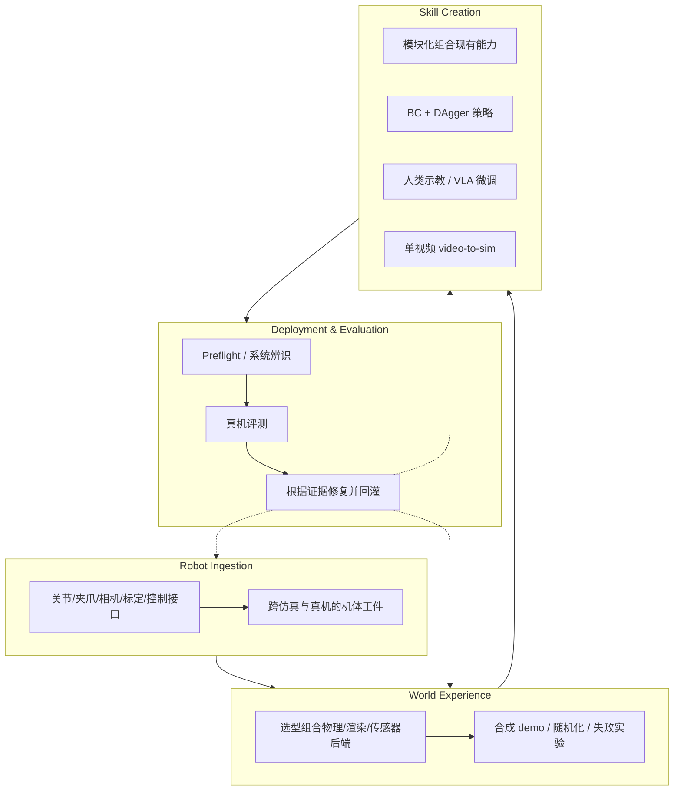

# GRID（General Robotics Auto-Engineering 平台）

**GRID** 是 [General Robotics](https://www.generalrobotics.company/) 的 **Robot Intelligence Platform**：单体 monorepo 集成 **50+ OEM 机器人**、数百感知/控制/规划/RL·IL/仿真/部署工作流。其 **Auto-Engineering** 范式用 agent + **四类 robotics harness** 把「理解机体 → 造世界经验 → 创建技能 → 部署评测与修复」收成可复利闭环——类比软件工程中 coding agent 的仓库、工具与可验证反馈，但反馈来自仿真与真机。

## 一句话定义

用 **GRID monorepo + 四类 harness** 让 agent 在统一抽象下自动完成机器人集成、混合仿真、多路径技能构建与真机评测迭代，并把失败、修复与验证结果沉淀为下次任务的工程起点。

## 英文缩写速查

| 缩写 | 英文全称 | 简要说明 |
|------|----------|----------|
| GRID | General Robotics Intelligence / Deployment 平台名 | 官方产品名；非 Duke General Robotics Lab |
| BC | Behavior Cloning | 行为克隆；Skill Creation 中合成 demo + DAgger 路线 |
| DAgger | Dataset Aggregation | 迭代式纠正性模仿；与 BC 联用训练反应式策略 |
| DFSPH | Divergence-free Smoothed Particle Hydrodynamics | 无散光滑粒子流体；文中与 MuJoCo 刚体耦合 |
| VLA | Vision-Language-Action | 视觉–语言–动作模型；示教 harness 可微调 visuomotor 策略 |
| Sim2Real | Simulation to Real | 部署 harness 负责暴露并修复仿真–真机差距 |

## 核心信息

| 字段 | 内容 |
|------|------|
| 机构 | General Robotics（商业 Physical AI 公司） |
| 产品 | GRID — Auto-Engineering 平台 |
| 开源状态 | **未开源**（截至 2026-09-10 官网无公开代码仓） |
| 官方入口 | [generalrobotics.company](https://www.generalrobotics.company/) · [Auto-Engineering 博客](https://www.generalrobotics.company/post/introducing-auto-engineering-for-robotics) |

## 为什么重要

- **把「稀缺」从模型转到工程 know-how：** 博客核心论断是能力供给日增，但可靠部署仍靠专家团队手工串联；Auto-Engineering 试图把这类知识蒸馏进可执行闭环。
- **Harness 而非单点模型：** 与只发布 VLA checkpoint 不同，GRID 强调 **机体摄取、世界构造、技能路径选择、部署证据** 四类可组合基础设施——对齐站内 [真机 autoresearch harness](../queries/real-robot-policy-autoresearch-harness.md) 对「环境 + 可验证反馈」的强调。
- **复利证据：** 官方实验室叙事给出量化起点——Flexiv 上首技能约 **4 h**，同 setup 后续 **10–15 min**；并列举系统辨识、控制频率、深度几何等 **部署侧修复** 案例，适合与 [Sim2Real](../concepts/sim2real.md) 工程读法对照。
- **与开源栈的关系：** 闭源平台，但依赖/对比对象包括 MuJoCo、[NVIDIA Warp](./nvidia-warp.md)、GELLO 示教等；选型时应与 [Cyclo Intelligence](./cyclo-intelligence.md)、[Isaac Lab](./nvidia-getting-started-isaac-lab.md) 等 **可审计开源栈** 区分。

## 四类 Robotics Harness

| Harness | 输入 / 输出 | 官方实验室示例 |
|---------|-------------|----------------|
| **Robot Ingestion** | 机体形态与运行上下文 → 仿真/真机共用描述与 preflight | 双 Flexiv 取试管→倒烧杯；技能迁移到 **UR5e** |
| **World Experience** | 任务需求 → **按需组装**仿真世界（可多后端） | **Warp DFSPH 流体 + MuJoCo 刚体** 耦合倒液；亦可仓库+PLC、Gaussian splat 导航、可变形体 |
| **Skill Creation** | 任务复杂度 → 选 **组合 / 策略 / 示教 / 视频** 路径 | 静态倒液用分割+抓取+规划；移动烧杯用仿真 BC+DAgger；搅棒用 GELLO 示教；旋液仅用手机视频 |
| **Deployment & Evaluation** | 技能候选 → 真机证据与下一步改动 | 运动学误差迭代；分割 prompt 调优；实时跟踪插入；**500 Hz→30 Hz** 指令 pacing；深度模型选型减 tabletop 误差 |

## 流程总览（实验室倒液任务链）

官方用 **试管拾取 → 双臂传递 → 倒入烧杯** 递增加复杂度：

1. **模块化技能：** 分割定位试管/烧杯 + 抓取 + 避障规划；对象级而非固定关节轨迹 → 物体在工作区内移动仍可用；仿真可达性/碰撞检查后上真机。
2. **反应式倒液：** 烧杯移动时需跟踪对齐；仿真专家 demo → **BC + DAgger** 状态策略（末端动作，便于跨 UR5e/Flexiv）。
3. **接触丰富搅拌：** 运动原语不足 → **GELLO 遥操作**采集 → visuomotor 策略；可按失败模式定向补采。
4. **视频到仿真：** 旋液任务禁示教，仅单段手机视频 → 手姿/物体分割 → 3D 轨迹 → 仿真变体与物理检查 → BC 策略。

## 工程实践（读法与边界）

| 主题 | GRID 叙事中的做法 | 站内对照 |
|------|-------------------|----------|
| 跨本体迁移 | 机体工件 + 对象/末端级技能 | [跨本体迁移策略](../queries/cross-embodiment-transfer-strategy.md) |
| 混合仿真 | 按任务拼装流体+刚体等多后端 | [仿真评测基础设施](../concepts/simulation-evaluation-infrastructure.md) |
| 部署反馈 | 系统辨识、感知链、控制 pacing、几何修复 | [Sim2Real](../concepts/sim2real.md)、[系统辨识](../concepts/system-identification.md) |
| 知识复利 | 机体/技能/模型/失败修复四类沉淀 | [Data Flywheel](../concepts/data-flywheel.md)（侧重数据；GRID 强调 **工程资产** 复利） |

**时间预算（官方单实验室叙事，非普遍 SLA）：** 首技能 ~4 h（摄取 ~20 min + 初始仿真 ~10 min + 其余迭代）；同 Flexiv setup 后续 10–15 min。

## 局限与风险

- **闭源与不可审计：** 截至入库日 **无公开仓库**；性能数字、 harness 边界与失败率无法独立复现，选型应要求 PoC 与数据/IP 条款（官网强调 Sovereign）。
- **叙事绑定特定硬件栈：** 案例含 Flexiv、UR5e、GELLO；迁移到其他 OEM 是否同等顺畅需实测。
- **与学术 General Robotics Lab 易混淆：** Duke **[General Robotics Lab](https://generalroboticslab.com/)**（如 Argus、TSIL）为独立学术实体，与 **generalrobotics.company** 商业 GRID **无从属关系**。
- **Agent 闭环风险：** 自动修改控制频率、深度模型与运动学参数能修 gap，也可能引入安全与回归问题；需保留人工闸门与变更追溯（博客强调 traceability，但实现未开源）。

## 源码运行时序图

**不适用** — 步骤 2.5 判定 GRID 为 **闭源商业平台**，官网未提供可运行公开仓库；上文 Mermaid 为 **产品架构读图**，非 README 对齐的源码时序。

## 关联页面

- [真机策略 autoresearch 闭环搭建指南](../queries/real-robot-policy-autoresearch-harness.md) — coding/agent harness 与可验证反馈
- [Sim2Real](../concepts/sim2real.md) — 部署期 gap 修复
- [Data Flywheel](../concepts/data-flywheel.md) — 部署复利与数据闭环
- [Cyclo Intelligence](./cyclo-intelligence.md) — 开源 Physical AI 全栈对照
- [NVIDIA Isaac Lab 入门](./nvidia-getting-started-isaac-lab.md) — 开源仿真训练部署对照

## 参考来源

- [Introducing Auto Engineering for Robotics（博客归档）](../../sources/blogs/generalrobotics_auto_engineering_2026-09-09.md)
- [General Robotics 官网归档](../../sources/sites/generalrobotics-company.md)

## 推荐继续阅读

- 官方博客：<https://www.generalrobotics.company/post/introducing-auto-engineering-for-robotics>
- NVIDIA ENPIRE / autoresearch 对照：[ENPIRE](../methods/enpire.md)、[真机 autoresearch harness](../queries/real-robot-policy-autoresearch-harness.md)
