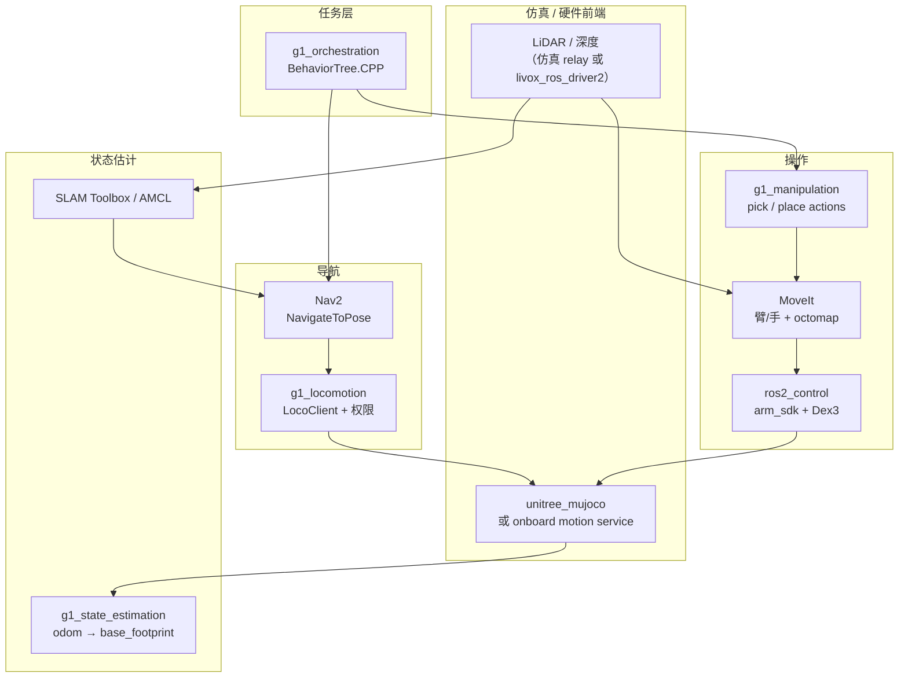

# Grove-G1

**Grove-G1**（[Adyansh04/grove-g1](https://github.com/Adyansh04/grove-g1)）是面向 **Unitree G1** 的开源 **自主导航 + 操作** 集成栈，基于 **ROS 2 Humble** 与 **CycloneDDS**，以 **`unitree_mujoco` 仿真优先** 开发，使 DDS 话题与真机一致，上硬件时仅改 domain / 网卡而非重写栈。

## 一句话定义

在 G1 上把 **2D SLAM + Nav2 行走**、**MoveIt 臂/手规划** 与 **pick-place 行为树任务** 串成可复现闭环，并通过 **`rt/arm_sdk` 权重混合** 让机载平衡控制器托住下肢——仿真与真机共享同一 ROS 图。

## 英文缩写速查

| 缩写 | 英文全称 | 简要说明 |
|------|----------|----------|
| G1 | Unitree G1 Humanoid | 宇树教育科研人形平台 |
| ROS 2 | Robot Operating System 2 | 导航、操作与系统集成中间件 |
| Nav2 | Navigation2 | ROS 2 标准导航栈（规划 + 控制 + BT） |
| BT | Behavior Tree | 行为树任务编排（BehaviorTree.CPP） |
| DDS | Data Distribution Service | Unitree 机载通信（CycloneDDS） |
| URDF | Unified Robot Description Format | G1 机器人模型与 `ros2_control` 描述 |
| AMCL | Adaptive Monte Carlo Localization | 2D 粒子滤波定位 |
| LiDAR | Light Detection and Ranging | 建图、octomap 与 Nav2 代价输入 |

## 为什么重要

- 给 G1 一条 **可 fork 的 ROS 2 全栈参考**：对照 CMU [autonomy_stack_go2](./autonomy-stack-go2.md)（四足几何导航），本仓覆盖 **双足行走 + 双臂/Dex3 操作 + 任务编排**。
- **仿真同构真机**：`unitree_mujoco` 与硬件共用 DDS 语义，降低 Sim2Real 在桥接层的返工——与 [G1 软件服务栈](./unitree-g1-software-stack.md) 的 SDK2/DDS 叙事一致。
- 显式 **控制权限** 与 **`arm_sdk` 混合** 设计，避免人形常见坑：多发布者抢低层通道、直接 `/lowcmd` 自管平衡导致摔机。

## 流程总览

## 核心原理

| 模块 | 作用 |
|------|------|
| **g1_bringup** | 单入口 launch：`mapping` / `localization` / `nav` / `moveit` / `manipulation` 模式组合 |
| **g1_navigation** | SLAM Toolbox 建图、AMCL 定位、Nav2 到点 |
| **g1_locomotion** | LocoClient 桥接与 **locomotion 权限** 括号 |
| **g1_hardware_interface** | 14 臂关节经 **`rt/arm_sdk`** 权重混合 |
| **g1_hand_interface** | 单 Dex3-1 手，`ros2_control` 插件 |
| **g1_moveit_config** | 臂/双手规划组、运动学、**LiDAR octomap** |
| **g1_manipulation** | pick/place **action**；物体位姿源（当前仿真专用） |
| **g1_orchestration** | BT 序列化「导航 → 走近 → 抓取 → 搬运 → 放置」 |

**设计约束（上游 README 强调）：**

1. 每个低层通道仅 **一个命令发布者**；切换前需 acquire/release（如 `activate_arm.launch.py`）。
2. 臂运动走 **`arm_sdk`**，勿在未接管平衡时直发 `/lowcmd`。
3. Nav2 停车精度约 **0.5 m**，臂有效窗口约 **0.2 m** — 任务树含 **base approach** 闭环补距。

## 工程实践

### 快速起步（上游）

| 步骤 | 动作 |
|------|------|
| 1 | Host 装 Docker + NVIDIA Container Toolkit；`pip install vcstool` |
| 2 | `cp .env.example .env` → `./scripts/import-externals.sh` → `./scripts/manage.sh start` → `exec` |
| 3 | 容器内 `colcon build --symlink-install` 并 `source install/setup.bash` |
| 4 | `ros2 launch g1_bringup bringup.launch.py mode:=localization nav:=true ...` |
| 5 | `ros2 launch g1_orchestration mission.launch.py tree:=pick_and_place.xml` |

### 真机切换要点

| 变量 | 用途 |
|------|------|
| `GROVE_G1_ROS_DOMAIN_ID` | 与机器人 DDS domain 对齐 |
| `GROVE_G1_ROBOT_NIC` | 可达机器人的网卡 |
| `GROVE_G1_CYCLONEDDS_URI` | 硬件 CycloneDDS profile（非 loopback） |

仿真 motion service → 厂商 onboard service；LiDAR relay → **`livox_ros_driver2`**。ROS 图上层 **不变**。

### 与官方栈关系

| 组件 | Grove-G1 | Unitree 官方 |
|------|----------|--------------|
| DDS / 消息 | CycloneDDS + 机载话题 | [unitree_sdk2](./unitree-sdk2.md) / [unitree_ros2](./unitree-ros2.md) |
| 臂接口 | `rt/arm_sdk` 混合 | 同 v0.3.0 `g1_arm_sdk_dds_example` 语义 |
| 仿真 | `unitree_mujoco` vendored | [unitree_mujoco](./unitree.md) 组织仓 |

## 局限与风险

- **开源状态：** **已开源**（BSD-3-Clause）；CI 仅跑 **无仿真器** 测试，locomotion/navigation/sensor 相关需本地 MuJoCo 套件验证。
- **感知缺口：** **无真机目标检测**；物体位姿由仿真 source 提供，README 写明硬件上该节点拒绝运行——换真实 detector 不应改 pick/place **action** 接口。
- **操作边界：** 结构化 pick-place 与 facility 地图任务已演示；**非结构化场景学习型操作** 为路线图下一里程碑，**尚未实现**。
- **环境：** devcontainer 为 **privileged + host network**；生产部署需自行收紧权限与网络安全。
- **版本：** 钉死 Humble + CycloneDDS loopback profile；与 [MoveIt 2 Humble](./moveit2.md) 分支一致。

## 关联页面

- [Unitree G1](./unitree-g1.md) — 硬件平台
- [G1 软件服务栈](./unitree-g1-software-stack.md) — SDK2/DDS 接口面
- [unitree_ros2](./unitree-ros2.md) — 官方 ROS 2 消息与 G1 示例
- [autonomy_stack_go2](./autonomy-stack-go2.md) — 四足几何自主导航对照
- [Navigation2](./navigation2.md) / [SLAM Toolbox](./slam-toolbox.md)
- [MoveIt 2](./moveit2.md)
- [导航·SLAM 栈总览](../overview/navigation-slam-autonomy-stack.md)
- [操作任务](../tasks/manipulation.md)

## 参考来源

- [sources/repos/grove-g1.md](../../sources/repos/grove-g1.md)
- 上游：<https://github.com/Adyansh04/grove-g1>

## 推荐继续阅读

- 上游 README「Packages」「Quick start」「Development environment」
- [Nav2 文档](https://docs.nav2.org/)
- [MoveIt 2 Humble 文档](https://moveit.picknik.ai/humble/)
