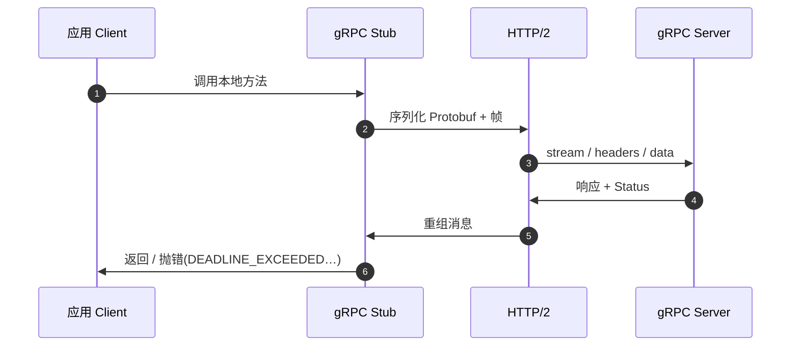

# gRPC

## 一句话定义

**gRPC** 是开源的高性能 **[远程过程调用](../concepts/remote-procedure-call.md)** 框架：用接口定义（默认 **Protocol Buffers**）生成多语言客户端/服务端桩，并在 **HTTP/2** 上传输；由 Google 发起，现为 CNCF incubating 项目。

## 英文缩写速查

| 缩写 | 英文全称 | 简要说明 |
|------|----------|----------|
| gRPC | gRPC Remote Procedure Calls | 本页框架（名称递归） |
| RPC | Remote Procedure Call | 远程过程调用范式 |
| IDL | Interface Definition Language | 默认 Protobuf `.proto` |
| HTTP/2 | Hypertext Transfer Protocol version 2 | gRPC 默认承载 |
| CNCF | Cloud Native Computing Foundation | 托管社区治理 |

## 为什么重要

- 边云推理、数据集工具、仿真–训练桥、部分机器人后端 API 的事实默认之一。
- 把「像本地调用」做到工程化：**强类型契约、代码生成、deadline、流式、拦截器/鉴权插件**。
- 与 [ROS 2 Services](../concepts/ros2-basics.md) 同属 RPC **风格**，但 **线协议与发现完全不同**（gRPC≠DDS）；不要假设二者可直接互通。

## 核心原理

| 层级 | 内容 |
|------|------|
| IDL | `.proto` 中 `service` / `rpc` / `message` |
| 生成物 | 各语言 stub（client）与 server 骨架 |
| 调用形态 | Unary、Server/Client/Bidi streaming |
| API 风格 | 同步阻塞 ≈ 过程调用；异步适合网络现实 |
| 传输 | 抽象双向消息流 → 映射到 HTTP/2 streams |
| 横切 | Deadline、metadata、cancellation、channel 状态 |

一手：[grpc.io Core concepts](../../sources/sites/grpc-io-docs.md)；仓内 `CONCEPTS.md` / `doc/PROTOCOL-HTTP2.md`。

## 工程实践

### 开源状态（2026-07-28）

- **已开源**：[grpc/grpc](https://github.com/grpc/grpc) Apache-2.0；~45.2k★；最新发行 **v1.83.0**（2026-07-22）。
- 生产安装优先语言包（`grpcio`、`google.golang.org/grpc`、Maven 等），不必从 monorepo 全量编译。

### 快速落地

1. 写 `.proto` → `protoc` + gRPC plugin 生成代码。
2. 服务端实现生成接口并 `Serve`；客户端建 **channel** + stub。
3. **一律设 deadline**；对非幂等写操作做幂等键或服务端去重。
4. 需要推流时用 streaming，而不是高频 unary 轮询。
5. 机器人：**服务面**可用；**关节/IMU 数据面**改走 [LCM](../concepts/lcm-basics.md) / SHM / 总线——见 [实时指南](../queries/real-time-control-middleware-guide.md)。

**上游元数据（2026-07）：** [grpc/grpc](https://github.com/grpc/grpc)，Homepage [grpc.io](https://grpc.io/)。

## 局限与风险

- 默认 **TCP + HTTP/2**：重传与队头阻塞不适合硬实时控制环。
- 与 ROS 2 / DDS **不互操作**；同进程混用时注意线程与内存分配对 RT 任务的干扰。
- 客户端/服务端对「成功」的判定可能不一致（deadline、取消）。
- 取消 **不回滚** 已产生的副作用。

## 关联页面

- [远程过程调用（RPC）](../concepts/remote-procedure-call.md)
- [ROS 2 基础](../concepts/ros2-basics.md)
- [网络协议栈](../concepts/network-protocol-stack.md)
- [DDS 通信机制](../concepts/dds-communication.md)
- [实时运控中间件指南](../queries/real-time-control-middleware-guide.md)
- [通信协议知识链](../overview/hub-communication.md)

## 参考来源

- [sources/repos/grpc.md](../../sources/repos/grpc.md)
- [sources/sites/grpc-io-docs.md](../../sources/sites/grpc-io-docs.md)
- [Birrell & Nelson 1984](../../sources/papers/birrell_nelson_implementing_rpc_tocs_1984.md)（概念源头）
- [RFC 5531](../../sources/sites/rfc-5531-onc-rpc.md)（另一历史 RPC 线协议，对照用）

## 推荐继续阅读

- 文档：<https://grpc.io/docs/>
- 仓：<https://github.com/grpc/grpc>
- Introduction：<https://grpc.io/docs/what-is-grpc/introduction/>
