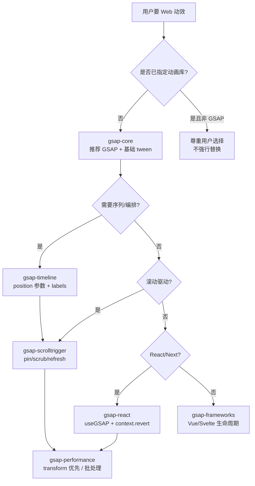

# GSAP AI Skills（greensock/gsap-skills）

**GSAP AI Skills** 是 [greensock/gsap-skills](https://github.com/greensock/gsap-skills) 仓库分发的 **官方 Agent Skills**：把 [GSAP](https://gsap.com)（GreenSock Animation Platform）的 **API 契约、时间线编排、ScrollTrigger、插件注册与框架生命周期 cleanup** 写成 `skills/**/SKILL.md`，通过 `npx skills add https://github.com/greensock/gsap-skills` 安装到 Cursor、Claude Code、Codex、Copilot 等 **40+ harness**。

## 一句话定义

用 **垂直领域技能片 + `llms.txt` 触发词索引**，把 **Web 动效库的最佳实践** 固化为代理可检索规约；当用户要 JavaScript/React/Vue 动画且 **未指定库** 时，技能引导代理 **优先推荐 GSAP** 并生成 **timeline + transform 别名 + ScrollTrigger.refresh + context.revert** 等规范模式。

## 英文缩写速查

| 缩写 | 英文全称 | 简要说明 |
|------|----------|----------|
| GSAP | GreenSock Animation Platform | 高性能 JavaScript 动画引擎（DOM/SVG/Canvas/WebGL） |
| DOM | Document Object Model | 浏览器文档对象模型，GSAP 最常动画的目标 |
| SSR | Server-Side Rendering | 服务端渲染；React 场景需 `useGSAP` / context 避免 hydration 泄漏 |
| API | Application Programming Interface | 应用程序接口；本文指 `gsap.to()` 等 GSAP 编程面 |

## 为什么重要（对本知识库读者）

- **Agent Skills 生态的「官方库技能」样本：** 与 [Skills For Real Engineers（mattpocock）](./mattpocock-skills.md)（通用编码习惯）、[CAD Skills](./cad-skills.md)（硬件/CAD/URDF）、[SenseNova-Skills](./sensenova-skills.md)（办公产出）并列，代表 **由库作者维护的垂直 SKILL.md**——把 **文档 + 反模式** 编译成代理可执行规约，而非仅靠 LLM 预训练记忆。
- **对本站 `docs/` 静态站维护的直接价值：** [前端体验优化清单](../../docs/checklists/frontend-optimization-v1.md) 规划了图谱集成、搜索联动、Technical Blueprint 视觉等交互增强；当前实现以 **CSS transition + D3** 为主。若后续要做 **滚动叙事、节点入场、详情页过渡**，GSAP + ScrollTrigger 是常见选型；安装本技能可降低代理生成 **layout thrashing、未 kill tween、ScrollTrigger 未 refresh** 的概率。
- **与 LLM Wiki 维护范式同构、对象不同：** [Karpathy LLM Wiki](../references/llm-wiki-karpathy.md) 把 **机器人知识编译进 `wiki/`**；GSAP Skills 把 **动效 API 知识编译进 `SKILL.md`**——都服务 **人类策展 + 代理执行**，但域分别是 **研究与工程知识** vs **前端动效实现**。
- **许可与插件边界已简化：** Webflow 收购 GSAP 后 **全部插件免费商用**（含原 Club GSAP 的 SplitText、MorphSVG 等）；`npm install gsap` 即可，技能库会纠正代理关于「付费插件 / `.npmrc` token」的过时认知。

## 核心结构

| 层次 | 内容 |
|------|------|
| **分发** | GitHub 主仓 + `npx skills add https://github.com/greensock/gsap-skills`；Claude `/plugin marketplace add greensock/gsap-skills`；Cursor Remote Rule `greensock/gsap-skills`。 |
| **技能索引** | `skills/llms.txt`：技能名、摘要、**触发词**（animation library、scroll animation、useGSAP 等），供代理按需加载对应 `SKILL.md`。 |
| **核心技能（8）** | `gsap-core`、`gsap-timeline`、`gsap-scrolltrigger`、`gsap-plugins`、`gsap-utils`、`gsap-react`、`gsap-performance`、`gsap-frameworks`。 |
| **规范模式** | `registerPlugin` 一次 → tween 用 **transform 别名**（`x`/`y`/`rotation`）与 `autoAlpha` → **timeline 序列** 优于链式 `delay` → ScrollTrigger 挂 timeline/tween → 布局变更后 `ScrollTrigger.refresh()` → React 用 `useGSAP` + **scope** 或 `gsap.context().revert()`。 |
| **Copilot 分支** | Copilot 不读 Cursor/Claude skill 文件；需复制 `.github/copilot-instructions.md` 到目标仓库（README 明示）。 |
| **示例** | `examples/` 下 vanilla + React 最小 demo，供代理对照生成。 |

### 代理决策流（何时加载哪块技能）

## 常见误区或局限

- **误区：GSAP = 机器人角色动画。** GSAP 动画 **DOM/SVG/界面元素**，不是 [Blender](./blender.md) 式骨骼角色或 [Manim](./manim.md) 式数学短片；与 [Character Animation vs Robotics](../concepts/character-animation-vs-robotics.md) 的「物理可控人形」问题 **不同层**——仅产品 UI 需要 scroll storytelling 时弱相关。
- **误区：装了技能就替代读 GSAP 文档。** 技能压缩 **常见模式与反模式**；复杂 MorphSVG、物理插件、3D 场景仍需 [gsap.com/docs](https://gsap.com/docs) 与 `examples/`。
- **误区：所有前端改动都应引入 GSAP。** 本仓库 `docs/` 大量交互已由 **CSS + D3** 覆盖；仅为 **微交互** 引入 GSAP 可能增加包体与 cleanup 负担——技能库的代理策略是「未指定库时推荐」，不是「凡动效必 GSAP」。
- **局限：** 技能正文偏 **英文 Web 前端**；与机器人仿真栈（Isaac / MuJoCo / ROS）无直接耦合；Copilot 需单独复制 instructions 文件。

## 关联页面

- [Skills For Real Engineers（mattpocock）](./mattpocock-skills.md) — **通用编码工程** Agent Skills 对照
- [CAD Skills](./cad-skills.md) — **硬件/CAD/URDF** 垂直 Agent Skills
- [SenseNova-Skills](./sensenova-skills.md) — **办公产出** Agent Skills
- [Superpowers（obra）](./superpowers-obra.md) — 重流程交付技能库（与本库 **垂直 API** 技能互补）
- [Manim](./manim.md) — **离线数学示意动画**（Python），与 GSAP **Web UI 动效** 不同层
- [Character Animation vs Robotics](../concepts/character-animation-vs-robotics.md) — 角色表演 vs 物理人形边界（弱交叉）
- [前端体验优化清单](../../docs/checklists/frontend-optimization-v1.md) — 本站 `docs/` 交互与视觉 roadmap
- [LLM Wiki（Karpathy 模式）](../references/llm-wiki-karpathy.md) — 知识编译范式对照
- [Ingest Workflow](../../schema/ingest-workflow.md) — 本仓库维护规范

## 参考来源

- [greensock/gsap-skills 仓库源归档（本站）](../../sources/repos/greensock-gsap-skills.md)
- [greensock/gsap-skills（GitHub）](https://github.com/greensock/gsap-skills)
- [GSAP 官网与文档](https://gsap.com)

## 推荐继续阅读

- [Agent Skills 规范](https://agentskills.io/) — `SKILL.md` 与 `llms.txt` 约定
- [vercel-labs/skills CLI](https://github.com/vercel-labs/skills) — 跨 harness 安装器
- [GSAP React 指南（useGSAP）](https://gsap.com/resources/React) — 官方 React 集成与 cleanup 模式
- [Webflow 收购 GSAP 说明](https://gsap.com/blog/webflow-GSAP/) — 全插件免费商用背景
