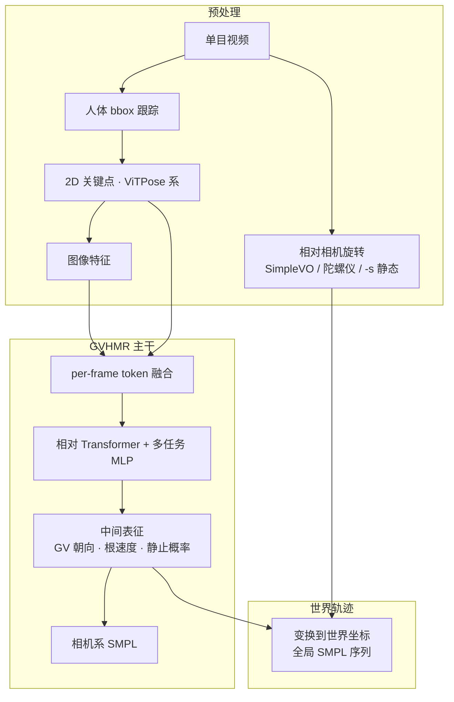

---

type: entity
tags: [repo, paper, human-pose, hmr, monocular-video, smpl, world-grounded, motion-retargeting, upstream, siggraph-asia-2024, tsinghua, zju]
status: complete
updated: 2026-06-21
arxiv: "2409.06662"
venue: SIGGRAPH Asia 2024
summary: "GVHMR 用 Gravity-View 坐标逐帧估计单目视频人体姿态，再经相机运动恢复 world-grounded SMPL 全局轨迹，是人形「视频→重定向」链路最常见的上游 HMR 模块之一。"
related:
  - ../overview/humanoid-motion-cerebellum-technology-map.md
  - ../overview/motion-cerebellum-category-03-data-pipeline.md
  - ../concepts/motion-retargeting.md
  - ../concepts/motion-retargeting-pipeline.md
  - ../queries/humanoid-training-data-pipeline.md
  - ../methods/motion-retargeting-gmr.md
  - ../methods/hy-motion-1.md
  - ../methods/crisp-real2sim.md
  - ./paper-htd-refine-monocular-hmr.md
  - ./paper-motion-cerebellum-tram.md
sources:
  - ../../sources/papers/gvhmr_arxiv_2409_06662.md
  - ../../sources/sites/gvhmr-zju3dv-github-io.md
  - ../../sources/repos/gvhmr.md
  - ../../sources/papers/motion_cerebellum_64_catalog.md
  - ../../sources/blogs/wechat_embodied_ai_lab_humanoid_motion_cerebellum_survey.md
---

# GVHMR

**GVHMR**（*World-Grounded Human Motion Recovery via Gravity-View Coordinates*，ZJU 3DV，SIGGRAPH Asia 2024；[项目页](https://zju3dv.github.io/gvhmr/)，[代码](https://github.com/zju3dv/GVHMR)）从 **单目 RGB 视频** 恢复 **重力对齐的世界坐标系 SMPL 人体运动**。其核心是把 **image→pose** 映射放到 **Gravity-View（GV）坐标系** 中 **逐帧** 学习，再借助 **相机相对旋转** 合成全局轨迹，从而相对 **自回归帧间运动** 方法减轻长序列 **误差累积**。

## 英文缩写速查

| 缩写 | 英文全称 | 简要说明 |
|------|----------|----------|
| HMR | Human Mesh Recovery | 从图像恢复人体网格/骨架参数 |
| GV | Gravity-View Coordinates | 由重力方向与相机视线定义的逐帧坐标系 |
| SMPL | Skinned Multi-Person Linear Model | 参数化人体模型（姿态 θ、形状 β、根轨迹） |
| VO | Visual Odometry | 从视频估计相机相对旋转；GVHMR 默认 SimpleVO |
| W-MPJPE | World-space MPJPE | 世界坐标下的关节位置误差，评测全局轨迹 |

## 为什么重要

- 在 [运动小脑 64 篇技术地图](../overview/humanoid-motion-cerebellum-technology-map.md) 中归类为 **C 数据入口**（16/64）：**视频动作恢复到重力对齐世界坐标**。
- **重定向不是第一步**：现场只有手机视频时，必须先有 GVHMR（或 [TRAM](./paper-motion-cerebellum-tram.md) 等同类 HMR）才能把像素变成 **带世界坐标的 SMPL 序列**，再交给 [GMR](../methods/motion-retargeting-gmr.md) 等几何重定向（见 [humanoid-training-data-pipeline](../queries/humanoid-training-data-pipeline.md)）。
- **坐标设计直击长视频痛点：** world 系定义随序列变化而歧义；GV 系 **每帧由重力+视线唯一确定**，天然对齐重力，避免沿重力方向的漂移累积。
- **生态互操作：** [GMR](https://github.com/YanjieZe/GMR) 官方支持 GVHMR 输入；[HTD-Refine](./paper-htd-refine-monocular-hmr.md) 可作为 **后处理** 改善 jitter/脚滑；[HY-Motion 1.0](../methods/hy-motion-1.md)、[CRISP-Real2Sim](../methods/crisp-real2sim.md) 等把其列为 **视频→SMPL** 环节。

## 流程总览

## 核心机制（归纳）

### 1）Gravity-View 坐标

| 性质 | 说明 |
|------|------|
| 定义 | $z$ 对齐 **重力**；$x$ 由 **相机视线** 在水平面投影确定 |
| 逐帧唯一 | 每帧图像对应一个 GV 系，降低 world 系学习歧义 |
| 非自回归 | **逐帧** 估计中间量，再合成全局轨迹，避免自回归 rollout 累积误差 |

### 2）多任务输出

- **GV 系人体朝向**、**SMPL 系根速度**、预定义关节 **静止概率**（用于接触/脚滑相关约束）。
- **相机系 SMPL** 参数与 **世界坐标全局轨迹** 由中间表征 + 相机运动 **显式变换** 得到。

### 3）训练与推理（公开配置）

| 项 | 内容 |
|----|------|
| 训练数据 | AMASS、BEDLAM、H36M、3DPW 混合 |
| 训练 | 2×RTX 4090，420 epoch，batch 256，约 13 h |
| 推理 | RTX 4090：1430 帧（~45 s）约 **280 ms**（**不含**预处理） |
| 权重 | `gvhmr_siga24_release.ckpt` |

### 4）工程入口（仓库）

- 单视频：`python tools/demo/demo.py --video=...`；静态相机加 `-s` 跳过 VO。
- 批处理：`demo_folder.py`；复现：`tools/train.py` + `gvhmr/test_3dpw_emdb_rich` 等 task。
- **2025-03** 起默认 **SimpleVO**（替代 DPVO）；支持 `f_mm` 指定焦距。

## 在重定向流水线中的位置

## 与相近方法的对比（索引级）

| 维度 | GVHMR | TRAM | 自回归相对运动 HMR |
|------|-------|------|-------------------|
| 全局坐标策略 | **GV 逐帧 + 相机变换** | 相机+人体联合估计 | 帧间相对积分 |
| 长序列误差 | 强调 **避免重力方向累积** | 野外全局轨迹 | 易漂移/过平滑 |
| 机器人管线出现频率 | GMR、CRISP、HY-Motion 等 **高频默认** | HTD-Refine baseline | WHAM 等 |

> 精度数值以论文 / 项目页为准；[HTD-Refine](./paper-htd-refine-monocular-hmr.md) 实验表明 GVHMR 初始化 **+ 动力学后处理** 可进一步改善 jitter 与 WA/W-MPJPE。

## 局限

- **单目深度与接触歧义** 仍会导致脚滑、尺度漂移；不宜直接把原始输出当真机指令。
- **依赖相机运动估计：** 移动相机需 VO；静态场景应使用 `-s`，否则 VO 噪声会污染世界轨迹。
- **动力学保真度：** 位置较准时仍可能 **过平滑或抖动**；重定向前可考虑 HTD-Refine 类 **高阶时序精炼**。
- 与棚拍 MoCap / [AMASS](./amass.md) 相比噪声更大，常需物理筛选或 RL 修补层。

## 关联页面

- [Motion Retargeting](../concepts/motion-retargeting.md)
- [Motion Retargeting Pipeline](../concepts/motion-retargeting-pipeline.md)
- [GMR](../methods/motion-retargeting-gmr.md)
- [HTD-Refine](./paper-htd-refine-monocular-hmr.md)
- [TRAM](./paper-motion-cerebellum-tram.md)

## 参考来源

- [GVHMR 论文摘录（arXiv:2409.06662）](../../sources/papers/gvhmr_arxiv_2409_06662.md)
- [GVHMR 项目页归档](../../sources/sites/gvhmr-zju3dv-github-io.md)
- [GVHMR 仓库归档](../../sources/repos/gvhmr.md)

## 推荐继续阅读

- 项目页：<https://zju3dv.github.io/gvhmr/>
- 论文：<https://arxiv.org/abs/2409.06662>
- [Motion Retargeting Pipeline](../concepts/motion-retargeting-pipeline.md)
- [HTD-Refine：单目 HMR 动力学后处理](./paper-htd-refine-monocular-hmr.md)
