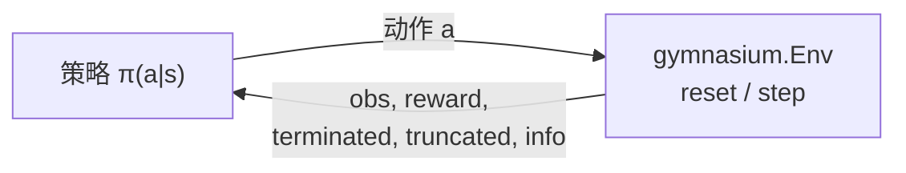

# Gymnasium（RL 环境 API 标准）

**Gymnasium** 是 [Farama Foundation](https://farama.org/) 维护的 **单智能体强化学习环境接口** 与参考环境集合，官方文档见 [gymnasium.farama.org](https://gymnasium.farama.org/)。它是 OpenAI Gym 的社区延续 fork；新研究与工程应使用 `import gymnasium as gym`，而非已停更的 `gym` 包。

| 字段 | 内容 |
|------|------|
| 机构 | Farama Foundation |
| 许可证 | MIT（以仓库为准） |
| 定位 | 单智能体 RL 环境 API 标准 + 参考环境注册表 |

## 一句话定义

Gymnasium 不替代 MuJoCo / Isaac Gym 等物理引擎，而是规定 **智能体与环境交互的 Python 契约**（观测、动作、奖励、终止信号），使 PPO、SAC 等训练代码能在不同仿真后端之间切换。

## 英文缩写速查

| 缩写 | 英文全称 | 简要说明 |
|------|----------|----------|
| Gymnasium | Gymnasium | Farama 维护的 Gym 继任项目与环境 API |
| RL | Reinforcement Learning | 通过与环境交互最大化长期回报的学习范式 |
| MDP | Markov Decision Process | `Env` 所抽象的状态–动作–奖励序贯决策过程 |
| API | Application Programming Interface | `reset` / `step` / `spaces` 等标准方法集合 |
| GPU | Graphics Processing Unit | Isaac Gym 类栈的并行仿真依赖；与 Gymnasium API 层正交 |

## 为什么重要

- **训练栈的「插座标准」**：算法库（Stable-Baselines3、CleanRL 等）默认假设环境实现 `gymnasium.Env`；机器人仓库（如 [gym-pybullet-drones](./gym-pybullet-drones.md)）对齐该接口后，换算法不必重写环境循环。
- **基准可比性**：CartPole、MuJoCo Ant/Humanoid 等任务长期作为 PPO、SAC 的横向对比靶场；与 [dm_control](./dm-control.md) 的 Control Suite 形成「Gym 注册表 vs DeepMind 约定」两条并行基准线。
- **语义升级影响 bootstrap**：v0.26 起 `step()` 返回 `terminated`（任务内终止）与 `truncated`（时间限制等 MDP 外截断），替代旧 Gym 的单一 `done`；误用会导致价值函数 bootstrap 与课程设计出错。
- **与 GPU 并行仿真区分**：`gymnasium.make_vec()` 做的是 **API 层向量化**；[Isaac Gym](./isaac-gym.md) / [legged_gym](./legged-gym.md) 的万环境并行是 **物理仿真并行**，二者互补而非替代。

## 核心结构（读者心智模型）

### 智能体–环境循环

| 组件 | 作用 |
|------|------|
| `gymnasium.make(id)` | 按注册表实例化环境，并默认叠加 `TimeLimit`、`OrderEnforcing`、`PassiveEnvChecker` 等 Wrapper |
| `reset(seed=…)` | 开始新回合；返回 `(observation, info)` |
| `step(action)` | 推进一步；返回 `(obs, reward, terminated, truncated, info)` |
| `action_space` / `observation_space` | 声明合法动作与观测；基于 `spaces.Box`、`Discrete`、`Dict` 等 |
| `gymnasium.Wrapper` | 不改底层代码即可改观测、奖励、动作缩放或记录视频 |
| `make_vec()` | 同步/异步向量化环境，便于批量采样（CPU 侧常见） |

### 与 Farama 生态

| 项目 | 分工 |
|------|------|
| **Gymnasium** | 单智能体环境 API + 内置参考环境 |
| **PettingZoo** | 多智能体环境 API（文档明确指向，非 Gymnasium 子模块） |
| **Shimmy** | 将其他 API（如旧 Gym、DeepMind 环境）适配到 Gymnasium |

### 机器人研究中的典型落点

| 层级 | 例子 |
|------|------|
| **API / 基准** | Gymnasium 本体：经典控制教学、MuJoCo 注册环境 |
| **另一套 MuJoCo 基准** | [dm_control](./dm-control.md) Control Suite（自有 `TimeStep` API，常与 Gym 结果并列报告） |
| **物理 + 任务框架** | [legged_gym](./legged-gym.md)（Isaac Gym 上足式 RL，非 Gymnasium 内置） |
| **轻量机体 RL** | [gym-pybullet-drones](./gym-pybullet-drones.md)（PyBullet + Gymnasium 四旋翼） |

## 常见误区或局限

- **误区：Gymnasium = 仿真器** — 它是 **接口与参考环境注册表**；Humanoid-v4 等任务的物理仍由 MuJoCo 等后端承担。
- **误区：`truncated` 与 `terminated` 可混用** — `truncated=True` 表示时间限制等 **MDP 外** 截断，bootstrap 时不应等同任务失败；旧 Gym 的 `done` 需按 [官方迁移指南](https://gymnasium.farama.org/introduction/migration_guide/) 拆分。
- **局限：不解决机器人 sim2real** — 接口统一不保证动力学保真；大规模 loco 量产训练仍常选 Isaac 系并行栈。
- **局限：内置环境偏学术基准** — 真机人形/四足的工程化任务、域随机化与 privileged obs 多在专用框架（legged_gym、Isaac Lab 等）而非 Gymnasium 自带注册表。

## 关联页面

- [Reinforcement Learning（方法总览）](../methods/reinforcement-learning.md) — RL 算法与训练 loop 上下文
- [MDP（形式化）](../formalizations/mdp.md) — `Env` 所抽象的数学对象
- [MuJoCo](./mujoco.md) — Gymnasium MuJoCo 域的物理后端
- [dm_control](./dm-control.md) — 并行存在的 MuJoCo 连续控制基准栈
- [gym-pybullet-drones](./gym-pybullet-drones.md) — Gymnasium 接口的四旋翼实例
- [legged_gym](./legged-gym.md) — 足式 RL 工程框架（底层多为 Isaac Gym，非 Gymnasium 内置）
- [Isaac Gym](./isaac-gym.md) — GPU 并行物理；与 API 标准分层理解
- [十年仿真平台技术地图](../overview/sim-platforms-decade-technology-map.md) — MuJoCo + Gym 基准的历史位置
- [仿真器选型指南](../queries/simulator-selection-guide.md) — 物理引擎选型；Gymnasium 解决「算法怎么接环境」

## 推荐继续阅读

- 官方文档：[Basic Usage](https://gymnasium.farama.org/introduction/basic_usage/)
- 自定义环境：[Create a Custom Environment](https://gymnasium.farama.org/introduction/create_custom_env/)
- 从旧 Gym 迁移：[Migration Guide](https://gymnasium.farama.org/introduction/migration_guide/)
- 代码仓库：[Farama-Foundation/Gymnasium](https://github.com/Farama-Foundation/Gymnasium)

## 参考来源

- [Gymnasium 官方文档与仓库归档](../../sources/repos/gymnasium.md)
