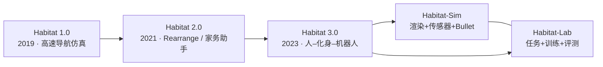
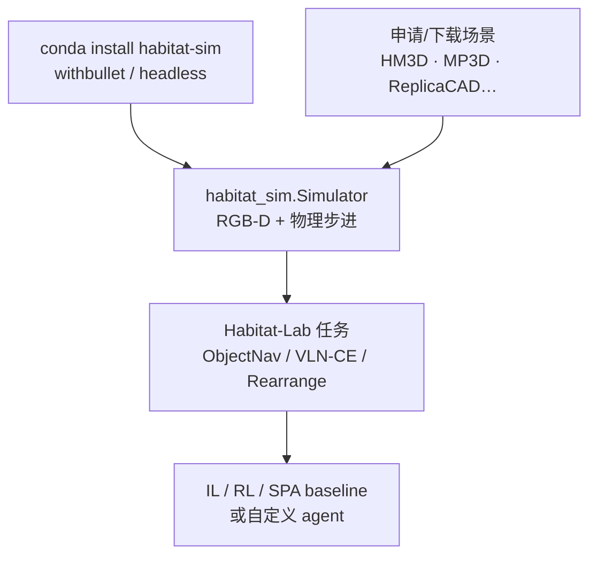
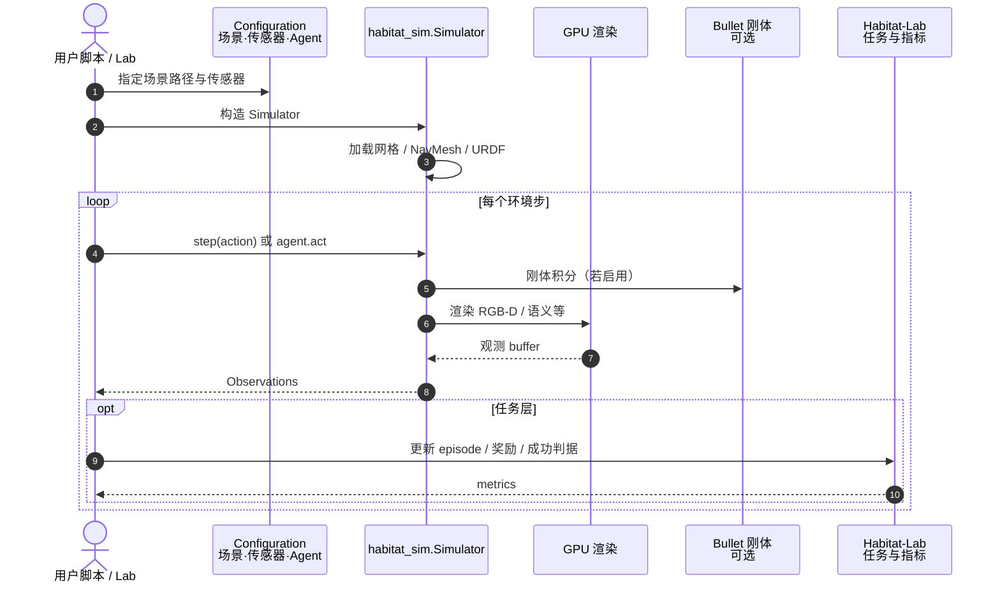

# Habitat-Sim

**Habitat-Sim**（平台常简称 **Habitat**）是 Meta AI（原 Facebook AI Research）开源的 **高速 3D 具身仿真器**（[GitHub](https://github.com/facebookresearch/habitat-sim)，[门户](https://aihabitat.org/)，[Sim Docs](https://aihabitat.org/docs/habitat-sim/)；**MIT**）。它与上层 [Habitat-Lab](https://github.com/facebookresearch/habitat-lab) 组成完整研究栈：Sim 负责渲染/传感器/物理与资产，Lab 负责任务、训练与标准评测。

> **维护边界（README，核查 2026-08-04）：** Beyond **v0.3.4**，Meta 内部团队**不再**做官方主动开发/维护；代码仍 MIT 开源，社区可继续 fork。最新 GitHub Release 当时为 **v0.3.3**（2026-02）。

## 一句话定义

> Habitat 把仿真瓶颈从「能不能渲染」变成「能不能 **足够快** 地渲染」：在真实扫描与 CAD 室内场景上实现单 GPU **数千–上万 FPS**，并可选 Bullet 刚体 + URDF 机器人，让亿级探索步数的具身 RL / 评测在工程上可行。

## 英文缩写速查

| 缩写 | 英文全称 | 简要说明 |
|------|----------|----------|
| Habitat | Habitat Embodied AI Platform | Meta 具身仿真 + 实验栈总称 |
| Habitat-Sim | Habitat Simulator | 渲染 / 传感器 / 物理 / 资产层 |
| Habitat-Lab | Habitat Laboratory | 任务定义、训练与评测层 |
| HM3D | Habitat-Matterport 3D | 大规模室内扫描数据集 |
| FPS / SPS | Frames / Steps Per Second | 渲染帧率 / 含物理的步进吞吐 |
| URDF | Unified Robot Description Format | 移动操作臂、固定臂、四足等机器人描述 |
| VLN-CE | VLN in Continuous Environments | 连续动作空间 VLN；常挂 Lab |

## 为什么重要

1. **吞吐即科学可用性：** PointNav / ObjectNav 等要 **数十亿步** 时，渲染是硬约束；官方宣称 MP3D 单线程数千 FPS、单 GPU 多进程 **>10k FPS**，Fetch@ReplicaCAD（128×128 RGBD + 1/30 s 刚体）**>8k SPS**。
2. **真实感导航基础设施：** 原生/生态加载 [Matterport3D](./matterport3d-simulator.md)、Gibson、HM3D、Replica 等，支撑 VLN-CE、ObjectNav、Challenge 系列。
3. **从纯导航到交互具身：** Habitat 2.0（Rearrange）与 3.0（人–化身–机器人）扩展可交互物体与社交设定——仍以 **速度优先于物理广度** 为设计哲学。
4. **开源可复现入口清晰：** conda 一键安装 + 完整 [Sim Docs](https://aihabitat.org/docs/habitat-sim/) / ECCV 2020 教程；与「仅论文无仓」的导航方法形成对照。

## 核心信息

| 项 | 内容 |
|----|------|
| **机构** | 元宇宙人工智能（Meta AI） |
| **许可证** | MIT |
| **安装** | conda（推荐）/ pip 源码编译 / Docker / 源码；常用 `withbullet`、`headless` |
| **物理** | Bullet 刚体（可选） |
| **机器人** | URDF（Fetch、Franka、AlienGo 等） |
| **传感器** | 可配置 RGB-D、egomotion 等 |
| **上层** | Habitat-Lab（另仓） |
| **维护** | v0.3.4 后 Meta **不再官方主动维护** |

## 核心结构/机制

### Sim ↔ Lab 分层

| 层 | 职责 |
|----|------|
| **Habitat-Sim** | 场景加载、传感器渲染、NavMesh、刚体步进、Python/`habitat_sim` API |
| **Habitat-Lab** | 任务（导航、指令跟随、问答、重排等）、IL/RL/经典 SPA 管线、标准指标 |

### 资产与任务

- **扫描 / 语义场景：** HM3D、HM3D-Semantics、MP3D、Gibson、Replica。
- **CAD / 物体：** ReplicaCAD、YCB、Google Scanned Objects、HSSD 等（许可各异）。
- **用例：** [ZONDA](./paper-zonda.md) 在 Habitat 上做多楼层 / 动态 ObjectNav（含 HM3D-DYNA）；VLN-CE 等见 [VLN 任务页](../tasks/vision-language-navigation.md)。

### 平台演进（门户叙事）

## 流程总览（典型本地闭环）

## 源码运行时序图

官方仓 [facebookresearch/habitat-sim](https://github.com/facebookresearch/habitat-sim)；Python 入口见 `examples/example.py`、`examples/demo_runner.py` 与 [Sim Docs](https://aihabitat.org/docs/habitat-sim/) tutorials。端到端实验通常再叠 [Habitat-Lab](https://github.com/facebookresearch/habitat-lab)：

- **复现路径：** `conda create -n habitat python=3.12` → `conda install habitat-sim withbullet -c conda-forge -c aihabitat` → 按 Datasets 取得场景 → 跑 docs Navigation notebook 或 Lab baseline。
- **开源状态：** **已开源（MIT）**；场景资产许可独立；Meta 维护进入社区阶段（见上）。

## 工程实践

| 项 | 建议 |
|----|------|
| 安装选型 | 研究机常用 `withbullet`；集群无显示加 `headless`（依赖 EGL，非 macOS） |
| 版本钉扎 | 跟 Challenge / 论文钉 conda 版本（如 `habitat-sim=0.1.6`）；新项目评估维护边界 |
| 文档入口 | [Sim Docs](https://aihabitat.org/docs/habitat-sim/)；C++ API 仅贡献者向 |
| 任务层 | 导航/重排/评测进 **Habitat-Lab**，勿在纯 Sim 里手搓全部 episode 协议 |
| 与 Isaac / ManiSkill | Habitat 赢在 **扫描场景导航吞吐**；精细接触操作优先 [ManiSkill2](./maniskill2.md) / [Isaac Lab](./isaac-lab.md) |
| 物理预期 | Bullet 刚体「够用」于重排与移动操作，**不是**腿式高保真接触引擎 |

## 常见误区或局限

- **误区：Habitat 只做 VLN** — Lab 覆盖 ObjectNav、Rearrangement、Social Nav、Challenge 多赛道。
- **误区：开源 = Meta 仍全力维护** — 代码 MIT 可用，但 README 已声明 **v0.3.4 后无官方主动维护**。
- **误区：装上 Sim 就能训所有论文** — 场景许可、Lab 版本与 episode 数据集常是实际阻塞。
- **局限：操作物理广度** — 设计明确「速度 > 能力广度」；精细关节/接触见 SAPIEN / ManiSkill / Isaac。
- **历史纠错：** 旧页曾误链 arXiv `1904.11121`（无关数据库论文）；Habitat 1.0 正确为 [1904.01201](https://arxiv.org/abs/1904.01201)。

## 关联页面

- [Matterport3D Simulator](./matterport3d-simulator.md) — VLN 真实感场景前驱 / 资产源
- [AI2-THOR](./ai2-thor.md) — 状态交互室内对照线
- [iGibson](./igibson.md) — 真实感 + PyBullet 物理融合
- [PyBullet](./pybullet.md) — Habitat 刚体后端同源生态
- [十年仿真平台技术地图](../overview/sim-platforms-decade-technology-map.md) — Habitat 作为「吞吐」代际节点
- [视觉–语言导航](../tasks/vision-language-navigation.md) — VLN-CE / ObjectNav 任务语境
- [Sim2Real](../concepts/sim2real.md) — Habitat→真机迁移用例（如 ZONDA）
- [ZONDA](./paper-zonda.md) — Habitat 多楼层 / 动态 ObjectNav
- [TravExplorer](./paper-travexplorer.md) — Habitat HM3D 零样本 ObjectNav 对照
- [零样本 ObjectNav 任务](../tasks/zero-shot-object-navigation.md) — ObjectNav 任务中心
- [四足×VLN 实战营总览](../overview/quadruped-vln-embodied-workshop.md) — 课程侧 Habitat 宿主节点
- [VLN-CE](./paper-vln-02-vln-ce.md) — 连续环境 VLN
- [Isaac Lab](./isaac-lab.md) / [ManiSkill2](./maniskill2.md) — GPU 并行 loco / 操作泛化对照

## 参考来源

- [Habitat-Sim 仓库归档](../../sources/repos/habitat-sim.md)
- [aihabitat.org 门户归档](../../sources/sites/aihabitat-org.md)
- [Habitat Sim Docs 归档](../../sources/sites/aihabitat-habitat-sim-docs.md)
- [深蓝：十年仿真平台 Top8 摘录](../../sources/blogs/wechat_shenlan_sim_platforms_top8_decade.md)
- [ZONDA 论文摘录（arXiv:2607.21025）](../../sources/papers/zonda_arxiv_2607_21025.md)
- Savva et al., *Habitat: A Platform for Embodied AI Research* — [arXiv:1904.01201](https://arxiv.org/abs/1904.01201)
- Szot et al., *Habitat 2.0* — [arXiv:2106.14405](https://arxiv.org/abs/2106.14405)
- Puig et al., *Habitat 3.0* — [arXiv:2310.13724](https://arxiv.org/abs/2310.13724)

## 推荐继续阅读

- [GitHub: facebookresearch/habitat-sim](https://github.com/facebookresearch/habitat-sim)
- [AI Habitat 门户](https://aihabitat.org/)
- [Habitat Sim Docs](https://aihabitat.org/docs/habitat-sim/)
- [Habitat-Lab](https://github.com/facebookresearch/habitat-lab)
- [浏览器 Demo](https://aihabitat.org/demo)
