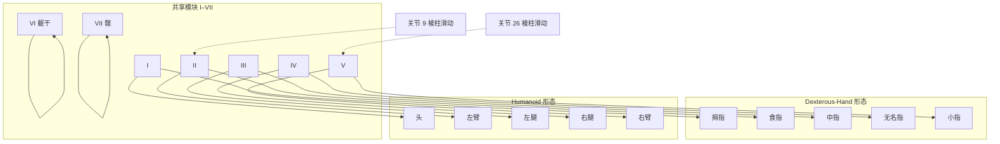
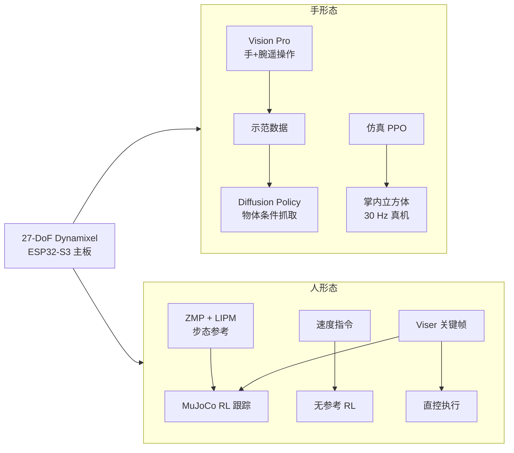

# Handroid

## 一句话定义

**Handroid** 是北卡罗来纳大学教堂山分校与斯坦福大学团队提出的 **桌面级双形态机器人**：同一套 **27-DoF**、**0.33 m / 2.05 kg** 的 **3D 打印模块化机电系统**，可通过 **两条棱柱滑动机构** 在 **20-DoF 仿人灵巧手** 与 **含 12-DoF 下肢的桌面人形** 之间重配置，并在两种形态上共享 **遥操作、模仿学习、强化学习与运动创作** 接口。

## 英文缩写速查

| 缩写 | 英文全称 | 简要说明 |
|------|----------|----------|
| DoF | Degrees of Freedom | 本机 27 主动轴；手形态约 20 指 DoF，人形态下肢 12 DoF |
| RL | Reinforcement Learning | 掌内立方体重定向与人形行走/速度策略 |
| ZMP | Zero Moment Point | 人形参考步态规划中的支撑多边形约束量 |
| LIPM | Linear Inverted Pendulum Model | 固定高度倒立摆，用于 CoM 轨迹生成 |
| IK | Inverse Kinematics | 由 CoM/足端目标求关节角；论文用 Mink 求解 |
| PD | Power Delivery | USB-C 等外供最高约 140 W |

## 为什么重要

- **打破手 / 人形硬件边界：** 多数灵巧手固定于臂端，mini 人形手往往欠驱动；Handroid 用 **同一批模块** 承担「五指」或「头–臂–腿」，把 **形态学复用** 做成可物理切换的桌面平台，而非纯仿真概念。
- **跨具身学习栈对齐：** 手形态走 **Vision Pro 遥操作 → Diffusion Policy 抓取 → 仿真 PPO 掌内操作**；人形态走 **ZMP 参考 + MuJoCo RL 跟踪**、**无参考速度 RL** 与 **Viser 关键帧**；传感、总线与部署接口一致，利于研究 **跨形态迁移与长时程任务**。
- **可复现锚点：** 论文宣称 **open-source**；截至入库日 **Onshape CAD** 与 **Google Sheets BOM** 已公开，适合 lab 跟踪 **控制/训练代码** 落地进度（项目页 Code 按钮仍为占位）。

## 核心原理

### 模块–形态映射

- **手形态：** 五指各 **1 外展/内收 + 3 屈伸**，共 **20** 主动指关节，接近常用 **21-DoF 人手模型**。
- **人形态：** **4-DoF 头**、**双臂各 4-DoF**、**双腿各 6-DoF**、**1-DoF 髋**；模块 VI 为躯干，模块 VII 为髋部。
- **切换：** 关节 **9、26** 的 **齿条–齿轮棱柱机构** 将模块 II/V 在人形「臂」与手形「食指/小指」位置间 **平移**，无需更换零件。

### 统一学习与控制栈（主干）

| 形态 | 代表能力 | 方法要点 |
|------|----------|----------|
| **手** | 倒水、叠杯、薄物/手套、双物体抓取 | 约 **100** 条遥操作示范 → **Diffusion Policy**；10 类物体 grasp 成功率约 **60–90%** |
| **手** | 掌内立方体重定向 | 仿真 **PPO** + 本体感知，真机 **30 Hz** |
| **人形** | 行走、转向、蹲起 | **ZMP 规划** → **LIPM+LQR** CoM → **Mink IK** → **RL 跟踪** |
| **人形** | 俯卧撑、引体向上 | **Viser 关键帧** 插值或作 RL 参考 |
| **跨形态** | 切换 → 行走 → Franka 对接 → 灵巧放置 | 长时程 **loco-manipulation** 演示 |

## 工程实践

| 维度 | 规格（论文 / 项目页） |
|------|----------------------|
| 规模 | **0.33 m** 高，**2.05 kg** |
| 驱动 | **Dynamixel**（TTL 总线） |
| 计算/通信 | **ESP32-S3** 主板；**Wi-Fi** 状态流；可板载原语或接主机策略 |
| 电源 | 电池或 **PD ≤140 W** 外供；STM32 监测 PSU/电池温度 |
| 传感 | 躯干 **IMU**；指尖（人形时为足端）**IMU** |
| 制造 | **全 3D 打印**、模块化；**Onshape CAD** + **Google Sheets BOM** 已公开 |
| 外设集成 | 手形态常配 **Franka Research 3** 臂做臂–手统一遥操作与对接 |

**复现路径（截至入库日）：** 从 [项目页](https://handroid.org/) 获取 **arXiv 论文**、**Onshape** 与 **BOM** → 按 BOM 采购 Dynamixel 与打印件 → 组装后通过主板 Wi-Fi/手柄验证关节；**训练与部署代码** 需等待官方 Code 链接发布后再对齐论文附录管线。

## 局限与风险

- **开源边界：** 论文写 **open-source**，但项目页 **Code 为占位**；复现者当前只能依赖 **CAD/BOM**，**仿真环境、策略权重与部署脚本** 尚不可用——按 **部分开源（机械已发布 / 软件待发布）** 记录（**2026-07-21** 复核查实仍无有效 Code URL）。
- **桌面尺度：** 非全尺寸人形，**载荷、行走鲁棒性与真实场景通过性** 不能外推到 Unitree G1/H1 等级平台。
- **形态切换成本：** 长时程任务需 **物理重配置 + 与外部臂对接**，工程上比固定形态平台更复杂。
- **执行器族：** 基于 **Dynamixel** 与 3D 打印结构，耐久性与精度需按桌面研究平台预期管理。

## 关联页面

- [Manipulation](../tasks/manipulation.md) — 灵巧操作与扩散/RL 策略语境
- [Loco-Manipulation](../tasks/loco-manipulation.md) — 跨形态长时程任务定位
- [Teleoperation](../tasks/teleoperation.md) — Vision Pro 臂–手遥操作范例
- [RUKA-v2 Hand](./ruka-v2-hand.md) — 全栈已开源灵巧手对照
- [ToddlerBot（161 索引）](./paper-loco-manip-161-141-toddlerbot.md) — 桌面/小型人形 ML 平台对照
- [开源人形硬件对比](./open-source-humanoid-hardware.md) — 开源整机选型地图
- [灵巧操作数据采集指南](../queries/dexterous-data-collection-guide.md) — 低成本示教与策略训练入口

## 参考来源

- [handroid_arxiv_2607_16187.md](../../sources/papers/handroid_arxiv_2607_16187.md) — arXiv:2607.16187 论文归档
- [handroid-org.md](../../sources/sites/handroid-org.md) — 官方项目页与资源链核查

## 推荐继续阅读

- 论文 HTML：<https://arxiv.org/html/2607.16187>
- 官方项目页：<https://handroid.org/>
- Onshape CAD：<https://cad.onshape.com/documents/d3de21915f3c9cacc1887cf3/w/dc7c7b68235fdbb205f27505/e/8673167885a4e16e9b6c2791>
