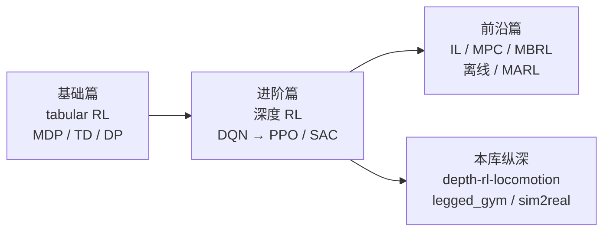

# 动手学强化学习（Hands-on RL / 蘑菇书）

**《动手学强化学习》**（社区常称**蘑菇书**）由上海交通大学张伟楠、沈键、俞勇等编写，以 Jupyter Notebook + 图文形式系统讲解强化学习。官方在线阅读与代码运行入口为 [hrl.boyuai.com](https://hrl.boyuai.com/)，源码在 [boyu-ai/Hands-on-RL](https://github.com/boyu-ai/Hands-on-RL)，配套 [伯禹学习平台免费视频课](https://www.boyuai.com/elites/course/xVqhU42F5IDky94x)。

对本知识库而言，它是**中文 RL 基础与主流深度 RL 算法**的推荐底座，适合接 [`roadmap/depth-rl-locomotion.md`](../../roadmap/depth-rl-locomotion.md) 的 Stage 0，再进入人形 locomotion 与 sim2real 专题。

## 为什么重要？

1. **中文友好、代码可跑**：每章一个 notebook，站点支持在线执行；比纯英文 Spinning Up 更易建立 MDP → PPO/SAC 的完整直觉。
2. **算法栈与机器人 RL 主线对齐**：进阶篇直接覆盖策略梯度、Actor-Critic、TRPO、**PPO**、DDPG、**SAC**——与人形/腿足仿真里最常用的两类算法一致。
3. **前沿篇衔接本库方法页**：模仿学习、MPC、基于模型的策略优化、离线 RL、多智能体 RL 均有对应章节，便于从教材跳到 wiki 深化。

## 学习路径总览

## 章节地图（与本知识库的对应）

| 教材部分 | 代表章节 | 本库相关页面 |
|---------|---------|-------------|
| 基础篇 | 马尔可夫决策过程 | [MDP](../formalizations/mdp.md)、[Bellman 方程](../formalizations/bellman-equation.md) |
| 基础篇 | 动态规划 / 时序差分 | [Reinforcement Learning](../methods/reinforcement-learning.md)（价值迭代与 TD 脉络） |
| 进阶篇 | DQN 及改进 | [Reinforcement Learning](../methods/reinforcement-learning.md)（离散动作价值学习） |
| 进阶篇 | 策略梯度 / Actor-Critic | [Policy Optimization](../methods/policy-optimization.md)（若存在）、RL 方法页 |
| 进阶篇 | **PPO** / **SAC** | [PPO vs SAC](../comparisons/ppo-vs-sac.md)、[Reinforcement Learning](../methods/reinforcement-learning.md) |
| 前沿篇 | 模仿学习 | [Imitation Learning](../methods/imitation-learning.md)、[RL vs IL](../comparisons/rl-vs-il.md) |
| 前沿篇 | 模型预测控制 | [Model Predictive Control](../methods/model-predictive-control.md)、[MPC vs RL](../comparisons/mpc-vs-rl.md) |
| 前沿篇 | 基于模型的策略优化 | [Model-Based RL](../methods/model-based-rl.md) |
| 前沿篇 | 离线强化学习 | [Online vs Offline RL](../comparisons/online-vs-offline-rl.md) |
| 前沿篇 | 多智能体 RL | [MARL](../methods/marl.md) |

## 三种学习形态

| 形态 | 入口 | 适用场景 |
|------|------|----------|
| 在线书 + 在线 notebook | [hrl.boyuai.com](https://hrl.boyuai.com/chapter) | 首选：渲染与交互体验最好 |
| 本地 clone + Jupyter | [GitHub 仓库](https://github.com/boyu-ai/Hands-on-RL) | 离线改代码、对接自有环境 |
| 视频 + 讨论 | [伯禹课程](https://www.boyuai.com/elites/course/xVqhU42F5IDky94x) | 需要讲解节奏与社群讨论时 |

**环境提示：** 仓库 README 建议 `gym==0.18.3`；若 notebook 报错，先核对 Gym 版本再查 issue。

## 局限（相对机器人研究）

- **环境以经典 Gym 为主**，不包含 Isaac Lab、人形 URDF、接触丰富仿真。
- **不覆盖** AMP/DeepMimic、WBC+RL 分层、域随机化 sim2real 等本库运动控制专题——需在 Stage 0 之后转入 [`depth-rl-locomotion`](../../roadmap/depth-rl-locomotion.md) 与 [`Locomotion`](../tasks/locomotion.md)。
- 与 [`Modern Robotics`](./modern-robotics-book.md) 互补：后者补刚体运动学与经典控制，蘑菇书补 RL 算法与深度 RL 训练。

## 推荐使用方式

| 目标 | 建议章节 | 之后跳转 |
|------|---------|----------|
| 零基础理解 MDP 与 TD | 基础篇 Ch3–Ch5 | [MDP](../formalizations/mdp.md) |
| 做人形 RL 前的算法准备 | 进阶篇 PPO + SAC | [depth-rl-locomotion Stage 0](../../roadmap/depth-rl-locomotion.md) |
| 理解 IL 与 RL 如何并存 | 前沿篇模仿学习 | [RL vs IL](../comparisons/rl-vs-il.md) |
| 了解离线 RL 与分布偏移 | 前沿篇离线 RL | [Online vs Offline RL](../comparisons/online-vs-offline-rl.md) |

## 关联页面

- [Reinforcement Learning](../methods/reinforcement-learning.md) — 本库 RL 方法总览
- [Robot Learning Overview](../overview/robot-learning-overview.md) — 机器人学习全景
- [depth-rl-locomotion](../../roadmap/depth-rl-locomotion.md) — 人形 RL 运动控制纵深路线
- [Modern Robotics Book](./modern-robotics-book.md) — 传统机器人学中文/英文教材互补

## 参考来源

- [sources/repos/boyu_ai_hands_on_rl.md](../../sources/repos/boyu_ai_hands_on_rl.md)
- [sources/sites/hrl-boyuai-hands-on-rl.md](../../sources/sites/hrl-boyuai-hands-on-rl.md)
- [sources/courses/boyuai_hands_on_rl_elites_course.md](../../sources/courses/boyuai_hands_on_rl_elites_course.md)
- [动手学强化学习在线书](https://hrl.boyuai.com/)
- [boyu-ai/Hands-on-RL](https://github.com/boyu-ai/Hands-on-RL)

## 推荐继续阅读

- Sutton & Barto, *Reinforcement Learning: An Introduction*
- [OpenAI Spinning Up in Deep RL](https://spinningup.openai.com)
