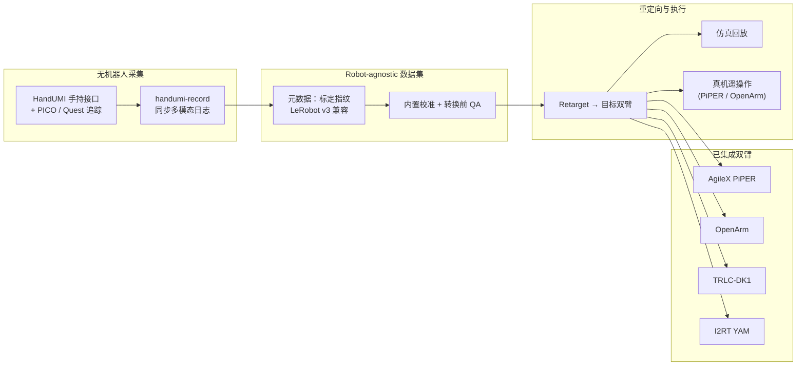

# HandUMI

**HandUMI** 是一套面向 **固定基座双臂 + 平行夹爪（parallel-jaw gripper）** 的 **无机器人示教（robot-free demonstration）** 接口与开源软件栈（[robonet-ai/handumi-sw](https://github.com/robonet-ai/handumi-sw)，Apache-2.0）。操作者佩戴/手持 HandUMI 采集同步多模态示范后，同一批 **robot-agnostic** 数据可经内置 **校准、转换前 QA、仿真回放与真机遥操作**，重定向到 **AgileX PiPER、OpenArm、TRLC-DK1、I2RT YAM** 等不同双臂平台——**无需为每台目标机器人重新做 leader–follower 遥操作采集**。

## 核心信息

| 字段 | 内容 |
|------|------|
| 机构 | 机器人网络（RoboNet AI） |
| 许可 | Apache-2.0（软件）；硬件/头显应用/数据集许可另计 |
| 追踪 | PICO（XRoboToolkit）；Meta Quest（handumi-quest-app） |
| 数据格式 | LeRobot v3 兼容同步捕获 |

## 英文缩写速查

| 缩写 | 英文全称 | 简要说明 |
|------|----------|----------|
| UMI | Universal Manipulation Interface | 手持夹爪+腕部相机的便携无机器人示教范式（HandUMI 谱系相关） |
| QA | Quality Assurance | 转换到目标机器人前的数据质量检查 |
| TCP | Tool Center Point | 工具中心点；控制器到夹爪 TCP 的标定影响重定向精度 |
| IL | Imitation Learning | 示教数据常用于 BC / ACT / Diffusion Policy 等模仿学习 |
| LeRobot | LeRobot (Hugging Face) | 具身数据与训练框架；HandUMI 导出 LeRobot v3 兼容格式 |

## 为什么重要

在 [bimanual-manipulation](../tasks/bimanual-manipulation.md) 与桌面/工位 **双臂操作** 落地中，**平行夹爪双臂** 往往是初创公司与实验室 **最先产生商业价值** 的具身形态：任务足够丰富（递接、装配、打包），硬件成本低于全身人形，又比单臂更能表达双手协同。瓶颈常在 **数据采集**——传统 [ALOHA](./aloha.md) 式 leader–follower 需要 **每台目标臂一套遥操作硬件**，规模化慢、设备绑定强。

HandUMI 把问题切成两步：

1. **采集阶段**：用可穿戴 HandUMI + PICO / Quest 追踪，**脱离目标机器人** 记录同步示范；
2. **部署阶段**：对选定 embodiment 做 **标定指纹 + 重定向 + QA**，再仿真预览或真机回放/遥操作。

这与 [BifrostUMI](./paper-bifrost-umi.md)、[HALOMI](./paper-halomi-humanoid-loco-manipulation.md) 等 **无机器人示范** 路线同族，但 HandUMI **明确收敛到平行夹爪双臂工位**，而非全身人形 loco-manipulation；工程上更贴近 **LeRobot 生态的数据飞轮**（见 [LeRobot](./lerobot.md)）。

## 流程总览

## 核心机制

### 1）模块化采集：换夹爪即可开录

HandUMI 强调 **夹爪可更换**：在同一臂型上替换平行夹爪模块后即可继续采集，无需重做整机遥操作栈。原始捕获格式保持 **与具体 URDF 解耦**， embodiment 差异在 **重定向与标定阶段** 注入。

### 2）标定指纹与可复现转换

物理 **控制器→TCP** 标定结果写入数据集 **metadata**。后续把同一份示范转换到 PiPER、OpenArm 等臂时，可追踪「用了哪套标定、哪版机器人配置」，避免 silently wrong retargeting——这是 **多机器人复用单批数据** 的前提。

### 3）LeRobot 兼容导出

导出 **LeRobot-compatible synchronized captures**（文档与 README 表述；与 [LeRobot](./lerobot.md) v3 数据管线对齐），便于直接进入 `lerobot-train`、Hub 上传或与 ACT / Diffusion / VLA 后训练栈对接，而不必维护私有二进制格式。

### 4）仿真回放 + 真机遥操作双通道

- **仿真回放**：在命令真机前 **预览/验证轨迹**（依赖 MuJoCo 等栈，见上游 credits）；
- **真机遥操作（可选 backend）**：当前文档列 **AgileX PiPER、OpenArm** 支持；其余 embodiment 以 **重定向回放** 为主。

追踪侧：**PICO** 经 XRoboToolkit；**Meta Quest** 经 [handumi-quest-app](https://github.com/robonet-ai/handumi-quest-app)。

## 工程实践

| 步骤 | 建议 |
|------|------|
| 环境 | Python **3.12+**，[uv](https://docs.astral.sh/uv/)，`bash install.sh`（Quest-only 工作站可加 `--skip-xrt`） |
| 采集 | `handumi-record`；先完成 HandUMI 与追踪设备标定 |
| 质检 | 转换前跑内置 **QA**，检查同步、夹爪通道与标定元数据 |
| 重定向 | 选定目标臂配置 → retarget → **仿真预览** → 真机 |
| 训练 | 导出 LeRobot 数据集 → [imitation-learning](../methods/imitation-learning.md) / [LeRobot](./lerobot.md) 训练管线 |

**安全（上游强调）：** 研究软件；真机前务必预览轨迹、备急停，并遵守关节/速度/工作空间/碰撞限制。

## 局限与风险

- **具身范围**：优化 **固定基座 + 平行夹爪双臂**；**非** 灵巧手、非移动人形全身——与 [BifrostUMI](./paper-bifrost-umi.md) / [HALOMI](./paper-halomi-humanoid-loco-manipulation.md) 的全身路线互补而非替代。
- **重定向误差**：跨臂 DoF、基座高度、夹爪行程差异仍会引入 embodiment gap；QA 与仿真预览是必要步骤，不能假设「采一次处处零调」。
- **真机遥操作覆盖不均**：截至入库日，**PiPER / OpenArm** 有可选遥操作 backend；TRLC-DK1、YAM 等以回放集成为主，部署前需读官方 integration 文档。
- **硬件与软件分仓**：机械设计在 [BrikHMP18/HandUMI](https://github.com/BrikHMP18/HandUMI)，本实体侧重 **handumi-sw** 软件栈；许可证上数据集/硬件/头显应用 **另计**（软件本体 Apache-2.0）。

## 开源状态（项目页核查，2026-07-19）

| 组件 | 状态 |
|------|------|
| **handumi-sw** | **已开源** — [GitHub](https://github.com/robonet-ai/handumi-sw)，Apache-2.0 |
| **HandUMI 硬件** | 独立开源仓 [BrikHMP18/HandUMI](https://github.com/BrikHMP18/HandUMI) |
| **Quest 应用** | [robonet-ai/handumi-quest-app](https://github.com/robonet-ai/handumi-quest-app) |
| **预训练策略/公开大数据集** | 文档未列官方权重；定位是 **工具链 + 自采数据** |

## 关联页面

- [Teleoperation（遥操作）](../tasks/teleoperation.md) — 无机器人示范在遥操作谱系中的位置
- [Bimanual Manipulation（双臂协调操作）](../tasks/bimanual-manipulation.md) — 双手协同任务与数据需求
- [LeRobot (Hugging Face)](./lerobot.md) — 兼容的数据与训练入口
- [ALOHA (双臂遥操作硬件)](./aloha.md) — 传统 leader–follower 双臂采集对照
- [BifrostUMI](./paper-bifrost-umi.md) — 无机器人示范 → 人形全身对照

## 参考来源

- [HandUMI Software 仓库归档](../../sources/repos/handumi-sw.md)
- [HandUMI 文档站归档](../../sources/sites/handumi-sw.md)

## 推荐继续阅读

- [HandUMI 官方文档](https://robonet-ai.github.io/handumi-sw/)
- [handumi-sw GitHub README](https://github.com/robonet-ai/handumi-sw)
- [Add a new robot embodiment](https://robonet-ai.github.io/handumi-sw/development/new_embodiment.html) — 贡献新双臂集成
