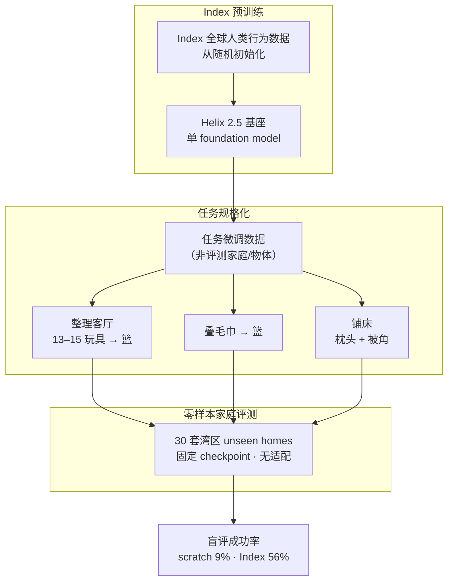

# Helix 2.5（Index 预训练 · 30 家庭零样本全身）

| 字段 | 内容 |
|------|------|
| **机构** | 人形机器人公司（Figure AI） |
| **类型** | 产业博客发布的神经网络策略系统（非单篇论文） |
| **前序** | [Helix / Helix 02](https://www.figure.ai/news/helix-02) — 长时程全身协同，但数据来自部署环境 |
| **发布** | 2026-09-17 |
| **硬件** | Figure 人形（文内演示；与 Figure 03 端侧 Helix 叙事同族） |

**Helix 2.5** 是 Figure 迄今最强的 **全身神经网络策略**：在 **Index** 全球人类行为数据上 **从随机初始化预训练**（区别于 Helix 02 的 VLM 初始化），再经 **任务规格数据微调** 适配具体 locomanipulation 行为，并在 **30 套从未进入采集管线** 的真实家庭中 **零权重适配** 评测。

## 一句话定义

**以 Index 人类经验预训练单基座全身策略，用减半的任务数据规格化三项家务式 locomanipulation，并在 30 套 unseen 家庭中固定 checkpoint 零样本部署——Index 预训练 alone 将盲评成功率从 9% 提到 56%。**

## 英文缩写速查

| 缩写 | 英文全称 | 简要说明 |
|------|----------|----------|
| VLA | Vision-Language-Action | Figure Helix 系列的视觉-语言-动作多模态策略方向 |
| WBC | Whole-Body Control | 感知、 locomotion 与 manipulation 不可分时的全身协调 |
| BC | Behavior Cloning | 任务规格阶段的示范/行为克隆式微调（文内未详述损失，属归纳） |
| O.O.D. | Out-of-Distribution | 零样本家庭布局与物体相对训练/规格数据分布外 |

## 为什么重要

- **零样本家庭尺度：** 作者称首次在 **人形** 上以 **30 套真实 unseen homes**、**三项长时程全身行为**、**单一 checkpoint** 报告零样本 locomanipulation——把「每换一家就要重采/微调」的产业痛点推到可量化对照。
- **Index 因果贡献可分离：** 固定架构/优化/任务数据，仅换 **是否 Index 初始化**，成功率 **9% → 56%**，为「人类视频预训练 → 机器人零样本」提供 **产业侧 ablation**（非第三方复现）。
- **数据效率 × 泛化范围：** 相对 Helix 02 代表行为 **任务数据减半**、评测家庭 **30×**，说明预训练改变的是 **规格化新行为的成本曲线**，而不只是单点 demo。
- **Scaling law 叙事：** Index 数据 **8×** 嵌套子集上 downstream action-prediction loss 可 **四位小数预报** 最大 run——若成立，则人形 foundation 训练可部分借用 LLM 式 **预算规划**（仍仅 Figure 自报）。
- **与 VLA 演进线对齐：** Helix 02 代表 **三系统分层 + 部署环境数据**；Helix 2.5 把主线推进到 **Index 人类预训练 + 零样本家庭泛化**，见 [VLA 演进技术地图](../overview/vla-evolution-lineage.md)。

## 流程总览

## 核心结构

### 「零样本」操作定义

文内 **zero-shot** 指：

- **评测家庭：** 30 套中 **零机器人数据采集**；
- **评测物体：** 玩具、毛巾、床品 **未出现在任务规格数据**（AI + 人工复核）；
- **仍有的监督：** 任务行为通过 **其他环境采集的微调数据** 指定；**非** 纯 prompt 即跑。

读法：这是 **环境/物体 O.O.D. 泛化** 评测，不是「无任何机器人示范」的纯 zero-shot RL。

### 三项 locomanipulation 任务

| 任务 | 能力组合 | 成功判据（无部分分） |
|------|----------|----------------------|
| **Living Room Tidy** | 主动感知 + 移动 + 抓取放置 | 全部 **13–15** 玩具入篮 |
| **Towel Folding** | 软体操作 + 双手 | 全部毛巾折叠并入篮 |
| **Bed Making** | 全身 reposition + 双手 + 长时程 | 枕头与被角至床头上 1/3，被面拉平 |

家庭场景迫使 **locomotion 与 manipulation 联合求解**（窄通道、 clutter、无固定工位），与桌面臂「固定 workspace」泛化设定不同。

### Index 预训练 ablation

| 初始化 | 盲评成功率 | 解读 |
|--------|------------|------|
| 随机权重 + 相同任务数据 | **9%** | 无 broad human pretrain 时，规格数据 alone 难以跨 30 家庭 |
| Index 预训练 + 相同任务数据 | **56%** | 约 **6×**；作者称 Index 贡献 **大部分** 零样本能力 |

Helix 2.5 基座本身 **仅 Index 预训练**；Helix 02 则从 **预训练 VLM** 起步——两代 **预训练数据源与初始化** 不同，不宜直接比参数量或架构。

### 相对 Helix 02 的数据效率

- Helix 02 代表行为：在 **评测环境内采数据** 训练；
- Helix 2.5：**一半** 任务规格数据，却在 **30× unseen homes** 达到可比成功率（官方自报，任务未必一一相同）。

### 全身自纠错（定性）

评测中出现 **后退、换 stance、绕床修正** 等 recovery；作者将其与 Index 上的 **broad human experience** 联系——与长时程 mission 里的「局部重试」同类，但此处 **无 mission VLM 显式 replan** 描述。

### 人→人形迁移 scaling law

- 4 个模型，Index 预训练数据 **8×** 嵌套；模型规模与下游训练固定；
- 每 **翻倍** Index 数据，held-out **action-prediction loss** 平滑下降；
- 用小 run **预报** 最大 run loss 至 **四位小数**，误差 **0.54%**（全 8× 范围变异内）。

**边界：** 测的是 **预训练数据 scaling**，非模型 width/depth 或下游 RL 全栈；是否外推到 **成功率** 未在文内建立同样精度的 law。

## 工程实践

| 维度 | Figure 文内可引用要点 |
|------|------------------------|
| **数据** | Index 预训练 + 任务规格数据（排除评测 home/object） |
| **部署** | **单 checkpoint** 跨 30 家庭；无 per-home 微调 |
| **评测** | 盲评；安全人工介入 = 失败；分任务超时（玩具 1 min/个等） |
| **算力叙事** | Index ~**35 min/s** 新人类经验；**$3.5B** 算力承诺训练 Helix |
| **开源** | **未开源** — 无公开权重/代码/Index 数据（见 [Figure AI 归档](../../sources/repos/figure-ai.md)） |

## 局限与风险

- **非 peer review：** 56%/9%、scaling law、30 家庭均为 **Figure 自报**；任务分布仅三项家务式 locomanipulation。
- **「零样本」易误读：** 仍有 **任务微调数据** 与 **固定 checkpoint 选型**（虽文内称未用评测 rollout 选 checkpoint）；不是进任意家庭 arbitrary language task 即做。
- **成功率绝对值：** 56% 意味着 **近半失败**；长时程、安全中止、超时 rubric 下 **不宜** 等同产品级可靠性。
- **学术复现：** Index 与 Helix 2.5 **不可公开复现**；与 [Isaac GR00T](./isaac-gr00t.md) 等开源 VLA 栈 **互补对照**，非替代关系。
- **地理/户型：** 30 套湾区家庭；家具高度、通道宽度、物体类别 **不能** 外推全球家庭。

## 关联页面

- [Figure AI](./figure-ai.md) — 整机 + Index 数据平台
- [VLA](../methods/vla.md) — Helix 在 VLA / foundation policy 脉络中的位置
- [Loco-Manipulation](../tasks/loco-manipulation.md) — 任务定义与评价维度
- [人形数据采集产业地图](../queries/humanoid-robot-data-collection-landscape.md) — Index 众包范式
- [六条路线的窟窿](../queries/embodied-six-routes-holes.md) — 演示 vs 数据/算力饥渴
- [Gemini Robotics](./gemini-robotics.md) — 另一路 **分层 + 端侧** 全身 VLA 对照

## 参考来源

- [Helix 2.5 官方新闻归档](../../sources/blogs/figure_ai_helix_25_zero_shot_30_home_generalization.md)
- [Figure AI 公司与 Index 背景](../../sources/repos/figure-ai.md)

## 推荐继续阅读

- [Figure · Helix 2.5 原文](https://www.figure.ai/news/helix-2-5-zero-shot-30-home-generalization)
- [Figure · Helix 02](https://www.figure.ai/news/helix-02)
- [Helix 产品页](https://www.figure.ai/helix)
