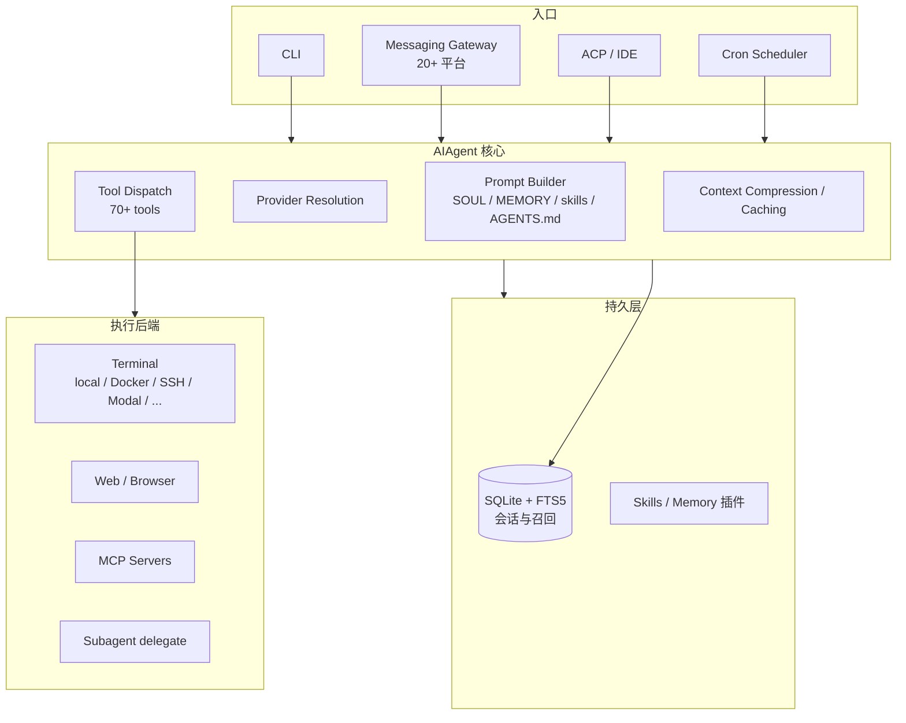

# Hermes Agent（Nous Research）

**Hermes Agent** 是 [Nous Research](https://nousresearch.com/) 维护的开源自主代理栈（[NousResearch/hermes-agent](https://github.com/NousResearch/hermes-agent)）：强调 **跨会话成长**（记忆、技能创建与改进、用户模型），而非 IDE 内嵌的 coding copilot 或单模型聊天前端。用户通过 CLI、Telegram / Discord / Slack 等 **Messaging Gateway**，或 VS Code / Zed / JetBrains 的 **ACP** 与同一 `AIAgent` 核心交互。

## 一句话定义

用 **平台无关的 AIAgent 环 + 持久会话/记忆/技能 + 多后端沙箱工具链 + 统一消息网关**，把「长期驻留、可调度、可扩展」的代理能力从笔记本 IDE 解耦到任意服务器或无服务器环境。

## 为什么重要（对本知识库读者）

- **与 Karpathy LLM Wiki 同构轴、不同落点：** [LLM Wiki（Karpathy 模式）](../references/llm-wiki-karpathy.md) 把 **知识** 编译进 `wiki/`；Hermes 把 **行为与程序性记忆** 编译进 **技能、MEMORY.md、USER.md、SOUL.md** 与 SQLite 会话。维护本仓库的 agent 可对照两者：**结构化 markdown 知识库** vs **可执行代理运行时**。
- **与 Superpowers / Agent Reach 的互补：** [Superpowers（obra）](superpowers-obra.md) 提供 **TDD / worktree / 子代理评审** 等 **交付流程技能**；[Agent Reach](agent-reach.md) 聚合 **外网读搜上游 CLI**；Hermes 自带 web/browser/MCP/终端，并覆盖 **网关、cron、沙箱、轨迹导出**，更接近 **agent OS**。
- **研究侧接口：** 文档与代码路径支持 **批处理、ShareGPT 轨迹、Atropos RL**，对需要 **从代理交互生成训练数据** 的机器人学习管线有参照价值（与仿真 RL 栈正交，但共享「轨迹 → 策略」思维）。

## 核心结构

| 层次 | 内容 |
|------|------|
| **入口** | `cli.py`（HermesCLI）、`gateway/run.py`（GatewayRunner + 20 平台 adapter）、`acp_adapter/`、batch / API server |
| **Agent 环** | `run_agent.py` 中 `AIAgent`：prompt 组装、provider 解析（chat_completions / codex_responses / anthropic_messages）、工具循环、压缩与缓存 |
| **工具** | `tools/registry.py` 自注册，70+ 工具、~28 toolsets；终端 7 后端、浏览器 5 后端、MCP 动态接入、`delegate_tool` 子代理 |
| **状态** | `hermes_state.py`：SQLite + FTS5；gateway `session.py` 按平台隔离会话 |
| **记忆 / 技能** | Memory provider 插件（单选）；技能兼容 agentskills.io；Honcho  dialectic 用户建模（文档叙述） |
| **调度** | `cron/`：自然语言 cron，任务为 **agent 任务**（非裸 shell），可附技能并向任意平台投递 |
| **配置** | `hermes_cli/config.py`、`HERMES_HOME`；**Profile**（`hermes -p`）隔离配置、记忆、会话与 gateway PID |

### 流程总览（概念级）

### 与「IDE Copilot」的边界（文档叙事）

| 维度 | IDE tethered copilot（典型） | Hermes Agent（文档定位） |
|------|------------------------------|---------------------------|
| **驻留** | 编辑器会话内 | 服务器 / 无服务器实例，多通道接入 |
| **记忆** | 常限于当前工作区上下文 | 跨会话 FTS5 + 技能/记忆文件 + 用户模型 |
| **触达** | 单 IDE | CLI + 即时通讯 + 邮件等网关 |
| **自动化** | 少见一等 cron | 内置 cron，可向聊天平台投递 |
| **沙箱** | 依赖 IDE/扩展 | 多后端容器/SSH/Modal 等可配置 |

## 常见误区或局限

- **误区：等价于「再装一个 ChatGPT 壳」。** 实质是 **工具环 + 网关 + 持久状态**；模型可通过 Nous Portal、OpenRouter、OpenAI 等接入，但价值在 **长期运行与技能闭环**，不在单一聊天 UI。
- **误区：可替代本仓库 `schema/ingest`。** 本知识库规约面向 **机器人 wiki 与派生导出**；Hermes 的 `AGENTS.md` / `.hermes.md` 是 **项目上下文文件**，二者可并存但 **检查项与产物不同**。
- **局限：** 平台适配器、提供商列表与安装脚本变更频繁；本页不固化命令行。安全模型（命令 approval、DM pairing）需按 [官方 Security 文档](https://hermes-agent.nousresearch.com/docs/user-guide/security) 自行评估后再接生产网关。

## 关联页面

- [SenseNova-Skills](sensenova-skills.md) — **办公生产力** Agent Skills（PPT/Excel/深度研究）；推荐安装至 `~/.hermes/skills/`
- [Superpowers（obra）](superpowers-obra.md) — 编码代理 **软件工程流程** 技能库
- [Agent Reach](agent-reach.md) — 编码代理 **外网读搜** 脚手架
- [LLM Wiki（Karpathy 模式）](../references/llm-wiki-karpathy.md) — **持久 wiki 知识编译** 范式
- [Ingest Workflow](../../schema/ingest-workflow.md) — 本仓库维护操作规范

## 参考来源

- [Hermes Agent 仓库源归档（本站）](../../sources/repos/nousresearch_hermes_agent.md)
- [Hermes Agent 官方站点与文档归档（本站）](../../sources/sites/hermes-agent-nousresearch-docs.md)
- [NousResearch/hermes-agent（GitHub）](https://github.com/NousResearch/hermes-agent)
- [Hermes Agent 文档](https://hermes-agent.nousresearch.com/docs)
- [Architecture（开发者指南）](https://hermes-agent.nousresearch.com/docs/developer-guide/architecture)

## 推荐继续阅读

- [Hermes Agent 文档：Memory System](https://hermes-agent.nousresearch.com/docs/user-guide/features/memory) — 跨会话记忆与 nudge 机制
- [Hermes Agent 文档：Skills System](https://hermes-agent.nousresearch.com/docs/user-guide/features/skills) — 程序性记忆与 agentskills.io 互操作
- [Hermes Agent 文档：Messaging Gateway](https://hermes-agent.nousresearch.com/docs/user-guide/messaging) — 多平台网关与授权模型
- [llms.txt 索引](https://hermes-agent.nousresearch.com/docs/llms.txt) — 机器可读的全文档目录（适合增量 ingest）
