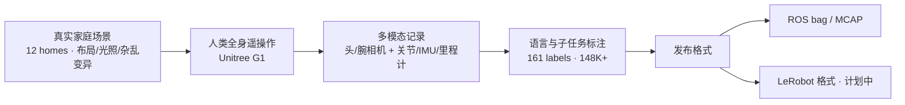

# HIW-500（野外人形遥操作数据集）

**HIW-500**（Humanoids In-the-Wild Dataset，<https://bitrobot-foundation.github.io/humanoids-in-the-wild-500-hours/>）是 BitRobot 与 Unitree、Hugging Face 联合发布的 **大规模开源人形机器人远程操作数据集**：在东南亚 **12 个真实家庭** 中记录 **Unitree G1** 全身遥操作示范，强调 **布局、物体状态、光照、杂乱度与操作员风格** 的 episode 间变异，而非实验室固定场景。

## 英文缩写速查

| 缩写 | 英文全称 | 简要说明 |
|------|----------|----------|
| HIW | Humanoids In-the-Wild | 真实野外/家庭环境中的人形机器人数据 |
| G1 | Unitree G1 Humanoid | 宇树教育科研人形实验平台 |
| IL | Imitation Learning | 遥操作示范常用于 BC / 扩散 / VLA 模仿学习 |
| MCAP | MCAP | 机器人多模态记录容器格式（与 ROS bag 并列发布） |
| WBC | Whole-Body Control | 全身遥操作需协调移动基座与双臂 |
| HF | Hugging Face | 托管数据集与 LeRobot 生态的平台 |

## 为什么重要

- **规模与开放度：** 据项目页为当前 **最大规模开源人形遥操作数据集之一**（**500+ 小时 / 23K+ 集 / ~10 TB**），显著大于多数已公开 G1 真机示范集。
- **in-the-wild 家庭场景：** 在 **真实住宅** 采集，任务含整理房间、冰箱补货、扫地、洗衣等 **长程家务**，直接服务 **移动操作（loco-manipulation）** 与 **开放世界泛化** 研究。
- **多模态 + 语言：** 头/腕多路 RGB（含立体/IR）+ 29-DoF 状态与动作 + **161 类子任务 / 148K+ 细粒度语言标注**，便于 VLA 与分层技能学习。
- **与 LeRobot 生态衔接：** 除原始 ROS bag / MCAP 外，**LeRobot 格式版本** 在路线图中，降低接入 [LeRobot](./lerobot.md) 训练管线的摩擦。

## 核心信息

| 字段 | 内容 |
|------|------|
| 机构 | BitRobot、宇树科技（Unitree）、Hugging Face |
| 机器人 | Unitree G1 + **夹爪**（家务抓取/放置） |
| 场景 | 东南亚 **12** 个真实家庭 |
| 规模 | **500+ h** · **23K+ episodes** · **~10 TB** |
| 任务 | **10+** 家务类（摆桌、厨房整理、扫地、洗衣等） |
| 标注 | **161** 子任务标签 · **148K+** 子任务语言标注 |
| 传感 | 头部 RGB 立体 + 腕部 RGB/IR 立体（480p@30Hz）；关节/IMU/里程计 |
| HF 入口 | <https://huggingface.co/datasets/BitRobot/HIW-500> |
| 许可 | Humanoid Data for Training & Evaluation（商用需联系发布方） |

## 流程总览

## 常见误区或局限

- **不是人体 MoCap 参考库：** 与 [AMASS](./amass.md) / [PHUMA](./dataset-bfm-phuma.md) 等 **参考运动** 不同，数据已是 **机器人执行轨迹**，适合 IL/VLA，不宜直接当 WBT 人体重定向源。
- **末端为夹爪而非灵巧手：** 任务以家务 **抓取/放置** 为主，精细灵巧操作覆盖有限。
- **LeRobot 格式尚未全量：** 当前 HF 以 **原始 ROS/MCAP** 为主；训练前需确认格式版本与加载脚本。
- **地域与户型偏差：** 东南亚家庭布局与物体分布决定 **跨地域 sim2real** 上限，不宜当作全球家庭分布的代表。

## 与其他页面的关系

- **同类真机操作集：** [Humanoid Everyday](./humanoid-everyday-dataset.md)（USC/TRI，260 任务 / 10.3k 轨迹，多传感含 LiDAR/触觉）
- **遥操作任务域：** [Teleoperation](../tasks/teleoperation.md)、[Loco-Manipulation](../tasks/loco-manipulation.md)
- **训练数据管线：** [Humanoid Training Data Pipeline](../queries/humanoid-training-data-pipeline.md) 第 1 层「真机操作数据」
- **平台：** [Unitree G1](./unitree-g1.md)、[LeRobot](./lerobot.md)

## 参考来源

- [HIW-500 项目页与 HF 归档](../../sources/sites/hiw-500-dataset.md)
- 项目页：<https://bitrobot-foundation.github.io/humanoids-in-the-wild-500-hours/>
- 数据集：<https://huggingface.co/datasets/BitRobot/HIW-500>

## 关联页面

- [Teleoperation](../tasks/teleoperation.md)
- [Humanoid Everyday](./humanoid-everyday-dataset.md)
- [Unitree G1](./unitree-g1.md)
- [LeRobot](./lerobot.md)

## 推荐继续阅读

- [HIW-500 项目页](https://bitrobot-foundation.github.io/humanoids-in-the-wild-500-hours/) — 任务分布、硬件栈与 Rerun 预览
- [Humanoid Everyday 项目页](https://humanoideveryday.github.io/) — 另一大规模真机人形操作集对照
- [LeRobot 文档](https://github.com/huggingface/lerobot) — 计划中的 HIW-500 LeRobot 格式接入
