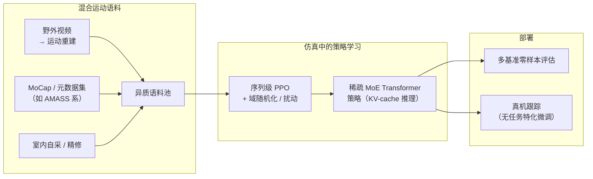

# HoloMotion（HoloMotion-1）

**HoloMotion-1** 是 **Horizon Robotics（地平线）** 发布的 **人形全身运动跟踪** 路线：把跟踪策略建成可在 **大规模异质运动语料** 上训练的 **高容量时序策略**，并在 **未见运动与采集条件** 下做 **零样本** 评估，报告 **无任务特化微调** 的真机迁移。工程侧提供 **GitHub 代码**、**Hugging Face 权重**、**Docker 镜像** 与 **GitHub Pages 文档**，与技术报告 [arXiv:2605.15336](https://arxiv.org/abs/2605.15336) 一致。

## 英文缩写速查

| 缩写 | 英文全称 | 简要说明 |
|------|----------|----------|
| MoCap | Motion Capture | 动作捕捉，参考动作与演示数据的主要来源 |
| RL | Reinforcement Learning | 通过与环境交互最大化长期回报来学习策略的范式 |
| MoE | Mixture-of-Experts | 门控网络加权组合多个专家子网络 |
| PPO | Proximal Policy Optimization | 人形/足式 locomotion 中最常用的 on-policy 策略梯度算法 |
| BFM | Behavior Foundation Model | 大规模行为数据预训练的可复用全身行为先验 |
| WBC | Whole-Body Control | 协调全身关节满足多任务/约束的控制基础设施 |
| Sim2Real | Simulation to Real | 把仿真中学到的策略迁移落地真机的工程主线 |
| AMASS | Archive of Motion Capture as Surface Shapes | 大规模统一人体动捕数据集 |

## 为什么重要

- 在 [运动小脑 64 篇技术地图](../overview/humanoid-motion-cerebellum-technology-map.md) 中归类为 **D 全身跟踪基座**（28/64）：跟踪策略：视频动作也进入运动基座训练。
- **数据 scaling 轴与 SONIC / BFM 并列阅读**：与强调 **MoCap 帧规模** 的 [SONIC](../methods/sonic-motion-tracking.md) 或 **生成式多接口 WBC** 的 [BFM](./paper-behavior-foundation-model-humanoid.md) 不同，HoloMotion-1 明确把 **野外视频重建运动** 作为 **多样性主来源**，用 **精选 MoCap + 自采** 补 **保真度与部署覆盖**——这是「**异质监督下的运动基础模型**」一条独立工程叙事。
- **实时人形闭环的系统约束**：高容量 **Transformer** 常见瓶颈是 **训练贵 + 推理延迟**；工作采用 **稀疏 MoE**、**KV-cache** 与 **序列级优化** 显式对准 **控制频率与算力预算**（细节与数字以论文为准）。
- **开源交付完整**：代码、文档站、权重与容器降低 **复现与集成** 成本，便于与仿真栈、数据管线对照实验。
- **下游生成栈复用 tracker：** [OMG](./paper-omg-omni-modal-humanoid-control.md) 将 HoloMotion **motion_tracking / velocity_tracking** ONNX 作为执行层，与「规模化 tracking 预训练 → 上游扩散生成参考」的分层叙事形成互证。

## 核心机制（提炼）

1. **任务：** 在仿真中通过 **稠密跟踪奖励 + 稳定性/正则项** 学习 **参考运动条件** 的闭环策略；观测融合 **本体感知** 与 **带短 horizon 前瞻的参考特征**，以缓解突变与接触丰富片段上的 **可预见性** 需求。
2. **数据：** **混合语料**同时吸收 **视频重建（主多样性）** 与 **MoCap / 室内数据（主保真）**，代价是 **噪声、域差与质量长尾**；训练侧需要 **时序容量 + 课程/鲁棒化**（域随机化、扰动等，见报告）共同消化。
3. **模型：** **因果解码器式 Transformer 骨干** + **稀疏 MoE**；**路由仅参考支路** 以降低对 **sim2real 动态细节** 的过敏感（报告中的关键设计动机）。
4. **优化：** **序列级 PPO** 面向 **长片段** 训练，减少逐步冗余计算（与逐步 PPO 对照的效率叙事见原文）。

## 流程总览

## 工程入口（一手链接）

| 类型 | URL |
|------|-----|
| 代码 | [HorizonRobotics/HoloMotion](https://github.com/HorizonRobotics/HoloMotion) |
| 文档 | [horizonrobotics.github.io/robot_lab/holomotion](https://horizonrobotics.github.io/robot_lab/holomotion) |
| 技术报告 | [arXiv:2605.15336](https://arxiv.org/abs/2605.15336) |
| 权重 | [Hugging Face：HorizonRobotics/HoloMotion_models](https://huggingface.co/HorizonRobotics/HoloMotion_models) |
| Docker | [hub.docker.com/r/horizonrobotics/holomotion](https://hub.docker.com/r/horizonrobotics/holomotion) |

## 命名说明

文档路径中的 `robot_lab` 指 **Horizon 在 GitHub Pages 上的站点分段**，与社区 IsaacLab 扩展 **[robot_lab（fan-ziqi）](./robot-lab.md)** **不是同一仓库**；选型与引用时请用 **组织名与 Git URL** 区分。

## 关联页面

- [SONIC（规模化运动跟踪人形控制）](../methods/sonic-motion-tracking.md)
- [BFM（人形行为基础模型论文实体）](./paper-behavior-foundation-model-humanoid.md)
- [Foundation Policy（基础策略模型）](../concepts/foundation-policy.md)
- [Whole-Body Control](../concepts/whole-body-control.md)
- [AMASS](./amass.md)
- [强化学习](../methods/reinforcement-learning.md)

## 推荐继续阅读

- [HoloMotion-1 Technical Report（arXiv:2605.15336）](https://arxiv.org/abs/2605.15336)
- [HoloMotion GitHub 仓库](https://github.com/HorizonRobotics/HoloMotion)
- [OMG](../entities/paper-omg-omni-modal-humanoid-control.md) — 以 HoloMotion 为 tracker 的 omni-modal 运动生成系统

## 参考来源

- [sources/repos/horizon_robotics_holomotion.md](../../sources/repos/horizon_robotics_holomotion.md)
- [sources/papers/holomotion_arxiv_2605_15336.md](../../sources/papers/holomotion_arxiv_2605_15336.md)
