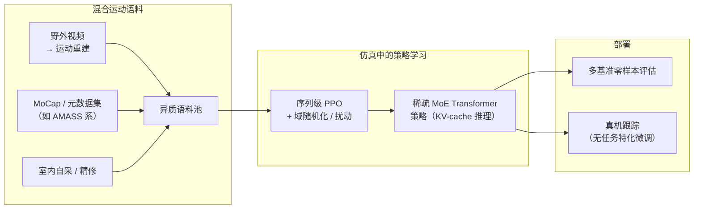
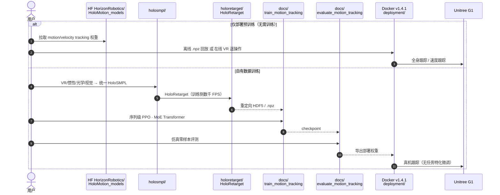

# HoloMotion（HoloMotion-1）

**HoloMotion-1** 是 **Horizon Robotics（地平线）** 发布的 **人形全身运动跟踪** 路线：把跟踪策略建成可在 **大规模异质运动语料** 上训练的 **高容量时序策略**，并在 **未见运动与采集条件** 下做 **零样本** 评估，报告 **无任务特化微调** 的真机迁移。工程侧提供 **GitHub 代码**、**Hugging Face 权重**、**Docker 镜像** 与 **GitHub Pages 文档**，与技术报告 [arXiv:2605.15336](https://arxiv.org/abs/2605.15336) 一致。

## 英文缩写速查

| 缩写 | 英文全称 | 简要说明 |
|------|----------|----------|
| MoCap | Motion Capture | 动作捕捉，参考动作与演示数据的主要来源 |
| RL | Reinforcement Learning | 通过与环境交互最大化长期回报来学习策略的范式 |
| MoE | Mixture-of-Experts | 门控网络加权组合多个专家子网络 |
| PPO | Proximal Policy Optimization | 人形/足式 locomotion 中最常用的 on-policy 策略梯度算法 |
| BFM | Behavior Foundation Model | 大规模行为数据预训练的可复用全身行为先验 |
| WBC | Whole-Body Control | 协调全身关节满足多任务/约束的控制基础设施 |
| Sim2Real | Simulation to Real | 把仿真中学到的策略迁移落地真机的工程主线 |
| AMASS | Archive of Motion Capture as Surface Shapes | 大规模统一人体动捕数据集 |

## 为什么重要

- 在 [运动小脑 64 篇技术地图](../overview/humanoid-motion-cerebellum-technology-map.md) 中归类为 **D 全身跟踪基座**（28/64）：跟踪策略：视频动作也进入运动基座训练。
- **数据 scaling 轴与 SONIC / BFM 并列阅读**：与强调 **MoCap 帧规模** 的 [SONIC](../methods/sonic-motion-tracking.md) 或 **生成式多接口 WBC** 的 [BFM](./paper-behavior-foundation-model-humanoid.md) 不同，HoloMotion-1 明确把 **野外视频重建运动** 作为 **多样性主来源**，用 **精选 MoCap + 自采** 补 **保真度与部署覆盖**——这是「**异质监督下的运动基础模型**」一条独立工程叙事。
- **实时人形闭环的系统约束**：高容量 **Transformer** 常见瓶颈是 **训练贵 + 推理延迟**；工作采用 **稀疏 MoE**、**KV-cache** 与 **序列级优化** 显式对准 **控制频率与算力预算**（细节与数字以论文为准）。
- **开源交付完整**：代码、文档站、权重与容器降低 **复现与集成** 成本，便于与仿真栈、数据管线对照实验。
- **下游生成栈复用 tracker：** [OMG](./paper-omg-omni-modal-humanoid-control.md) 将 HoloMotion **motion_tracking / velocity_tracking** ONNX 作为执行层；[HoloAgent-0](https://github.com/HorizonRobotics/HoloAgent) 将其作为 Embodied AgentOS 的全身运动技能层——与「规模化 tracking 预训练 → 上游生成/规划」的分层叙事形成互证。
- **模块化 G1 一套策略：** 官方 README 报告 **一套共享策略** 覆盖 **2 种头 × 5 种 29-DoF 机身模式 × 7 种手**，共 **66** 种兼容硬件组合，无需为每种装配单独训练。

## 核心机制（提炼）

1. **任务：** 在仿真中通过 **稠密跟踪奖励 + 稳定性/正则项** 学习 **参考运动条件** 的闭环策略；观测融合 **本体感知** 与 **带短 horizon 前瞻的参考特征**，以缓解突变与接触丰富片段上的 **可预见性** 需求。
2. **数据：** **混合语料**同时吸收 **视频重建（主多样性）** 与 **MoCap / 室内数据（主保真）**，代价是 **噪声、域差与质量长尾**；训练侧需要 **时序容量 + 课程/鲁棒化**（域随机化、扰动等，见报告）共同消化。
3. **模型：** **因果解码器式 Transformer 骨干** + **稀疏 MoE**；**路由仅参考支路** 以降低对 **sim2real 动态细节** 的过敏感（报告中的关键设计动机）。
4. **优化：** **序列级 PPO** 面向 **长片段** 训练，减少逐步冗余计算（论文报告相对逐步 PPO 最高约 **22×** 训练加速）。

## 实验与评测

- **平台：** **Unitree G1（29 DoF）**；训练在 **IsaacLab**，离线 rollout 评测在 **MuJoCo**（与部署导出路径一致）。
- **零样本 held-out：** **五个未见** 运动数据集，覆盖多样动作类型与采集设备；全混合语料 **2000+ h** 训练时在 **MPKPE** 等指标上 consistently 最优。
- **相对 Sonic：** 全局 **MPKPE 约降 40%**（论文最强对照基线）；关节位置、根速度等辅助指标同步改善。
- **效率：** **KV-cache** 推理相对稠密 Transformer 最高约 **11×**；**序列级 PPO** 训练最高约 **22×**（长 clip 场景）。
- **真机：** 野外视频重建舞蹈、接触丰富武术片段与 **实时 VR 遥操作** 均报告 **无任务特化微调** 的 zero-shot 迁移（见技术报告 Fig.2）。

## 工程实践

| 用户目标 | 入口 | 所需资源 |
|----------|------|----------|
| **离线 motion 回放**（舞蹈/脚本演示） | [`docs/realworld_deployment.md` 离线跟踪](https://github.com/HorizonRobotics/HoloMotion/blob/master/docs/realworld_deployment.md#offline-motion-tracking) | **Docker v1.4.1** + 重定向 `.npz`；**无需自训** |
| **在线 VR / 遥操作跟踪** | [同上 · 实时 teleop](https://github.com/HorizonRobotics/HoloMotion/blob/master/docs/realworld_deployment.md#live-teleoperation) | Docker + 机上部署 + 实时运动源；**无需自训** |
| **自有数据训练** | `environment_setup` → **HoloSMPL** → **HoloRetarget** → `train_motion_tracking` → `evaluate_motion_tracking` | GPU 训练环境、HDF5 语料、评测后导出部署权重 |
| **仅拉权重推理** | [HF HorizonRobotics/HoloMotion_models](https://huggingface.co/HorizonRobotics/HoloMotion_models) | motion / velocity tracking 预训练 checkpoint |

**复现提示：** HoloRetarget 训练侧可达 **3000+ FPS**（RTX 4090），机上遥操作 **300+ FPS**；HoloSMPL 已对接 **10+** 数据集/设备。评测分 **IsaacLab HDF5 rollout** 与 **MuJoCo sim2sim 批量指标** 两路，与「训练 checkpoint → 导出 ONNX/策略 → 真机 runtime」部署链对齐。

## 局限与风险

- **异质语料噪声：** 野外视频重建是多样性主来源，但带来重建伪影、视角误差与质量长尾；需 MoCap/自采补保真，且对 **课程与域随机化** 敏感。
- **仍属 tracking 范式：** v1 聚焦 **Any Pose** 模仿跟踪；**语言/任务条件生成（v2 Any Command）**、跨形态与地形仍在路线图中，勿与已发布的 OMG / HoloAgent 上游能力混为一谈。
- **算力与镜像体积：** 0.4B 级 MoE + Docker 部署对 GPU/边缘算力有要求；真机路径强依赖官方 **v1.4.1** 容器与 G1 硬件变体兼容性表。
- **命名易混：** 文档路径 `robot_lab/holomotion` 与社区 **[robot_lab（fan-ziqi）](./robot-lab.md)** IsaacLab 扩展 **同名不同仓**；引用与 issue 排查时务必核对组织与 URL。

## 结论

**HoloMotion-1 把「野外视频规模 + 高容量时序策略 + 部署向系统工程」绑成一条可复现的全身跟踪基座路线，适合作为下游生成/Agent 栈的执行层，但仍是模仿跟踪而非通用指令策略。**

1. **数据轴：** 以 **视频重建运动** 扩多样性、**MoCap/自采** 补保真，**2000+ h** 混合语料是零样本泛化的前提，而非单纯堆 MoCap 帧数。
2. **模型轴：** **稀疏 MoE Transformer + KV-cache** 在保持容量的同时满足 **~300 FPS** 级闭环推理（v1.3 工程数据）。
3. **训练轴：** **序列级 PPO** 面向长 clip；论文报告最高约 **22×** 训练效率，是规模化实验的可操作杠杆。
4. **评测轴：** 五个未见数据集上 **MPKPE 相对 Sonic 约 −40%** 是选型时的主对照数字；部署前建议走官方 **MuJoCo sim2sim** 批量评测。
5. **工程轴：** **预训练权重 + Docker v1.4.1** 即可离线/在线跟踪，无需每位用户自训；自训链路为 HoloSMPL → HoloRetarget → train/eval。
6. **生态轴：** [OMG](./paper-omg-omni-modal-humanoid-control.md) / HoloAgent-0 已将其作为 **tracker 层** 复用——若你的系统是「生成参考 + 物理执行」，优先对齐其 **motion_tracking / velocity_tracking** ONNX 接口。

## 流程总览

```mermaid
flowchart LR
  subgraph data [混合运动语料]
    V["野外视频\n→ 运动重建"]
    M["MoCap / 元数据集\n（如 AMASS 系）"]
    I["室内自采 / 精修"]
    V --> C[异质语料池]
    M --> C
    I --> C
  end
  subgraph train [仿真中的策略学习]
    C --> RL["序列级 PPO\n+ 域随机化 / 扰动"]
    RL --> pol["稀疏 MoE Transformer\n策略（KV-cache 推理）"]
  end
  subgraph deploy [部署]
    pol --> sim["多基准零样本评估"]
    pol --> real["真机跟踪\n（无任务特化微调）"]
  end
```

## 工程入口（一手链接）

| 类型 | URL |
|------|-----|
| 代码 | [HorizonRobotics/HoloMotion](https://github.com/HorizonRobotics/HoloMotion) |
| 文档 | [horizonrobotics.github.io/robot_lab/holomotion](https://horizonrobotics.github.io/robot_lab/holomotion) |
| 技术报告 | [arXiv:2605.15336](https://arxiv.org/abs/2605.15336) |
| 权重 | [Hugging Face：HorizonRobotics/HoloMotion_models](https://huggingface.co/HorizonRobotics/HoloMotion_models) |
| Docker | [hub.docker.com/r/horizonrobotics/holomotion](https://hub.docker.com/r/horizonrobotics/holomotion)（README 推荐 **v1.4.1**） |

## 源码运行时序图

节点对齐 [`sources/repos/horizon_robotics_holomotion.md`](../../sources/repos/horizon_robotics_holomotion.md) 与官方 README（**v1.4.1**：HoloSMPL → HoloRetarget → 训练/评测 → Docker 真机）。

```mermaid
sequenceDiagram
    autonumber
    actor U as 用户
    participant HF as HF HorizonRobotics/<br/>HoloMotion_models
    participant SMPL as holosmpl/
    participant RT as holoretarget/<br/>HoloRetarget
    participant TR as docs/<br/>train_motion_tracking
    participant EV as docs/<br/>evaluate_motion_tracking
    participant DK as Docker v1.4.1<br/>deployment/
    participant G1 as Unitree G1
    alt 仅部署预训练（无需训练）
        U->>HF: 拉取 motion/velocity tracking 权重
        U->>DK: 离线 .npz 回放 或 在线 VR 遥操作
        DK->>G1: 全身跟踪 / 速度跟踪
    else 自有数据训练
        U->>SMPL: VR/惯性/光学/视觉 → 统一 HoloSMPL
        SMPL->>RT: HoloRetarget（训练侧数千 FPS）
        RT-->>TR: 重定向 HDF5 / .npz
        U->>TR: 序列级 PPO · MoE Transformer
        TR-->>EV: checkpoint
        U->>EV: 仿真零样本评测
        EV-->>DK: 导出部署权重
        DK->>G1: 真机跟踪（无任务特化微调）
    end
```

关键复现路径：预训练用户走 **Docker + HF 权重**（离线 motion / 在线 teleop）；训练用户按 `docs/environment_setup.md` → HoloSMPL → Retargeting → `train_motion_tracking` → `evaluate_motion_tracking` → `docs/realworld_deployment.md`。

## 命名说明

文档路径中的 `robot_lab` 指 **Horizon 在 GitHub Pages 上的站点分段**，与社区 IsaacLab 扩展 **[robot_lab（fan-ziqi）](./robot-lab.md)** **不是同一仓库**；同分段下还有 [RoboOrchardLab](./robo-orchard-lab.md) 等具身 AI 训练框架。选型与引用时请用 **组织名与 Git URL** 区分。

## 关联页面

- [SONIC（规模化运动跟踪人形控制）](../methods/sonic-motion-tracking.md)
- [BFM（人形行为基础模型论文实体）](./paper-behavior-foundation-model-humanoid.md)
- [Foundation Policy（基础策略模型）](../concepts/foundation-policy.md)
- [Whole-Body Control](../concepts/whole-body-control.md)
- [AMASS](./amass.md)
- [强化学习](../methods/reinforcement-learning.md)

## 推荐继续阅读

- [HoloMotion-1 Technical Report（arXiv:2605.15336）](https://arxiv.org/abs/2605.15336)
- [HoloMotion GitHub 仓库](https://github.com/HorizonRobotics/HoloMotion)
- [OMG](../entities/paper-omg-omni-modal-humanoid-control.md) — 以 HoloMotion 为 tracker 的 omni-modal 运动生成系统
- [HoloAgent-0](https://github.com/HorizonRobotics/HoloAgent) — 将 HoloMotion 作为 AgentOS 全身技能层的官方下游项目

## 参考来源

- [sources/repos/horizon_robotics_holomotion.md](../../sources/repos/horizon_robotics_holomotion.md)
- [sources/sites/holomotion-docs.md](../../sources/sites/holomotion-docs.md)
- [sources/papers/holomotion_arxiv_2605_15336.md](../../sources/papers/holomotion_arxiv_2605_15336.md)
