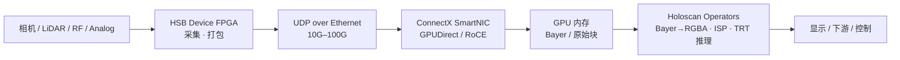
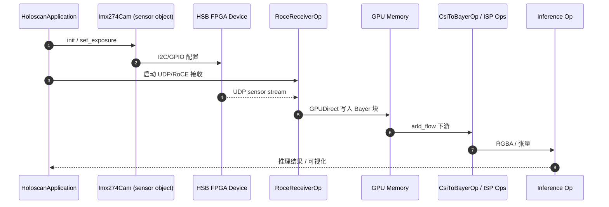

# Holoscan Sensor Bridge（HSB）

**Holoscan Sensor Bridge**（[产品页](https://www.nvidia.com/en-us/technologies/holoscan-sensor-bridge/)，[文档 Introduction](https://docs.nvidia.com/holoscan/sensor-bridge/getting-started/introduction)）是 NVIDIA 的 **Sensor-over-Ethernet** 技术：用 **FPGA 参考设计 + 标准 API + 开源主机软件**，把相机、雷达、LiDAR、RF 等高速传感器数据 **低延迟流式送入 GPU 内存**，并在 **Holoscan pipeline** 中做实时 ISP、推理与可视化。相对「每颗传感器写专有驱动 + CPU 拷贝」，HSB 面向 **机器人、医疗、仪器与信号处理** 等需要 **mission-critical 低延迟** 的边缘 AI。

## 一句话定义

**把传感器变成「以太网上的 GPU 输入设备」——FPGA 打包 UDP 流，ConnectX 直写显存，Holoscan operator 从 Bayer 一路跑到推理。**

## 英文缩写速查

| 缩写 | 英文全称 | 简要说明 |
|------|----------|----------|
| HSB | Holoscan Sensor Bridge | 本页 Sensor-over-Ethernet 平台 |
| CoE | Camera-over-Ethernet | 相机以太网流式；官方标称 Thor 上 ~1% CPU |
| GPUDirect | NVIDIA GPUDirect | ConnectX SmartNIC 将 UDP 数据 **绕过 CPU** 写入 GPU |
| RoCE | RDMA over Converged Ethernet | `RoceReceiverOp` 等接收路径使用的 RDMA 以太网 |
| PTP | Precision Time Protocol | IGX/AGX Orin 板载网口硬件 PTP，用于时间戳与多传感器同步 |
| SIL | Safety Integrity Level | 产品页宣称端到端协议可达 **SIL 2** |
| BYOS | Bring Your Own Sensor | GitHub 仓定位：在标准 API 上适配自有传感器 |

## 为什么重要

- **多传感器融合瓶颈：** 机器人/自主系统常混接 **CSI 相机 + LiDAR + RF**；专有协议与驱动栈拖慢集成 — HSB 提供 **统一以太网数据面 + 用户态 sensor object**。
- **延迟预算：** 官方在 IGX Orin 上标称 **4K60 端到端 ~17 ms**（photon→display）、GPUDirect 信号处理 **<1 ms** — 对 **HIL 与机载闭环** 有选型意义（见 [Hardware-in-the-Loop](../concepts/hardware-in-the-loop.md)）。
- **与 Jetson 栈互补：** [JetPack 7](./nvidia-jetson.md) 将 HSB 列为组件；**Jetson AGX Orin / Thor** 为文档列出的主机之一，但 **无 ConnectX 时需走 Linux socket**（性能低于 IGX）。
- **开源可扩展：** [nvidia-holoscan/holoscan-sensor-bridge](https://github.com/nvidia-holoscan/holoscan-sensor-bridge)（Apache-2.0）含 operator 源码与 **hololink** 设备驱动框架，便于 BYOS。

## 核心原理

### 参考架构

### 软件分层（文档模型）

| 层 | 职责 | 代表组件 |
|----|------|----------|
| **Sensor object** | 设备配置/健康/曝光等 API | `Imx274Cam`（用户态驱动，无应用逻辑） |
| **Receiver operator** | 网络 → GPU 内存 | `RoceReceiverOp`（SmartNIC）；`LinuxReceiverOp`（socket） |
| **处理 operator** | 格式转换、ISP、推理、可视化 | `CsiToBayerOp`、推理算子、CRC 校验 |
| **HoloscanApplication** | `configure()` 里 `add_flow` 组 pipeline | IMX274/IMX477 官方示例 |

### 主机与网络模式

| 主机 | 推荐网络路径 | 备注 |
|------|--------------|------|
| **NVIDIA IGX** | ConnectX + GPUDirect / RoCE | 文档 **最佳性能**；硬件 PTP |
| **Jetson AGX Thor** | ConnectX 或 socket（视载板） | CoE CPU 占用官方标称 ~1% |
| **Jetson AGX Orin Devkit** | **Linux socket** | 无加速 NIC 时受 OS 网络栈限制 |
| **DGX Spark** | ConnectX SmartNIC | 文档列出的桌面/开发主机 |

## 源码运行时序图

以下对齐 [holoscan-sensor-bridge](https://github.com/nvidia-holoscan/holoscan-sensor-bridge) IMX274 类示例：**sensor object 配置设备 → receiver operator 收 UDP 入 GPU → 处理链 → 输出**。

复现入口：克隆 GitHub 仓 → 安装 **Holoscan SDK ≥4.2** → 按文档连接 Lattice/Microchip 评估板或自建 **hololink_module** 驱动 → 运行 IMX274 demo pipeline。

## 工程实践

| 步骤 | 做法 |
|------|------|
| **选型** | 先定 **传感器类型 + 带宽 + 延迟**；需 SIL 2 时核对产品页安全声明与具体部署认证边界 |
| **硬件** | 评估板：Lattice CertusPro-NX / Microchip PolarFire 等伙伴方案；量产走 Sensor Partners |
| **主机** | 追求极限延迟用 **IGX + ConnectX**；机载机器人常见 **Jetson AGX Orin/Thor** 需接受 socket 路径或外接 SmartNIC |
| **软件** | `git clone` [holoscan-sensor-bridge](https://github.com/nvidia-holoscan/holoscan-sensor-bridge)；按 [Introduction](https://docs.nvidia.com/holoscan/sensor-bridge/getting-started/introduction) 组 pipeline |
| **BYOS** | 新传感器：实现 **sensor object**（I2C/寄存器）+ 配置 receiver operator；自定义板卡参考 **hololink_module** 教程 |
| **时间同步** | 多相机/多模态对齐时启用 **PTP** 时间戳（IGX / AGX Orin 板载网口） |
| **推理** | Holoscan 链后可接 **TensorRT** 等运行时（见 [TensorRT](./tensorrt.md)） |

开源结论（2026-09-06）：**主机软件与 operator 已开源**（Apache-2.0）；**FPGA IP 与评估板** 为商业/伙伴交付，非单仓全部内容。

## 局限与风险

- **硬件依赖：** 无 HSB FPGA 设备则仅有软件无法复现端到端延迟；Jetson Devkit **不能**假设具备 ConnectX GPUDirect 路径。
- **标称延迟需实测：** 17 ms / <1 ms 为官方特定平台与场景；机器人全栈（SLAM + 规划 + 控制）须单独预算。
- **Holoscan 栈绑定：** 应用模型为 **Holoscan operator**，与纯 ROS 2 节点需额外桥接（可对比 [Isaac ROS Visual SLAM](./isaac-ros-visual-slam.md) 路径）。
- **FPGA 与 SIL 认证：** SIL 2 为产品级宣称；具体项目仍需独立功能安全评估。

## 关联页面

- [NVIDIA Jetson](./nvidia-jetson.md) — AGX Orin/Thor 主机与 JetPack 7 HSB 组件
- [Jetson Orin NX](./jetson-orin-nx.md) — 轻量机载模组（HSB 文档主列 AGX 级主机）
- [TensorRT](./tensorrt.md) — Holoscan 链后推理优化
- [Isaac ROS Visual SLAM](./isaac-ros-visual-slam.md) — 替代/互补的 Jetson ROS 感知栈
- [Hardware-in-the-Loop](../concepts/hardware-in-the-loop.md)
- [边缘–云机器人](../concepts/edge-cloud-robotics.md)
- [ORT vs MNN vs TensorRT](../comparisons/onnxruntime-vs-mnn-vs-tensorrt.md)

## 参考来源

- [NVIDIA Holoscan Sensor Bridge 产品页摘录](../../sources/sites/nvidia-holoscan-sensor-bridge.md)
- [Holoscan Sensor Bridge Introduction 文档摘录](../../sources/sites/holoscan-sensor-bridge-docs-intro.md)
- [nvidia-holoscan/holoscan-sensor-bridge 仓库归档](../../sources/repos/nvidia_holoscan_sensor_bridge.md)
- [NVIDIA JetPack 产品页](../../sources/sites/nvidia-jetpack.md)

## 推荐继续阅读

- [Holoscan Sensor Bridge 产品页](https://www.nvidia.com/en-us/technologies/holoscan-sensor-bridge/)
- [Getting Started — Introduction](https://docs.nvidia.com/holoscan/sensor-bridge/getting-started/introduction)
- [GitHub — holoscan-sensor-bridge](https://github.com/nvidia-holoscan/holoscan-sensor-bridge)
- [HoloHub — holoscan-sensor-bridge module](https://nvidia-holoscan.github.io/holohub/modules/holoscan-sensor-bridge/)
- [Adapting new sensors（文档）](https://docs.nvidia.com/holoscan/sensor-bridge/latest/new_sensors.html)
