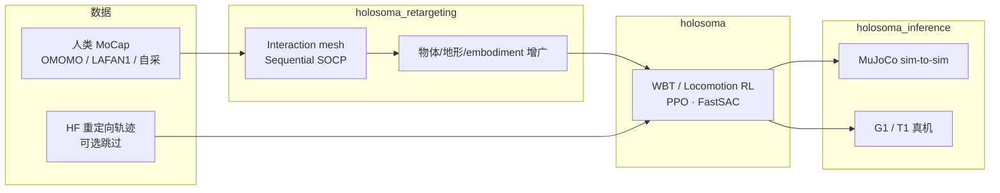

# holosoma（Amazon FAR 人形 RL + 重定向框架）

**holosoma**（<https://github.com/amazon-far/holosoma>，Apache-2.0）是 Amazon FAR 发布的 **人形机器人全身强化学习** 开源框架，名称取自希腊语「全身」。它将 **[OmniRetarget](./paper-hrl-stack-03-omniretarget.md)** 的 interaction-mesh 重定向与 **locomotion / whole-body tracking（WBT）** 训练、**sim-to-sim / sim-to-real** 推理统一在同一仓库，是论文承诺的 **代码与可复现管线入口**。

## 英文缩写速查

| 缩写 | 英文全称 | 简要说明 |
|------|----------|----------|
| WBT | Whole-Body Tracking | 全身关节/根轨迹跟踪类 RL 任务 |
| RL | Reinforcement Learning | 通过与环境交互最大化长期回报来学习策略的范式 |
| PPO | Proximal Policy Optimization | 常用 on-policy 策略梯度算法 |
| DR | Domain Randomization | 训练时随机化仿真参数以提升跨域鲁棒迁移 |
| ONNX | Open Neural Network Exchange | 跨框架神经网络模型交换格式 |
| G1 | Unitree G1 Humanoid | 宇树教育科研人形实验平台 |
| Sim2Real | Simulation to Real | 仿真训练策略迁移到真实硬件 |
| MoCap | Motion Capture | 动作捕捉，参考动作与演示数据的主要来源 |

## 为什么重要

- **论文落地入口：** OmniRetarget 的 `holosoma_retargeting` 子包实现交互保留重定向；下游 **5 reward + 4 DR** 的 WBT 训练与真机部署脚本同仓发布。
- **多仿真器覆盖：** 训练侧支持 **IsaacGym、IsaacSim、MJWarp**；推理侧支持 **MuJoCo** 与真机，降低「只训不配」的摩擦。
- **端到端 Demo：** 官方 `demo_omomo_wb_tracking.sh` / `demo_lafan_wb_tracking.sh` 串联 **数据下载 → 重定向 → 转换 → WBT 训练**，适合作为人形模仿学习工程样板。
- **与公开数据配套：** HuggingFace **[OmniRetarget 数据集](./omniretarget-dataset.md)** 提供 `.npz` 轨迹；LAFAN1 因许可需用本仓库自行重定向。

## 仓库结构

| 包 | 职责 |
|----|------|
| `src/holosoma/` | locomotion / WBT **训练**（PPO、FastSAC） |
| `src/holosoma_inference/` | **仿真与真机推理**、ONNX 部署工作流 |
| `src/holosoma_retargeting/` | **OmniRetarget** 人形 MoCap → 机器人轨迹 |

## 流程总览

## 工程要点

- **环境脚本分离：** `setup_isaacgym.sh`、`setup_isaacsim.sh`、`setup_mujoco.sh`、`setup_retargeting.sh`、`setup_inference.sh` 按子任务安装依赖。
- **Wandb 集成：** 视频日志、ONNX 自动上传、从 Wandb 直接拉 checkpoint。
- **机器人：** 官方 README 列出 **Unitree G1** 与 **Booster T1**；与 OmniRetarget 论文跨 embodiment 演示一致。

## 与其他页面的关系

- **方法来源：** [OmniRetarget（arXiv:2509.26633）](./paper-hrl-stack-03-omniretarget.md)
- **公开轨迹：** [OmniRetarget 数据集](./omniretarget-dataset.md)
- **下游跑酷：** [PHP（感知跑酷）](./paper-hrl-stack-22-perceptive_humanoid_parkour.md) 使用 OmniRetarget 构建技能库
- **问题域：** [Motion Retargeting](../concepts/motion-retargeting.md)

## 参考来源

- [holosoma 仓库归档](../../sources/repos/holosoma.md)
- [OmniRetarget 论文归档](../../sources/papers/omniretarget_arxiv_2509_26633.md)

## 推荐继续阅读

- GitHub：<https://github.com/amazon-far/holosoma>
- OmniRetarget 项目页：<https://omniretarget.github.io/>
- 数据集：<https://huggingface.co/datasets/omniretarget/OmniRetarget_Dataset>
