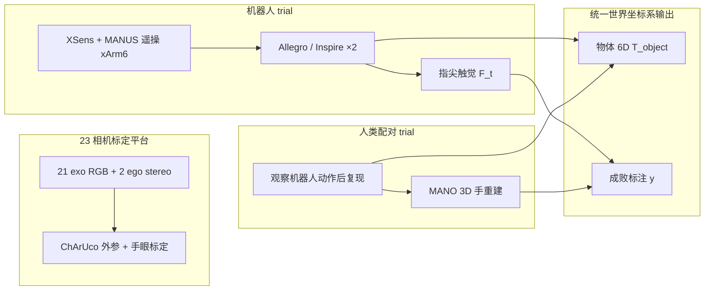

# HRDexDB（人–机器人配对灵巧抓取数据集）

**HRDexDB**（Lim et al., arXiv:[2604.14944](https://arxiv.org/abs/2604.14944)，2026；<https://snuvclab.github.io/HRDexDB/>）是首尔大学 SNU VC Lab 与 RLWRLD 发布的 **首个在相同物体上配对采集人类与多种灵巧机器人手抓取轨迹** 的大规模多模态数据集，强调 **markerless** 高精度 3D 标注与跨 embodiment 可比性。

## 英文缩写速查

| 缩写 | 英文全称 | 简要说明 |
|------|----------|----------|
| HRDexDB | Human-Robot Dexterous Database | 本数据集名称 |
| HOI | Human-Object Interaction | 人–物交互数据范式 |
| HROI | Human-Robot-Object Interaction | 人–机–物联合交互数据 |
| MANO | hand Model with Articulated and Non-rigid defOrmations | 参数化人手网格与姿态表示 |
| SE(3) | Special Euclidean Group in 3D | 刚体 6D 位姿（旋转+平移）群 |
| Teleop | Teleoperation | 人遥操作机器人采集演示数据 |
| IMU | Inertial Measurement Unit | 惯性测量单元，XSens 服提供稳定腕/身运动 |

## 为什么重要

- **同物体配对而非任务级对齐**：相对 [DexWild](https://arxiv.org/abs/2403.08282) 等便携采集或 RH20T 类平行夹爪数据，HRDexDB 在 **100 种相同物体** 上提供人类与机器人 **episode 级语义配对**，且物体 6D 轨迹在统一世界坐标系下重建。
- **多灵巧手形态**：除人类外覆盖 **Allegro Hand** 与两款 **Inspire**（RH56DFTP、RH56F1），便于研究 morphology 差异下的抓取与跨手迁移，而非单一 RealDex 式单 embodiment。
- **触觉 + 视觉 + 3D 一体**：Inspire 指尖触觉与 23 路同步 RGB 对齐，弥补多数 HOI/机器人集缺力交互或缺 3D 手重建的问题。
- **密集多视角抗遮挡**：21 路第三人称 + 2 路 ego 立体 RGB（**2048×1536**），针对灵巧抓取中指尖严重遮挡设计。

## 核心信息

| 字段 | 内容 |
|------|------|
| 机构 | 首尔大学（SNU）· RLWRLD |
| 物体 | **100+**（论文投稿 100，规划扩至 1000） |
| 序列 | 论文 **1.4K** trial；项目页 **2.1K** sequences（含成败） |
| Embodiment | 人 + **Allegro** + **Inspire RH56DFTP** + **Inspire RH56F1**（项目页计 **5** 类） |
| 相机 | **23** 路全同步（21 exo + 2 ego stereo） |
| 机器人平台 | **xArm6** + XSens 惯性服 + MANUS 手套遥操 |
| 人类手表示 | **MANO** 参数 $\mathbb{R}^{51}$ |
| 物体 | 扫描模型 + 逐帧 **6D pose** |
| 触觉 | Inspire 系列指尖力；项目页亦展示 Allegro 触觉流 |
| 标签 | 抓取成功/失败 $y\in\{0,1\}$ |
| 项目页 | <https://snuvclab.github.io/HRDexDB/> |

## 流程总览（配对采集）

**配对协议（robot-driven mimicry）**：先由机器人完成一次抓取，再由人类操作者 **复现相同抓取意图**；允许执行速度与微动力学差异，但保持任务语义与物体条件一致。

## 常见误区或局限

- **不是全身 loco-manipulation 集**：聚焦 **桌面/台架灵巧抓取**，不含人形下肢移动或大范围 loco-manip（对照 [Humanoid Everyday](./humanoid-everyday-dataset.md)）。
- **人类侧无触觉**：触觉仅机器人 embodiment（主要为 Inspire）；人类 trial 为视觉 + MANO + 物体 6D。
- **规模口径不一**：论文投稿写 **1.4K / 4 embodiment**；项目页更新 **2.1K / 5**——以发布包 README 为准，本页并列标注。
- **遥操偏 IMU 手套**：机器人轨迹来自 XSens+MANUS，而非纯视觉手部追踪；与 [数据手套 vs 视觉遥操作选型](../comparisons/data-gloves-vs-vision-teleop.md) 中「抗遮挡」权衡一致，但便携性低于 DexWild 类方案。

## 与其他页面的关系

- **硬件**：[Allegro Hand](./allegro-hand.md) — 三套机器人手之一
- **采集指南**：[灵巧操作数据采集指南](../queries/dexterous-data-collection-guide.md) — 多模态采集与重定向背景
- **跨具身迁移**：[跨具身策略迁移选型指南](../queries/cross-embodiment-transfer-strategy.md) — 配对数据如何服务 embodiment gap
- **任务域**：[Manipulation](../tasks/manipulation.md)、[抓取专题](../overview/topic-grasp.md)
- **触觉**：[触觉感知](../concepts/tactile-sensing.md)

## 参考来源

- [HRDexDB 论文归档](../../sources/papers/hrdexdb_arxiv_2604_14944.md)
- [HRDexDB 项目页归档](../../sources/sites/snuvclab-hrdexdb-github-io.md)

## 关联页面

- [Manipulation](../tasks/manipulation.md)
- [灵巧操作数据采集指南](../queries/dexterous-data-collection-guide.md)
- [Allegro Hand](./allegro-hand.md)
- [跨具身策略迁移选型指南](../queries/cross-embodiment-transfer-strategy.md)

## 推荐继续阅读

- [HRDexDB 项目页](https://snuvclab.github.io/HRDexDB/) — 可视化样例、触觉/接触演示与 BibTeX
- [RealDex（arXiv）](https://arxiv.org/abs/2310.16898) — 单 embodiment 人–机同步灵巧抓取对照
- [DexWild（arXiv）](https://arxiv.org/abs/2403.08282) — 便携人–机配对采集对照
