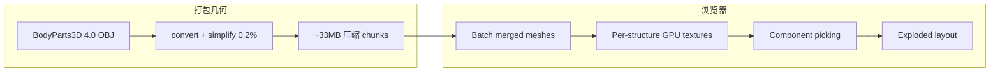

# Human Atlas（3D 解剖探索器）

**Human Atlas**（[GitHub](https://github.com/ashemag/human-atlas)，[在线演示](https://human-atlas-seven.vercel.app)）是把 **BodyParts3D 4.0** 成人男性参考解剖做成 **可交互 Web 3D  atlas**：**2,234** 独立可选 mesh、**15** 解剖系统层、**3,432** FMA 命名概念检索，以及 assembled ↔ exploded 拆解视图。技术栈为 React + Three.js + shadcn/ui。

## 一句话定义

**在浏览器里把标准参考人体拆成可选、可搜、可隔离的 3D 器官/系统 inventory——给人形设计、遥操作 ergonomics 与跨学科沟通提供解剖坐标，不是 SMPL 骨架也不是临床工具。**

## 英文缩写速查

| 缩写 | 英文全称 | 简要说明 |
|------|----------|----------|
| FMA | Foundational Model of Anatomy | BodyParts3D 使用的解剖概念本体；3,432 命名概念 |
| BP3D | BodyParts3D | 生命科学数据中心发布的 3D 参考解剖库 |
| CC BY 4.0 | Creative Commons Attribution 4.0 | 解剖数据许可；保留署名可再分发 |
| WebMCP | Web Model Context Protocol | 可选浏览器工具接口，暴露 search/inspect |
| HOI | Hand–Object Interaction | 操纵研究常需对手/前臂解剖有直观参照 |
| SMPL | Skinned Multi-Person Linear Model | 运动重定向常用参数化体；与本 atlas **互补** |

## 为什么重要

- **人形栈缺「看得见的参考人体」：** 本库大量页面讲 [Motion Retargeting](../concepts/motion-retargeting.md)、[UHAS](../methods/uhas-unified-hand-action-space.md)、[Unitree G1](./unitree-g1.md) 等 **骨架/关节/动作**；Human Atlas 补 **器官–系统–体积** 层，便于理解 workspace、reachable volume 与 ergonomics 讨论（如 [ergoCub](./paper-ergocub-shared-embodied-intelligence.md) 的人体生物力学目标）。
- **标准命名对齐：** FMA concept id 与解剖英文名可和医学/生物力学文献对齐，减少「这个 link 在人体哪里」的沟通成本。
- **工程上可 fork：** MIT 前端 + 明确 CC BY 数据管线；几何已打包 ~33MB，也可从官方 BodyParts3D OBJ **自重建**（`convert-anatomy.py` 链）。
- **与机器人 sim 资产不同：** 不是 URDF/USD 碰撞体；**教育/设计参照**，不要当 MuJoCo/Isaac 默认 human mesh。

## 核心原理

### 数据与概念两层

| 层 | 数量 | 含义 |
|----|------|------|
| **Source mesh** | 2,234 OBJ | BodyParts3D 4.0 独立三角网格 |
| **FMA concept** | 3,432 | 命名解剖概念；**一个 concept 可对应多 mesh** |
| **Display system** | 15 | 界面 curated 的系统层（骨/肌/消化等 preset） |

参考模型为 **成人男性**（TARO MRI + 插图细化）；**不代表** 全部人类变异或完整结构集合。

### 流程总览（查看器）

**读法：** 渲染侧 merge 降 draw call；GPU texture 驱动平移/可见/选中；exploded 只对 **当前可见** 结构做 spaced pack，保证移动端 inventory 不重叠。

## 工程实践

| 项 | 说明 |
|----|------|
| **在线** | <https://human-atlas-seven.vercel.app> — 无需账号 |
| **本地** | Node **≥22.13**；`npm ci && npm run dev` → `:3016` |
| **校验** | `npm run check` + `validate-atlas.mjs` + `validate-interactions.mjs` |
| **部署** | Vite 静态 `dist/`；仓库含 `vercel.json` |
| **重建数据** | 下载官方 `isa_BP3D_4.0_obj_99.zip` → `convert-anatomy.py` → optimize → compress |
| **许可** | 代码 **MIT**；解剖 **CC BY 4.0** — 再分发须保留 `ATTRIBUTION.md` |

开源结论（2026-09-06）：**应用与打包几何流程均已开源**（~1,020★）；上游 BodyParts3D 遵循 DBCLS 当前 CC BY 4.0 条款。

## 局限与风险

- **非临床：** README 与 ATTRIBUTION 均写明 **educational explorer**，不能用于诊断或手术规划。
- **单一参考体型：** 当前 release 为 **成年男性** BP3D；女性 HuBMAP 参考集仅在历史 revision 出现，**现行 release 未包含**。
- **非运动学模型：** 无关节 DOF、无 SMPL pose — 不能替代 retargeting 骨架或 mocap 管线。
- **简化网格：** 0.2% meshoptimizer 误差；精细 contact/体积计量仍应用 CAD/医学影像级数据。
- **Web 性能：** ~230 万三角 + 33MB 下载；真机移动端性能未全面实测。

## 关联页面

- [Humanoid Robot（人形机器人）](./humanoid-robot.md) — 硬件与控制栈总览
- [Motion Retargeting](../concepts/motion-retargeting.md) — 人体动作→机器人；解剖 atlas 是 **空间理解** 补充
- [UHAS 统一手动作空间](../methods/uhas-unified-hand-action-space.md) — 跨手型动作语义
- [Manipulation（操作任务）](../tasks/manipulation.md)
- [ergoCub 论文](./paper-ergocub-shared-embodied-intelligence.md) — 人体生物力学进 hardware codesign
- [Unitree G1](./unitree-g1.md) — 常见灵巧人形平台

## 参考来源

- [ashemag/human-atlas 仓库](../../sources/repos/ashemag_human_atlas.md)
- [Human Atlas 演示站摘录](../../sources/sites/human-atlas-demo.md)

## 推荐继续阅读

- [BodyParts3D 下载与许可](https://dbarchive.biosciencedbc.jp/en/bodyparts3d/download.html)
- [BodyParts3D 论文（NAR 2009）](https://doi.org/10.1093/nar/gkn613)
- [Human Atlas GitHub README](https://github.com/ashemag/human-atlas/blob/main/README.md)
