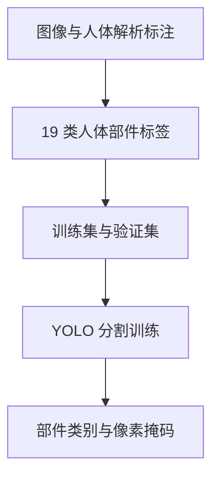

# Human Body And Accessories（人体部件与服饰分割数据集）

## 一句话定义

**Human Body And Accessories** 是托管在 Ultralytics Platform 上的细粒度人体解析分割数据集：它将画面中的人体拆成脸、头发、衣物、肢体与配件等 19 类像素级目标，可通过 Platform URI 进入 Ultralytics 分割训练流程。

## 英文缩写速查

| 缩写 | 英文全称 | 简要说明 |
|------|----------|----------|
| LIP | Look Into Person | 截图所称的标签对齐参考之一；原始人体解析基准 |
| CIHP | Crowd Instance-level Human Parsing | 截图所称的多人解析标签对齐参考之一 |
| YOLO | You Only Look Once | 此数据集配套模型页使用的训练框架 |
| API | Application Programming Interface | 使用 Platform 数据 URI 时配置访问凭证的接口 |

## 为什么重要

- **从“人”细化到人体部件：** 普通 person detection 给出整个人的框；此数据集区分身体区域、衣物和配件，适合细粒度视觉理解。
- **多人场景可见：** 截图展示多人室内画面与独立部件掩码；数据页将任务标记为 Segment。
- **类别规模与数据量可作起点：** 截图/公开索引显示 33,141 张图像与 826,524 个标注，平台模型页已提供 YOLO26n-seg 的数据 URI 示例。
- **标签对齐提供基准语境：** 发布介绍称与 LIP、CIHP 类别对齐，便于理解人体解析任务；它不证明底层图像或标注直接来自这两个基准。

## 核心信息

| 字段 | 内容 |
|------|------|
| 平台名称 | Human Body And Accessories |
| 发布账号 | Muhammadrizwanmunawar |
| 任务 | Segment |
| 模态 | 单帧 RGB 图像 + 19 类人体部件分割标注；未见深度、视频时序或关键点标注 |
| 图像数 | 33,141 |
| 标注数 | 826,524 |
| 划分 | 28,142 训练 / 4,999 验证（截图所示） |
| 类别数 | 19 |
| 类别 | Face、Upper clothes、Hair、Torso-skin、Left arm、Right arm、Pants、Coat、Right shoe、Left shoe、Left leg、Right leg、Hat、Dress、Socks、Glove、Scarf、Skirt、Sunglasses |
| 数据 URI | `ul://muhammadrizwanmunawar/datasets/human-body-and-accessories` |
| 数据许可 | 当前公开条目未能核实；应以下载时数据页与导出 metadata 为准 |
| 专属代码 | 未发现；训练使用通用 [Ultralytics](./ultralytics.md) 框架 |

## 分割数据流

该节点描述的是数据到训练的常规用法，不代表平台公开了完整预处理脚本或数据构建流程。



此类标签把“一个人”拆成细粒度区域。部署时输出的类别掩码仍需结合目标跟踪、相机标定和下游任务逻辑，不能直接视作机器人状态或人体姿态估计。

## 工程实践

配套模型页展示的训练入口将数据集 URI 传给 `segment` 任务：

```bash
yolo train model=ul://ultralytics/yolo26/yolo26n-seg data=ul://muhammadrizwanmunawar/datasets/human-body-and-accessories task=segment
```

开始训练前：

1. 确认账号对数据集有访问权限，并按 Platform 文档配置 API key。
2. 导出或读取当前数据集版本，核对类别映射、训练/验证划分和标签格式。
3. 检查左右侧类别的标注一致性、遮挡与小配件像素占比；单看总标注数无法判断边界质量。
4. 固定模型、数据版本和图像尺寸，使用每类 IoU / AP 与多人场景样例做验证。

| 可复现项 | 当前状态 |
|----------|----------|
| 数据页与数据 URI | 平台公开索引及配套模型页可见 |
| 通用训练框架 | [Ultralytics 官方代码仓](https://github.com/ultralytics/ultralytics) 已公开 |
| 原始数据下载 / 导出 | 平台文档支持数据 URI 与 NDJSON 导出；本数据集自身访问条件未核实 |
| 许可与再分发 | 未核实，不应默认可商用或可镜像 |
| 基线指标 | 当前项目资料未提供可核对的独立测试集指标 |

## 与其他分割任务对比

| 任务 | 输出 | 与本数据集的区别 |
|------|------|----------------|
| 人体检测 | 人体框 / person 类别 | 本集将人体细分成多个语义部件和服饰类 |
| 通用实例分割 | 任意物体的实例掩码 | 本集关注人体解析类别与左右肢体等细类 |
| 语义分割 | 每像素类别图 | 是否保留每个人的实例身份，需以该版本实际导出标注格式为准 |
| 姿态估计 | 关键点与骨架 | 部件掩码本身不等价于关键点或关节角 |

## 局限与风险

- **访问与许可不明：** 可检索到平台条目不代表数据文件可匿名下载；数据许可、再分发和商业使用条件尚未核实。
- **来源边界：** LIP / CIHP 是发布介绍中的标签对齐参照；没有证据可据此断言原始数据来自这两个基准。
- **没有公开评测结论：** 826,524 是平台标注数量，不是模型效果指标；目前未找到该数据集配套的独立 benchmark 报告。
- **场景与偏差：** 截图说明有多人和室内外场景，但数据来源、人口统计分布、隐私处理和遮挡统计需查看实际数据卡。
- **机器人应用需再验证：** 人体部件分割不是机器人专用感知基准；运动模糊、遮挡、相机视角和时序稳定性仍需在目标平台测试。

## 关联页面

- [图像分割任务分类](../concepts/image-segmentation-taxonomy.md) — 语义、实例与全景输出的区别
- [Ultralytics YOLO](./ultralytics.md) — 数据集 URI 的通用训练框架
- [FCN 语义分割](../methods/fcn-semantic-segmentation.md) — 像素级语义预测方法背景
- [机器人视觉感知栈选型闭环](../queries/robot-perception-stack-selection-loop.md) — 本集位于「2D 检测/分割选型」层；落到人机交互还需 2D→3D 提升与时序跟踪

## 参考来源

- [Human Body And Accessories 数据集快照归档](../../sources/datasets/human-body-and-accessories.md)
- [Ultralytics Platform 项目页核查](../../sources/sites/ultralytics-human-body-and-accessories.md)
- [LIP 原始论文](https://arxiv.org/abs/1703.05446)
- [CIHP 原始论文](https://arxiv.org/abs/1808.00157)
- [Ultralytics Platform Dataset 文档](https://docs.ultralytics.com/platform/data/datasets)

## 推荐继续阅读

- [Human Body And Accessories 官方数据集页](https://platform.ultralytics.com/muhammadrizwanmunawar/datasets/human-body-and-accessories)
- [YOLO26n-seg 配套模型页](https://platform.ultralytics.com/muhammadrizwanmunawar/coco-cihp-train/yolo26n-seg)
- [LIP 论文](https://arxiv.org/abs/1703.05446)
- [CIHP 论文](https://arxiv.org/abs/1808.00157)
