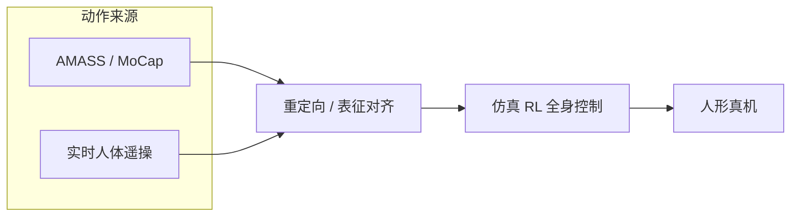

---

type: entity
tags: [repo, humanoid, teleoperation, motion-retargeting, lecar-lab, cmu]
status: complete
updated: 2026-06-26
summary: "LeCAR-Lab human2humanoid 是人形全身实时遥操作与模仿学习开源栈，README 提供 AMASS→机器人重定向脚本，同系 OmniH2O / H2O / ASAP。"
related:
  - ../concepts/motion-retargeting.md
  - ./paper-hrl-stack-07-learning_human_to_humanoid_real_time.md
  - ./paper-hrl-stack-08-omnih2o.md
  - ./tairan-he.md
sources:
  - ../../sources/repos/human2humanoid.md
---

# human2humanoid（LeCAR-Lab）

**human2humanoid**（<https://github.com/LeCAR-Lab/human2humanoid>）是 CMU **LECAR Lab** 的 **人形全身实时遥操作（human-to-humanoid teleoperation）** 开源代码库，配套项目页 <https://human2humanoid.com/>。除遥操接口与 RL 训练外，仓库 **README 的 Motion Retargeting** 章节提供 **AMASS 等人体运动 → 目标人形** 的转换脚本入口。

## 英文缩写速查

| 缩写 | 英文全称 | 简要说明 |
|------|----------|----------|
| MoCap | Motion Capture | AMASS 等参考动作来源 |
| RL | Reinforcement Learning | 跟踪遥操或重定向参考 |
| WBT | Whole-Body Tracking | 全身关节/根轨迹跟踪 |
| Sim2Real | Simulation to Real | 仿真策略上真机 |

## 为什么重要

- **遥操 + 重定向同仓**：现场操作者动作与离线 MoCap 库可通过同一套人形表征进入训练，减少「遥操一套、重定向另一套」的接口分裂。
- **同系扩展**：后续 [OmniH2O](https://omni.human2humanoid.com/)（鲁棒遥操）、[ASAP](https://agile.human2humanoid.com/)（敏捷运动）等共享 LECAR 工程脉络；见 [Tairan He](./tairan-he.md)。

## 流程概念

## 关联页面

- [Motion Retargeting](../concepts/motion-retargeting.md)
- [Learning Human-to-Humanoid](./paper-hrl-stack-07-learning_human_to_humanoid_real_time.md)
- [OmniH2O](./paper-hrl-stack-08-omnih2o.md)
- [GMR](../methods/motion-retargeting-gmr.md)
- [Tairan He](./tairan-he.md)

## 参考来源

- [human2humanoid 仓库归档](../../sources/repos/human2humanoid.md)

## 推荐继续阅读

- GitHub：<https://github.com/LeCAR-Lab/human2humanoid#motion-retargeting>
- 项目页：<https://human2humanoid.com/>
