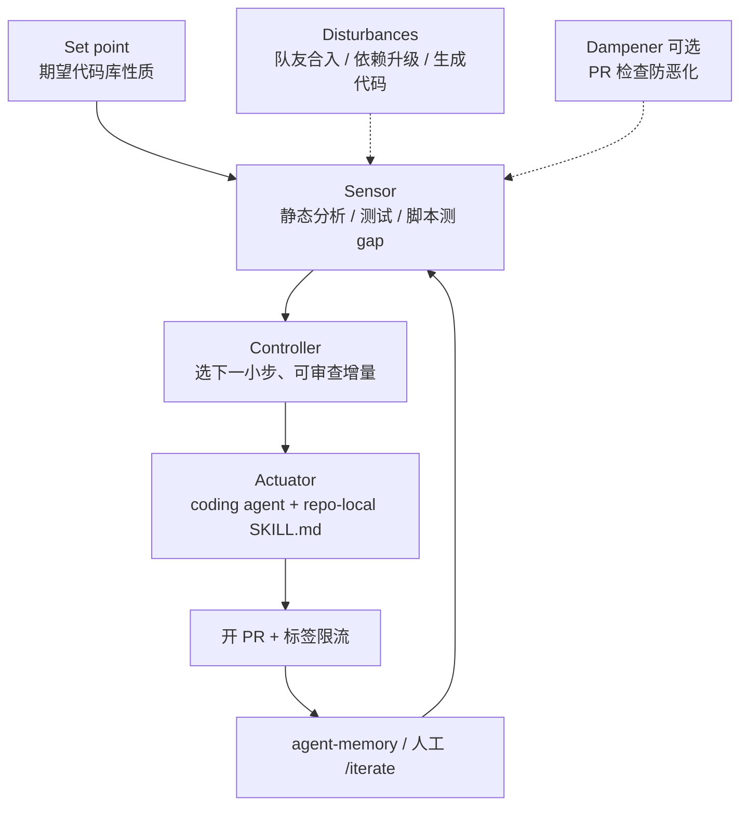

# HumanLayer Skills

**HumanLayer Skills** 是 [humanlayer/skills](https://github.com/humanlayer/skills) 仓库及其 Claude Code marketplace 分发形态的总称：把 HumanLayer 团队在 **harness 指令工程** 与 **迭代式 coding-agent 自动化** 上的实践拆成五个可按需安装的 `SKILL.md` 插件，通过 `npx skills add humanlayer/skills --skill <name>` 装入目标仓库。

## 一句话定义

用 **条件化 harness 规约 + 可视化讲解 + 控制论式 agentic loop 脚手架**，把「持续、可审查、低风险的代码库维护」从一次性聊天任务变成 **本地可运行组件 + 定时/手动 GHA 工作流** 的闭环。

## 英文缩写速查

| 缩写 | 英文全称 | 简要说明 |
|------|----------|----------|
| GHA | GitHub Actions | GitHub 托管的 CI/CD 与工作流调度 |
| LLM | Large Language Model | 大语言模型，常作 coding agent 推理核心 |
| PR | Pull Request | 代码变更审查与合并请求 |
| CI | Continuous Integration | 持续集成；loop 中常用验证门禁 |

## 为什么重要（对本知识库读者）

- **与 LLM Wiki 维护同构：** [Karpathy LLM Wiki](../references/llm-wiki-karpathy.md) 把知识编译进 `wiki/`；HumanLayer 把 **维护环** 编译进 `SKILL.md` + workflow + `agent-memory`。本仓库的 [ingest/query/lint](../../schema/ingest-workflow.md) 与 `make ci-preflight` 正是可被 `design-control-loop` 建模的 **set point + sensor + actuator** 实例。
- **控制论隐喻对机器人读者友好：** `design-control-loop` 显式借用 **set point / sensor / controller / actuator / disturbances / dampener** 语言——与 locomotion、WBC、Sim2Real 中的闭环思维一致，但对象换成 **代码库性质**（覆盖率、lint 违规、类型宽度、迁移进度等）。
- **与 Superpowers / mattpocock 的分工：** [Superpowers](superpowers-obra.md) 强调 **单次交付管线**（brainstorm → worktree → TDD → 评审）；[mattpocock/skills](mattpocock-skills.md) 强调 **日常对齐与反馈环**；HumanLayer 更聚焦 **把重复维护任务托管给定时 agent**，并用 PR 标签 **限流未审 PR**（默认每 loop 最多 1 个 open PR）。
- **对本仓库 harness 的直接价值：** [AGENTS.md](../../AGENTS.md) 与 Claude Code 的 `CLAUDE.md` 同构；`improve-claude-md` 的 `<important if>` 模式可降低「长规约被模型整体忽略」的风险——对 ingest、派生文件同步、截图验证等 **条件触发** 段落尤其有用。

## 核心结构

| 层次 | 内容 |
|------|------|
| **分发** | GitHub 主仓 + `.claude-plugin/marketplace.json`；`npx skills add humanlayer/skills --skill <name>`。 |
| **Harness 指令层** | `improve-claude-md`：通用上下文裸放、领域规则用 `<important if="…">` 包裹。 |
| **领域维护技能** | `narrow-react-prop-types`：React/TS 组件 prop 类型与真实调用路径对齐（参考型完整 loop）。 |
| **Loop 脚手架** | `build-iterated-agentic-loop`：生成 repo-local skill、GHA workflow、`agent-memory`、references 模板。 |
| **Loop 设计器** | `design-control-loop`：访谈式定义 set point / sensor / controller / actuator，强调本地先行。 |
| **沟通/教学** | `show-me`：伪代码、调用树、组件树、浅文件树、Mermaid 或 HTML artifact。 |

### 流程总览（agentic control loop）

## 技能要点

| 技能 | 触发场景 | 核心产出 |
|------|----------|----------|
| `improve-claude-md` | CLAUDE.md / AGENTS.md 过长、模型常忽略后半段 | 带 `<important if>` 的分层 harness 文件 |
| `narrow-react-prop-types` | Storybook/mock 撑宽了 prop 类型 | 收窄类型 + 可参考的 agent workflow |
| `build-iterated-agentic-loop` | 想把重复 agent 任务变成定时 PR | skill + workflow + memory + references |
| `design-control-loop` | 需要按仓库定制维护闭环 | 本地 sensor/controller 脚本 + actuator skill + GHA |
| `show-me` | 需要快速可视化架构或数据流 | 图/树/HTML，少叙述 |

## 常见误区或局限

- **误区：stars 高 = 适合机器人仿真栈开箱即用。** 技能正文与示例偏 **Web/TS 工程** 与 **GHA**；迁移到 Isaac / MuJoCo / ROS 时需重写 sensor（如 `make lint`、仿真回归）与 validation 命令。
- **误区：可替代本仓库 `schema/ingest-workflow.md`。** ingest/query/lint 与 `make ci-preflight` **无等价 skill**；最多用 control-loop 思维 **外包** 派生文件同步或断链修复，不能省略 wiki 健康检查。
- **误区：与 [Superpowers](superpowers-obra.md) 重复。** Superpowers 管 **单次功能交付**；HumanLayer 管 **持续托管维护环**；可叠加（Superpowers 做特性，control-loop 做存量卫生）。
- **局限：** 五插件体量小、迭代快；`CodeLayer` 为 HumanLayer 自家轻量 harness，非本仓库默认栈；英文为主。

## 关联页面

- [Superpowers（obra）](superpowers-obra.md) — 重流程 **单次交付** 技能库（worktree、子代理、TDD）
- [Skills For Real Engineers（mattpocock）](mattpocock-skills.md) — 轻量日常工程技能（grill、CONTEXT.md、TDD）
- [Hermes Agent](hermes-agent.md) — 常驻代理运行时与 skills 自举
- [SenseNova-Skills](sensenova-skills.md) — 办公产出向 Agent Skills
- [CAD Skills](cad-skills.md) — 硬件/CAD/URDF 垂直 Agent Skills
- [WikiSkill（论文实体）](paper-wikiskill.md) — LLM Wiki 嵌入 agent skill 进化环
- [Agent Reach](agent-reach.md) — 外网读搜工具链脚手架
- [Agentic Coding 时代的软件工程基础](../concepts/agentic-coding-software-fundamentals.md) — 有 agent 仍要懂取舍
- [LLM Wiki（Karpathy 模式）](../references/llm-wiki-karpathy.md) — 持久 wiki 知识编译范式
- [Ingest Workflow](../../schema/ingest-workflow.md) — 本仓库 ingest / query / lint 规范

## 参考来源

- [humanlayer/skills 仓库源归档（本站）](../../sources/repos/humanlayer-skills.md)
- [humanlayer/skills（GitHub）](https://github.com/humanlayer/skills)
- [HumanLayer](https://humanlayer.dev)

## 推荐继续阅读

- [improve-claude-md SKILL.md（上游）](https://github.com/humanlayer/skills/blob/main/plugins/improve-claude-md/skills/improve-claude-md/SKILL.md) — `<important if>` 编写原则全文
- [design-control-loop 示例（上游 references）](https://github.com/humanlayer/skills/tree/main/plugins/design-control-loop/skills/design-control-loop/references) — control-loop 分类与 workflow 模板
- [obra/superpowers](https://github.com/obra/superpowers) — 对照「单次交付型」技能方法论
