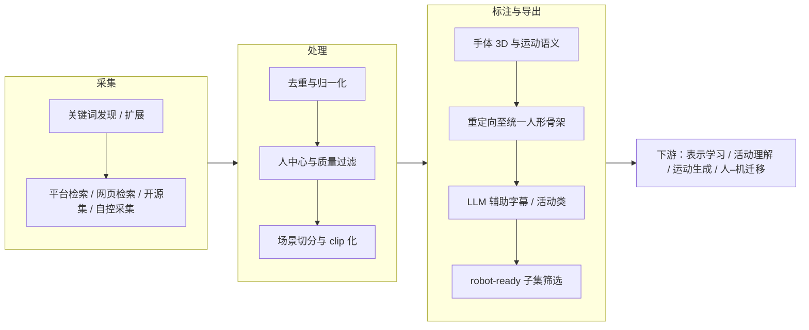

# HumanNet

**HumanNet** 是一套把 **互联网级人中心视频** 加工成「可喂给大规模模型」的具身向语料：强调 **第一人称与第三人称并存**、**物理相关行为** 的策展、以及 **手体几何 + 语言描述 + 活动语义** 等多层标注；论文在固定下游设定下对比了 **egocentric 人视频小时数** 与 **真机机器人数据小时数** 作为 VLA 类模型持续预训练来源的相对价值。

## 为什么重要？

- **缓解机器人日志稀缺**：高质量真机演示昂贵且慢；人视频在行为多样性与环境覆盖上可补位，但前提是管线能把「泛网页视频」压成 **交互可学** 的分布。
- **视点分工明确**：ego 侧贴近执行者与手–物接触；exo 侧补充全身运动与多智能体场景上下文，和 Ego-Exo4D 等路线的动机一致，但目标更偏向 **具身预训练基础设施**。
- **可审计管线**：采集 / 处理 / 标注分阶段，便于与工业界数据飞轮、自动标注与隐私合规流程对照讨论（不等同于已解决隐私与许可问题）。

## 流程总览（论文管线抽象）

**robot-ready 子集（论文公开阈值）**：重定向误差约 **<15 mm** 且有效帧覆盖率 **>60%** 的片段被标为更适合跨本体运动监督；具体比例与字段以官方数据卡与仓库说明为准。

## 常见误区或局限

- **「百万小时」≠ 均匀覆盖**：论文强调长尾行为需要规模，但分布仍受互联网来源偏置与过滤规则影响；下游任务仍需匹配数据切片。
- **不能替代安全与物理一致**：人视频可改善视觉–语义–动作接口的先验，但接触动力学、执行器与系统延迟仍需真机或高保真仿真闭环。
- **许可与隐私**：一三人称室内场景可能涉及身份与空间隐私；工程使用需以发布方条款与本地合规审查为准。

## 与其他页面的关系

- **方法**：[VLA](../methods/vla.md) 讨论把 web/VLM 能力接到动作头；HumanNet 代表「人类视频小时」作为持续预训练来源的系统级尝试。
- **方法**：[Imitation Learning](../methods/imitation-learning.md) 把人类演示视作监督来源时，可对照互联网级人视频的策展与重定向接口。
- **概念**：[Motion Retargeting](../concepts/motion-retargeting.md) 是连接人体运动与机器人可训练监督的关键模块。
- **实体**：[人形机器人](./humanoid-robot.md) 作为典型目标形态，可与人视频–机器人数据的混合训练叙事对照阅读。

## 参考来源

- [HumanNet 论文 ingest 归档](../../sources/papers/humannet.md)
- [HumanNet 仓库与项目索引](../../sources/repos/humannet.md)
- Deng et al., *HumanNet: Scaling Human-centric Video Learning to One Million Hours* (arXiv:2605.06747)
- 项目主页：<https://dagroup-pku.github.io/HumanNet/>
- 代码仓库：<https://github.com/DAGroup-PKU/HumanNet/>

## 关联页面

- [VLA](../methods/vla.md)
- [Imitation Learning](../methods/imitation-learning.md)
- [自动化标注流水线](../methods/auto-labeling-pipelines.md)
- [Motion Retargeting](../concepts/motion-retargeting.md)
- [具身规模法则](../concepts/embodied-scaling-laws.md)
- [人形机器人](./humanoid-robot.md)

## 推荐继续阅读

- Ego4D / Ego-Exo4D / EgoScale / EgoVerse 等项目页与数据卡（对比视点设计与下游任务）
- LingBot-VLA 相关公开材料（论文中作为受控 VLA 后训练协议参照架构）
