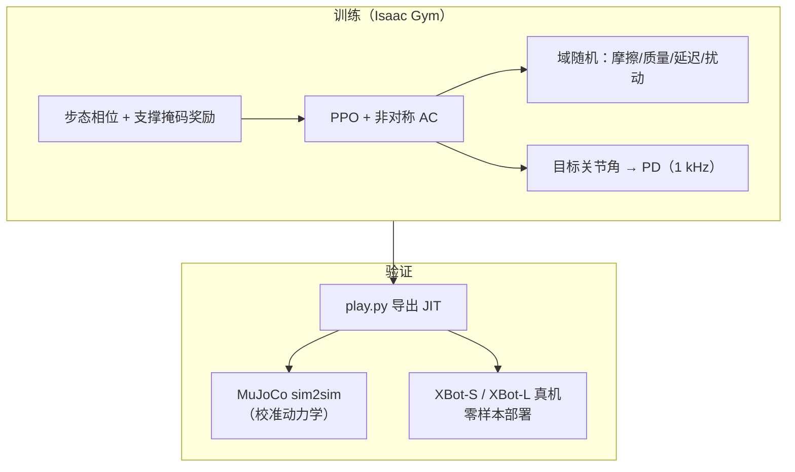

# Humanoid-Gym（人形零样本 Sim2Real 训练框架）

**Humanoid-Gym**（Gu / Wang / Chen，[arXiv:2404.05695](https://arxiv.org/abs/2404.05695)，RobotEra）是在 **NVIDIA Isaac Gym** 上针对 **人形双足 locomotion** 设计的 RL 框架：继承 ETH **[legged_gym](./legged-gym.md)** 工程范式，加入 **步态周期相位与接触掩码奖励**、**非对称 Actor-Critic 特权训练** 与 **域随机**，在 **XBot-S / XBot-L** 真机完成 **零样本 sim2real**；并提供 **Isaac Gym → MuJoCo** 的 **sim2sim** 校验。官方代码：[roboterax/humanoid-gym](https://github.com/roboterax/humanoid-gym)。

## 一句话定义

**用 PPO 在 GPU 并行仿真里训人形走路策略，训练时吃特权状态、部署时只靠本体传感，再用校准过的 MuJoCo 和真机 XBot 验证零样本迁移。**

## 英文缩写速查

| 缩写 | 英文全称 | 简要说明 |
|------|----------|----------|
| RL | Reinforcement Learning | 通过交互最大化长期回报学习策略 |
| PPO | Proximal Policy Optimization | 人形/足式 locomotion 主流 on-policy 算法 |
| AAC | Asymmetric Actor-Critic | 训练用 critic 特权信息、actor 仅部署观测 |
| DR | Domain Randomization | 仿真随机化动力学以缩小 sim2real 差距 |
| Sim2Real | Simulation to Real | 仿真策略零样本或微调上真机 |
| PD | Proportional–Derivative | 策略输出目标关节角，内环 PD 执行力矩 |
| POMDP | Partially Observable MDP | 部署时观测不完整的标准建模 |
| GAE | Generalized Advantage Estimation | PPO 优势函数估计 |
| Isaac Gym | NVIDIA Isaac Gym | GPU 并行刚体仿真训练底座 |
| DS / SS | Double / Single Support | 双支撑 / 单支撑步态相 |

## 为什么重要

- **人形 RL 的早期开源标杆：** 在 [legged_gym](./legged-gym.md) 四足范式之上，首次把 **步态相位奖励 + 人形专用 DR + 真机零样本** 打包成可复现仓库（~2k stars），影响后续 SPRINT、AMP 对照等工作的 baseline 叙事。
- **Sim2Sim 作为 sim2real 前置门：** 论文强调 **MuJoCo 经正弦跟踪与相图校准后比 Isaac Gym 更接近真机**——给「没有机器人也能先验策略」提供了可操作检查点（见 [Sim2Real](../concepts/sim2real.md)）。
- **工程模板价值：** 多帧观测堆叠（15×47）、特权帧（3×73）、100 Hz 策略 / 1000 Hz PD、接触模式掩码 $I_p$ 与奖励拆项，是人形 RL **reward / obs / DR** 设计的教科书级参考。
- **与深读笔记互补：** 单篇机制细节见 [Paper Notebooks：Humanoid-Gym](https://imchong.github.io/Humanoid_Robot_Learning_Paper_Notebooks/papers/03_High_Impact_Selection/Humanoid-Gym_Zero-Shot_Sim2Real_Transfer/Humanoid-Gym_Zero-Shot_Sim2Real_Transfer.html)；本页侧重跨主题选型与栈关系。

## 流程总览

## 核心结构

| 模块 | 作用 |
|------|------|
| **环境基类** | 基于 legged_gym `LeggedRobot`；`humanoid_ppo` 为默认速度跟踪任务。 |
| **观测** | 单帧 47 维：时钟 $\sin/\cos$、速度指令、$q,\dot{q}$、基座角速度/欧拉角、$a_{t-1}$；堆叠 15 帧。 |
| **特权（训练）** | 单帧 73 维：摩擦、质量、基座线速度、推力/力矩、跟踪差、$I_p$、足端接触等；堆叠 3 帧。 |
| **动作** | 目标关节位置 → PD；策略 100 Hz。 |
| **步态** | 周期 $C_T$、正弦参考、$I_p(t)\in\{[0,1],[1,1],\ldots\}$ 与实测接触 $I_d$ 对齐奖励。 |
| **奖励** | 速度/姿态/高度跟踪 + 接触模式 + 关节/能量/平滑正则；$z,\gamma,\beta$ 指令刻意为零。 |
| **Sim2Sim** | `sim2sim.py` 加载 JIT，在 MuJoCo 平地/崎岖地形回放。 |

### 训练超参（论文 Table II 摘要）

| 项 | 值 |
|----|-----|
| 并行环境 | 8192 |
| Episode 长度 | 2400 steps |
| Batch | $8192 \times 24$ |
| $\gamma$ / GAE $\lambda$ | 0.994 / 0.95 |
| 学习率 | $10^{-5}$ |

## 社区 fork：humanoid-gym-modified

[roboman-ly/humanoid-gym-modified](https://github.com/roboman-ly/humanoid-gym-modified) 在上游基础上：

- 接入开源 **Pandaman** 人形模型（`pandaman_ppo` 任务）；
- 增加 **Gazebo + ROS Noetic** sim2sim（`humanoid_ros`），适合已习惯 ROS 控制栈的团队；
- 方法论仍遵循 Humanoid-Gym 论文；**新功能（如 DWL）以官方仓库为准**。

见归档：[humanoid-gym-modified](../../sources/repos/humanoid-gym-modified.md)。

## 与 legged_gym / Isaac Lab 的关系

| 框架 | 关系 |
|------|------|
| [legged_gym](./legged-gym.md) | **直接上游**；Humanoid-Gym 致谢并复用 `LeggedRobot` 与 rsl_rl。 |
| [Isaac Gym](./isaac-gym.md) | 物理仿真底座（Preview 4）。 |
| [Isaac Lab](./isaac-lab.md) / [robot_lab](./robot-lab.md) | **长期新主线**；学 Humanoid-Gym 的人形 reward/DR 经验，新项目优先 Isaac Lab 生态。 |

## 常见误区或局限

- **误区：** 把 Humanoid-Gym 当成独立物理引擎——它是 **训练框架**，仿真仍是 Isaac Gym。
- **误区：** 认为四足 legged_gym 经验可原样复制——人形需 **步态相位、更高维耦合、更大 sim2real 差距**（论文动机）。
- **局限：** 栈绑定 **Python 3.8 + PyTorch 1.13 + Isaac Gym Preview 4**；默认叙事为 **平地/崎岖速度跟踪**，不含感知地形或操作；极速冲刺等场景已被 [SPRINT](./paper-sprint-humanoid-athletic-sprints.md) 等工作超越。
- **局限：** Gazebo fork 为社区维护，可能与上游 API 漂移；真机仍以 **XBot / 自适配 URDF** 为主。

## 参考来源

- [Humanoid-Gym 论文摘录（arXiv:2404.05695）](../../sources/papers/humanoid_gym_arxiv_2404_05695.md)
- [humanoid-gym 官方仓库归档](../../sources/repos/humanoid-gym.md)
- [humanoid-gym-modified 社区 fork 归档](../../sources/repos/humanoid-gym-modified.md)

## 关联页面

- [legged_gym](./legged-gym.md) — 上游足式 RL 工程范式
- [Sim2Real](../concepts/sim2real.md) — 零样本迁移与 sim2sim 检查清单
- [Domain Randomization](../concepts/domain-randomization.md) — DR 项与参数范围
- [Humanoid Locomotion](../tasks/humanoid-locomotion.md) — 人形行走任务语境
- [Reinforcement Learning](../methods/reinforcement-learning.md)
- [SPRINT（人形冲刺对照基线）](./paper-sprint-humanoid-athletic-sprints.md)

## 推荐继续阅读

- [Paper Notebooks 深读：Humanoid-Gym Zero-Shot Sim2Real](https://imchong.github.io/Humanoid_Robot_Learning_Paper_Notebooks/papers/03_High_Impact_Selection/Humanoid-Gym_Zero-Shot_Sim2Real_Transfer/Humanoid-Gym_Zero-Shot_Sim2Real_Transfer.html)
- 项目页：<https://sites.google.com/view/humanoid-gym/>
- 官方仓库：<https://github.com/roboterax/humanoid-gym>
- 社区 fork（Pandaman + Gazebo）：<https://github.com/roboman-ly/humanoid-gym-modified>
