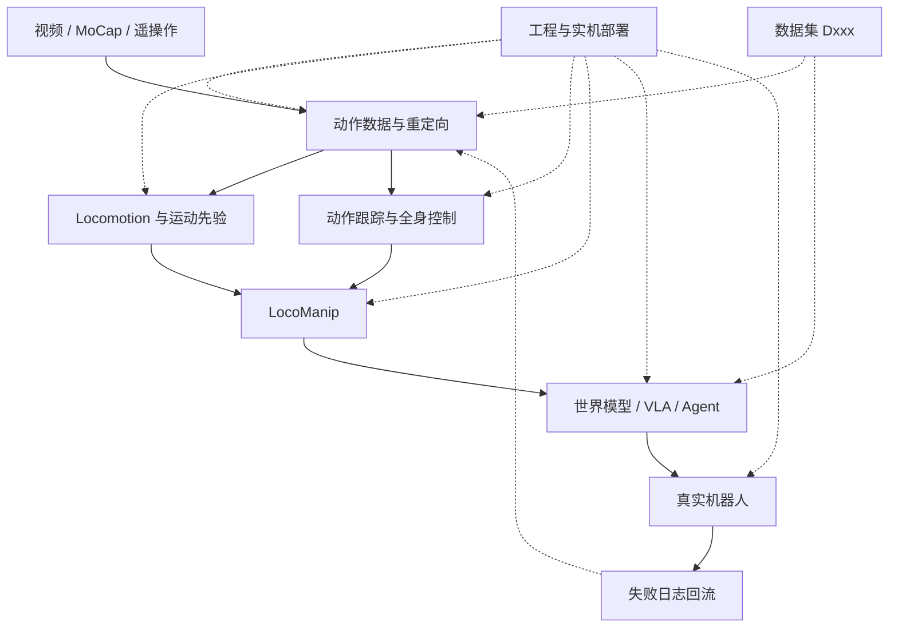

# Humanoid Motion Intelligence（人形机器人运动智能知识库）

**Humanoid Motion Intelligence**（GitHub：[`RealXiaoze/humanoid-motion-intelligence`](https://github.com/RealXiaoze/humanoid-motion-intelligence)）是 **具身智能研究室** 出品的开源 Markdown 知识库：把人形 **运动智能** 从动作数据到实机部署放进同一张问题地图，并挂上论文解读、开源入口、数据集、产业信号与求职材料。

| 字段 | 内容 |
|------|------|
| 机构 | 具身智能研究室（Embodied AI Lab） |
| 仓库 | <https://github.com/RealXiaoze/humanoid-motion-intelligence> |
| 许可 | 原创编排 CC BY-NC-SA 4.0；校验脚本 MIT |
| 规模（2026-09-10） | 191 篇论文 · 586 个开源项目 · 40 个数据集 · 176 家公司；515 ★ |
| 定位 | 策展知识库（非算法训练仓） |

## 一句话定义

面向人形运动智能的 **结构化外部策展仓**（六条研发路线 + 论文/开源/数据集三索引），与本库已 ingest 的公众号长文同源，适合当持续更新入口，而不是再抄一遍列表。

## 英文缩写速查

| 缩写 | 英文全称 | 简要说明 |
|------|----------|----------|
| AMP | Adversarial Motion Prior | 用对抗判别约束策略接近人类运动分布 |
| LocoManip | Loco-Manipulation | 移动与操作在同一闭环中改变场景状态 |
| VLA | Vision-Language-Action | 视觉–语言–动作统一策略，常作上层调用 |
| WBC | Whole-Body Control | 全身多任务 / 多接触控制框架 |
| Sim2Real | Simulation to Real | 仿真策略迁移到真机的工程主线 |
| MoCap | Motion Capture | 动捕数据，常作重定向与模仿学习上游 |
| BFM | Behavior Foundation Model | 身体级行为基座，封装可提示低层技能 |
| WAM | World-Action Model | 联合预测未来视觉与可执行动作的上层模型 |

## 为什么重要

- **把微信长文落成可克隆仓库**：本库已大量 ingest「具身智能研究室」综述（[42 篇身体系统栈](../overview/humanoid-rl-motion-control-body-system-stack.md)、[64 篇运动小脑](../overview/humanoid-motion-cerebellum-technology-map.md) 等）；该仓是同一策展逻辑的 **GitHub 主站**，便于 Agent 全目录检索与人类对照更新。
- **按最终解决的问题分类**：AMP / Mimic / Diffusion / Transformer 只作方法标签；主轴是「数据 → 身体能力 → 物理交互 → 上层调用 → 部署」。
- **开源、数据与产业旁路齐全**：论文表标注开源程度；另有数据集 `Dxxx`、按公司拆开的官方开源、招聘快照——使用前必须回一手来源核时效。
- **规模在扩，不要整仓镜像**：2026-07 入库时约 145 篇 / 166 项；本次复核已到 **191 / 586**。本库只交叉引用 + 导读挂接，不复制上游表格。

## 核心结构

### 六条技术路线（问题地图）

上游 README 强调：六条路线是 **资料分类**，不等于六个并列研究方向。核心是两条运动基座主线——**自主运动**（速度/地形/行为提示）与 **参考跟踪**（动作/关键点/人体信号）；数据在上游，LocoManip 与 VLA/WAM/Agent 在下游，工程层横向支撑。

| 路线 | 上游自报规模 | 主要回答的问题 | 本库邻近页 |
|------|-------------|----------------|------------|
| 动作数据与重定向 | 17 篇 / 47 项 | 人体/视频如何变成可训练机器人参考 | [Motion Retargeting](../concepts/motion-retargeting.md) |
| Locomotion 与运动先验 | 39 篇 / 61 项 | 基础移动、地形、行为先验如何形成 | [humanoid-locomotion](../tasks/humanoid-locomotion.md)、[AMP 综述](../overview/humanoid-amp-motion-prior-survey.md) |
| 动作跟踪与全身控制 | 40 篇 / 52 项 | 参考如何稳定执行并处理失配/恢复 | [运动跟踪选型](../queries/humanoid-motion-tracking-method-selection.md) |
| LocoManip | 31 篇 / 37 项 | 移动–接触–操作如何改变场景 | [loco-manipulation](../tasks/loco-manipulation.md)、[161 篇地图](../overview/humanoid-loco-manip-161-papers-technology-map.md) |
| 世界模型、VLA 与 Agent | 47 篇 / 103 项 | 预测、生成与技能调度 | [VLA](../methods/vla.md) |
| 工程与实机部署 | 17 篇 / 286 项 | 接口、仿真、安全与 Sim2Real | [Sim2Real](../concepts/sim2real.md)、[运动控制主路线](../../roadmap/motion-control.md) |

工程层项目数（286）远高于其他路线，是因为 URDF/SDK、仿真器、控制库、数据工具和部署中间件都汇在这里——**条目数 ≠ 方法贡献**。

### 导航入口（仓库 README，2026-09-10）

| 想解决什么 | 上游入口 |
|------------|----------|
| 建立完整技术路线 / 新手路径 | [`技术路线/README.md`](https://github.com/RealXiaoze/humanoid-motion-intelligence/blob/main/%E6%8A%80%E6%9C%AF%E8%B7%AF%E7%BA%BF/README.md) |
| 查论文与稳定 ID（Pxxx） | [`论文与项目/README.md`](https://github.com/RealXiaoze/humanoid-motion-intelligence/blob/main/%E8%AE%BA%E6%96%87%E4%B8%8E%E9%A1%B9%E7%9B%AE/README.md)（**191** 条）→ 本库导读见 [HMI 论文总索引 · 本库导读](../queries/hmi-papers-coverage.md) |
| 找代码与复现入口 | [开源项目主表](https://github.com/RealXiaoze/humanoid-motion-intelligence/blob/main/%E8%AE%BA%E6%96%87%E4%B8%8E%E9%A1%B9%E7%9B%AE/%E5%BC%80%E6%BA%90%E9%A1%B9%E7%9B%AE%E4%B8%BB%E8%A1%A8.md)（**586** 项）→ 本库导读见 [HMI 开源项目主表 · 本库导读](../queries/hmi-opensource-projects-coverage.md) |
| 按公司查官方开源 | [`具身智能公司的开源项目/`](https://github.com/RealXiaoze/humanoid-motion-intelligence/tree/main/%E5%85%B7%E8%BA%AB%E6%99%BA%E8%83%BD%E5%85%AC%E5%8F%B8%E7%9A%84%E5%BC%80%E6%BA%90%E9%A1%B9%E7%9B%AE)（约 81 家页面；只收可核验归属） |
| 查训练数据 | [`数据集/README.md`](https://github.com/RealXiaoze/humanoid-motion-intelligence/blob/main/%E6%95%B0%E6%8D%AE%E9%9B%86/README.md)（40 个 `Dxxx`） |
| 国内机构开源全景（76 家 · 424 项） | [微信全景 2026-09-06](../../sources/blogs/wechat_embodied_station_domestic_opensource_panorama_2026-09-06.md) → [五层技术地图](../overview/china-domestic-embodied-opensource-76-companies-technology-map.md) + [424 项覆盖索引](../queries/china-domestic-opensource-424-coverage.md) |
| 产业信号 / 求职面经 | [`公司与产业/`](https://github.com/RealXiaoze/humanoid-motion-intelligence/tree/main/%E5%85%AC%E5%8F%B8%E4%B8%8E%E4%BA%A7%E4%B8%9A)（176 家）、[`求职与岗位/`](https://github.com/RealXiaoze/humanoid-motion-intelligence/tree/main/%E6%B1%82%E8%81%8C%E4%B8%8E%E5%B2%97%E4%BD%8D) |
| RL 工具分层选型 | [`强化学习开发者必备开源资料/`](https://github.com/RealXiaoze/humanoid-motion-intelligence/tree/main/%E5%BC%BA%E5%8C%96%E5%AD%A6%E4%B9%A0%E5%BC%80%E5%8F%91%E8%80%85%E5%BF%85%E5%A4%87%E5%BC%80%E6%BA%90%E8%B5%84%E6%96%99/README.md) |

## 工程实践

| 场景 | 建议用法 |
|------|----------|
| Agent 辅助学习路线 | 克隆仓库后让 Agent 先读根 README、`AGENTS.md` 与 `技术路线/`，再按背景给分阶段验收标准 |
| 算法改进 brainstorm | 描述本体/观测/奖励/训练现象，要求对照相邻 `Pxxx` 设计可消融改进，而非只列算法名 |
| 开源选型 | 先查开源主表的「定位」与开源标注，再跳官方仓核对许可证与真机入口；公司官方仓另走「按公司拆页」目录 |
| 数据选型 | 先分清原始数据集 / 训练配方 / rollout 日志 / 仿真资产（见上游数据集 README），再打开数据卡核对许可与本体依赖 |
| 求职准备 | 面经与招聘快照仅作线索；投递前回公司招聘页确认 |

**开源状态（本仓自身，2026-09-10）：** 知识库内容 **已公开**；分层许可见上游 [`LICENSE.md`](https://github.com/RealXiaoze/humanoid-motion-intelligence/blob/main/LICENSE.md)。**无可运行训练入口**（不是算法实现仓）；复现走各论文官方代码链接。源码运行时序图 **不适用**。

## 局限与风险

- **第三方策展，非一手论文**：数值、消融与开源声明以 arXiv / 项目页为准。
- **与本库分工**：[`Robotics_Notebooks`](https://github.com/ImChong/Robotics_Notebooks) 做跨主题编译与图谱；该仓做同主题的路线+产业+求职聚合——**勿整仓镜像**，只交叉引用。
- **导读页是快照**：论文导读覆盖 P001–P191 的挂接（少数待补）；开源主表导读仍以 2026-07 的 166 项为深读快照，上游 586 项以原文为准。
- **招聘与公司信息不构成排名或投资建议**；上游也明确声明产品发布 ≠ 独立验证能力。
- **许可边界**：原创解读 CC BY-NC-SA 4.0；转载需署名且非商业；论文图与上游代码许可证不变。

## 关联页面

- [人形 RL 身体系统栈](../overview/humanoid-rl-motion-control-body-system-stack.md) — 同公众号 42 篇八层管线视角
- [运动小脑 64 篇技术地图](../overview/humanoid-motion-cerebellum-technology-map.md) — 动作小脑横切面
- [AMP 运动先验综述](../overview/humanoid-amp-motion-prior-survey.md) — 运动先验姊妹篇
- [人形 Loco-Manip 161 篇技术地图](../overview/humanoid-loco-manip-161-papers-technology-map.md) — 移动操作全谱
- [HMI 论文总索引 · 本库导读](../queries/hmi-papers-coverage.md) — 总索引接到本库详情页（P146–P191 为本次增量挂接）
- [HMI 开源项目主表 · 本库导读](../queries/hmi-opensource-projects-coverage.md) — 166 项快照导读；上游现 586 项
- [国内具身开源全景（76 家 · 424 项）](../overview/china-domestic-embodied-opensource-76-companies-technology-map.md) — 2026-09-06 公众号五层机构清单
- [424 项覆盖索引](../queries/china-domestic-opensource-424-coverage.md) — 逐条独立实体节点导读
- [开源运动控制项目结构化摘要](../queries/open-source-motion-control-projects.md) — 本库另一条开源项目方法地图
- [人形运动跟踪方法选型](../queries/humanoid-motion-tracking-method-selection.md)
- [运动控制主路线](../../roadmap/motion-control.md)
- [Awesome Text-to-Motion（Zilize）](./awesome-text-to-motion-zilize.md) — 人体 T2M 清单对照（非机器人控制）
- [robot_descriptions.py](./robot-descriptions-py.md) — 主表「工程与实机部署」条目的独立详情；选型见 [机器人描述目录](../comparisons/robot-description-catalogs.md)

## 参考来源

- [sources/repos/humanoid-motion-intelligence.md](../../sources/repos/humanoid-motion-intelligence.md)
- [sources/repos/robot-descriptions-py.md](../../sources/repos/robot-descriptions-py.md) — 主表工程条目加深
- [微信 · 42 篇 RL 运动控制](../../sources/blogs/wechat_embodied_ai_lab_humanoid_rl_motion_survey.md)
- [微信 · 运动小脑 64 篇](../../sources/blogs/wechat_embodied_ai_lab_humanoid_motion_cerebellum_survey.md)
- [微信 · 国内开源全景 76 家 424 项](../../sources/blogs/wechat_embodied_station_domestic_opensource_panorama_2026-09-06.md)

## 推荐继续阅读

- [GitHub 仓库 README（入口与六条路线）](https://github.com/RealXiaoze/humanoid-motion-intelligence/blob/main/README.md)
- [技术路线总览与新手学习路径](https://github.com/RealXiaoze/humanoid-motion-intelligence/blob/main/%E6%8A%80%E6%9C%AF%E8%B7%AF%E7%BA%BF/README.md)
- [数据集主表（D001–D040）](https://github.com/RealXiaoze/humanoid-motion-intelligence/blob/main/%E6%95%B0%E6%8D%AE%E9%9B%86/%E6%95%B0%E6%8D%AE%E9%9B%86%E4%B8%BB%E8%A1%A8.md)
- [许可与版权边界](https://github.com/RealXiaoze/humanoid-motion-intelligence/blob/main/LICENSE.md)
- [awesome-humanoid-robot-learning](https://github.com/YanjieZe/awesome-humanoid-robot-learning)（互补论文列表）
