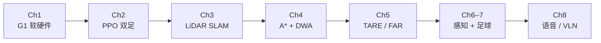

# 人形机器人系统学习策展（G1 → 导航 → 足球 → 大模型）

**一句话：** 把深蓝学院「人形机器人系统 - 理论与实践」八章大纲落成可交叉引用的知识图：以 [Unitree G1](./unitree-g1.md) 为平台，从 **行走 RL** 走到 **建图导航、自主探索、RoboCup 感知与语音/VLN**。

## 英文缩写速查

| 缩写 | 英文全称 | 简要说明 |
|------|----------|----------|
| G1 | Unitree G1 Humanoid | 课程主用教育科研人形平台 |
| PPO | Proximal Policy Optimization | 双足行走 RL 主流算法 |
| SLAM | Simultaneous Localization and Mapping | LiDAR 建图定位主线 |
| DWA | Dynamic Window Approach | 局部避障速度采样 |
| TARE | Technologies for Autonomous Robot Exploration | CMU 分层自主探索规划 |
| FAR | Fast Attemptable Route Planner | CMU 动态可见图路由规划 |
| VLN | Vision-Language Navigation | 视觉–语言导航 |
| EKF | Extended Kalman Filter | 线特征视觉定位融合常用滤波器 |
| YOLO | You Only Look Once | 球/门/线实时检测骨干族 |

## 为什么重要

1. **系统课而非单点方法**：覆盖「能动 → 能定位 → 能规划 → 能探索 → 能看球 → 能听懂指令」整条工程链，适合作为人形入门第二阶段（在 [运动控制主路线](../../roadmap/motion-control.md) 之后）。
2. **与四足策展对照**：[四足控制策展](./quadruped-control-curriculum.md) 偏动力学/SysID/DR；本课偏 **G1 服务栈 + 导航规划 + 足球感知 + 大模型导航**。
3. **开源可复现节点齐全**：TARE/FAR、PythonRobotics/Nav2、NaVid、YOLO 均可落到仓库已有或新建实体页。

## 推荐学习路径

## 章节 ↔ 本库节点完整映射

### 第 1 章 发展现状与课程介绍

| 节 | 主题 | 独立节点 |
|----|------|----------|
| 1.1 | 人形发展历史 | [人形机器人发展历史](../overview/humanoid-robot-history.md) |
| 1.2 | 算法研究现状 | [人形算法研究现状](../overview/humanoid-algorithm-research-status.md) |
| 1.3 | G1 硬件组成 | [Unitree G1](./unitree-g1.md) |
| 1.4 | G1 软件服务 | [G1 软件服务栈](./unitree-g1-software-stack.md) |
| 1.5 | 课程与进度 | **本页** |
| 实践 | 仿真与运动控制 | [G1](./unitree-g1.md)、[humanoid-locomotion](../tasks/humanoid-locomotion.md) |

### 第 2 章 强化学习行走控制

| 节 | 主题 | 独立节点 |
|----|------|----------|
| 2.1 | 双足行走理论 | [LIP/ZMP](../concepts/lip-zmp.md) |
| 2.2 | RL 与 PPO | [PPO](../methods/ppo.md)、[Reinforcement Learning](../methods/reinforcement-learning.md) |
| 2.3 | 双足 RL 训练 | [Humanoid RL Cookbook](../queries/humanoid-rl-cookbook.md)、[Humanoid Locomotion](../tasks/humanoid-locomotion.md) |
| 2.4 | Sim2Real | [Sim2Real](../concepts/sim2real.md) |
| 实践 | G1 行走训练 | 同上 |

### 第 3 章 Lidar 建图与定位

| 节 | 主题 | 独立节点 |
|----|------|----------|
| 3.1 | 方案与硬件 | [导航·SLAM 栈总览](../overview/navigation-slam-autonomy-stack.md) |
| 3.2 | 激光建图 | [slam_toolbox](./slam-toolbox.md)、[FAST-LIO](./fast-lio.md) |
| 3.3 | 激光定位 | [slam_toolbox](./slam-toolbox.md)、[Navigation2](./navigation2.md) |
| 3.4 | 里程计–激光融合 | [Lidar–Odometry 融合定位](../methods/lidar-odometry-fusion.md) |
| 实践 | G1 建图定位 | 同上 + [G1](./unitree-g1.md) |

### 第 4 章 全局规划与局部避障

| 节 | 主题 | 独立节点 |
|----|------|----------|
| 4.1 | 动态障碍剔除与 2D 地图 | [动态障碍物滤波](../concepts/dynamic-obstacle-filtering.md) |
| 4.2 | A* 全局规划 | [A*](../methods/a-star.md) |
| 4.3 | DWA 局部规划 | [DWA](../methods/dwa.md) |
| 4.4 | 仿真规划实践 | [PythonRobotics](./python-robotics.md)、[Nav2](./navigation2.md) |
| 实践 | A* + DWA 避障 | 同上 |

### 第 5 章 TARE / FAR 自主探索

| 节 | 主题 | 独立节点 |
|----|------|----------|
| 5.1 | 自主探索任务 | [自主探索](../tasks/autonomous-exploration.md) |
| 5.2 | TarePlanner | [TARE Planner](./tare-planner.md) |
| 5.3 | FarPlanner | [FAR Planner](./far-planner.md) |
| 5.4 / 实践 | 仿真探索 | 同上 |

### 第 6 章 RealSense 感知

| 节 | 主题 | 独立节点 |
|----|------|----------|
| 6.1 | RealSense | [Intel RealSense](./intel-realsense.md) |
| 6.2 | YOLO 系列 | [目标检测](../methods/object-detection.md)、[YOLO v1 论文](./paper-yolo-unified-realtime-detection.md) |
| 6.3 | 足球场仿真 | [足球场仿真环境](../concepts/soccer-field-simulation.md) |
| 6.4 | 球门与场地线交点 | [足球场地线检测](../methods/soccer-field-line-detection.md) |
| 实践 | YOLO11 检测 | 同上 |

### 第 7 章 RoboCup 仿真足球

| 节 | 主题 | 独立节点 |
|----|------|----------|
| 7.1 | 感知后处理与坐标变换 | [感知后处理与坐标变换](../concepts/perception-coordinate-postprocessing.md) |
| 7.2 | 线匹配视觉定位 | [线匹配视觉定位](../methods/visual-line-matching-localization.md) |
| 7.3 | EKF 融合定位 | [线特征 EKF 融合](../methods/visual-line-ekf-fusion.md)、[EKF](../formalizations/ekf.md) |
| 7.4 / 实践 | 足球实践 | [Humanoid Soccer](../tasks/humanoid-soccer.md)、[足球纵深路线](../../roadmap/depth-humanoid-soccer.md) |

### 第 8 章 大模型赋能

| 节 | 主题 | 独立节点 |
|----|------|----------|
| 8.1 | 大模型赋能方法 | [大模型赋能人形](../overview/large-model-empowered-humanoids.md) |
| 8.2 | 智能语音交互 | [人形语音交互](../methods/humanoid-voice-interaction.md) |
| 8.3 | VLN | [Vision-Language Navigation](../tasks/vision-language-navigation.md) |
| 8.4 | NaVid | [NaVid](./paper-vln-10-navid.md) |
| 实践 | 语音交互导航 | 8.2 + 8.3 + 8.4 |

## 常见误区

- **把 Ch2 策略直接当导航 cmd_vel**：行走策略与 Nav2/`cmd_vel` 分层接口不同，需显式速度指令桥接。
- **用 TARE 替代局部避障**：TARE/FAR 是高层探索/路由；近场避障仍靠 DWA/局部规划器。
- **足球检测框当全局位姿**：必须经 [线匹配](../methods/visual-line-matching-localization.md) / [EKF](../methods/visual-line-ekf-fusion.md) 才能稳定上场。

## 关联页面

- [四足控制策展](./quadruped-control-curriculum.md) — 姊妹课程地图
- [导航·SLAM 栈总览](../overview/navigation-slam-autonomy-stack.md)
- [运动控制成长路线](../../roadmap/motion-control.md)

## 参考来源

- [深蓝学院人形系统课程大纲](../../sources/courses/shenlan_humanoid_system_theory_practice.md)
- [know-how 深蓝学院索引](../../sources/notes/know-how.md)

## 推荐继续阅读

- 深蓝学院课程页：<https://www.shenlanxueyuan.com/course/802/task/33927/show>
- CMU Exploration：<https://www.cmu-exploration.com/>
