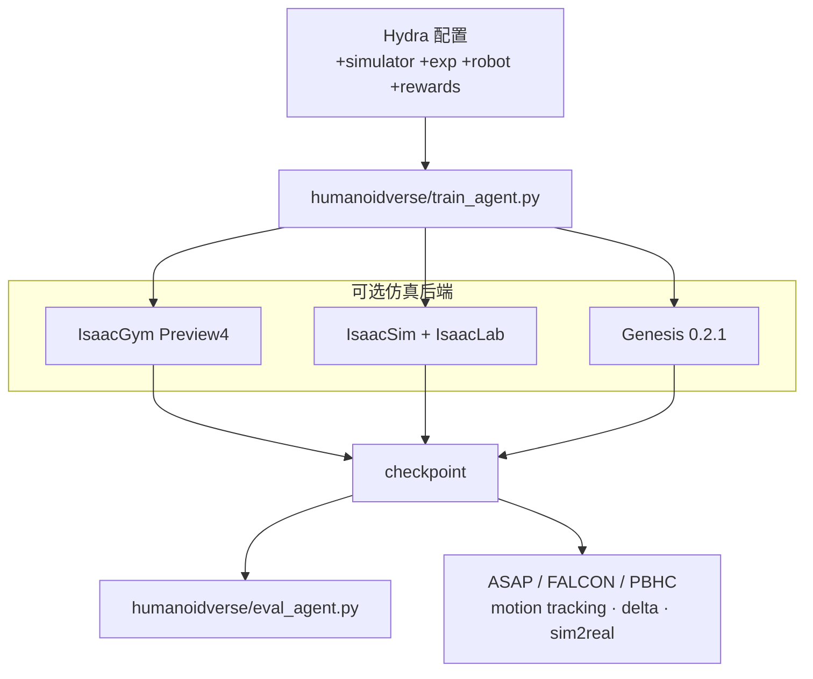
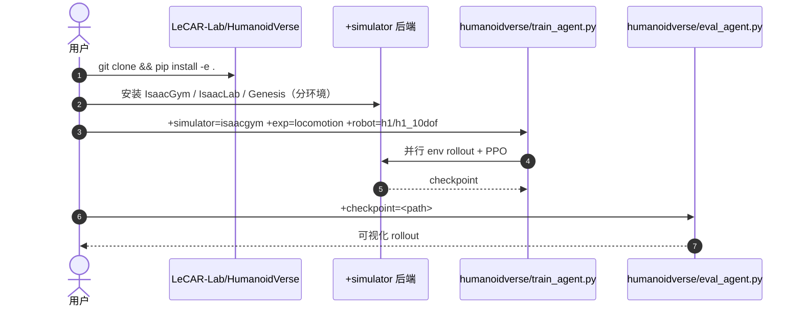

# HumanoidVerse（LeCAR-Lab）

**HumanoidVerse**（[LeCAR-Lab/HumanoidVerse](https://github.com/LeCAR-Lab/HumanoidVerse)，MIT）是 CMU **LECAR Lab** 的 **人形多仿真器强化学习框架**。核心设计是把 **仿真后端、任务与算法解耦**，用统一 Hydra 入口 `humanoidverse/train_agent.py` 训练，换 IsaacGym / IsaacSim / Genesis 通常只需改 **`+simulator=<name>`**。

> **命名消歧：** 本页指 **训练框架仓库**。Paper Notebooks 中另有 VLN 论文 *HumanoidVerse: A Versatile Humanoid for Vision-Language Guided Multi-Object Rearrangement*（arXiv:2508.16943），见 [paper-notebook-humanoidverse](./paper-notebook-humanoidverse.md)——**同名不同物**。

## 一句话定义

HumanoidVerse 用模块化配置把人形 RL 的 **仿真器、任务与算法** 分开，使同一套训练脚本可在 IsaacGym、IsaacSim(IsaacLab) 与 Genesis 间低成本切换，并为 ASAP / FALCON 等 Sim2Real 管线提供共用底座。

## 英文缩写速查

| 缩写 | 英文全称 | 简要说明 |
|------|----------|----------|
| RL | Reinforcement Learning | 框架主训练范式（如 PPO） |
| Sim2Real | Simulation to Real | 下游 ASAP 等仓库的部署目标 |
| Sim2Sim | Simulation to Simulation | 跨仿真器策略迁移（如 Gym→Sim/Genesis） |
| DoF | Degree of Freedom | 支持的 H1/G1 等 embodiment 变体 |
| Hydra | — | 配置组合与 CLI 覆盖机制 |

## 为什么重要

- **一行换后端：** 相对「每个 simulator  fork 一套 legged_gym」的碎片化，HumanoidVerse 把切换成本压到配置层，便于做 IsaacGym→IsaacSim→Genesis 的 sim2sim 对照（ASAP 论文三类迁移场景即建立在此能力上）。
- **LECAR 工程谱系中枢：** [ASAP](./paper-notebook-asap-aligning-simulation-and-real-world-physics.md) 代码库 **built on top of HumanoidVerse**；[FALCON](./paper-loco-manip-161-109-falcon.md)、PBHC/KungfuBot 等亦复用 `humanoidverse/` 目录约定。
- **Sim2Real 管线可扩展：** 框架 README 发布 locomotion；motion tracking、delta action、MuJoCo/Unitree 部署在 [ASAP 仓库](https://github.com/LeCAR-Lab/ASAP) 中落地。

## 流程总览

## 核心信息

| 项 | 内容 |
|----|------|
| **机构** | 卡内基梅隆大学（CMU）LECAR Lab |
| **许可** | MIT |
| **仿真器** | IsaacGym、IsaacSim 4.2 + IsaacLab、Genesis 0.2.1 |
| **Embodiment** | Unitree H1（10/19 DoF）、G1（12/23 DoF）等 |
| **开源** | **已开源**；2025-02-04 初始公开发布 locomotion pipeline |

## 与同系框架对比（README 归纳）

| 框架 | 多仿真器 | Sim2Sim & Sim2Real |
|------|:--------:|:------------------:|
| **HumanoidVerse** | ✓ | ✓（管线在 ASAP 等下游完善） |
| Mujoco Playground | ✗ | ✓ |
| ProtoMotions | ✓ | ✗ |
| Humanoid Gym / Unitree RL Gym | ✗ | ✓ |
| Legged Gym | ✗ | ✗ |

## 源码运行时序图

官方仓库提供可运行 **locomotion** 训练/评测入口；完整 sim2real 见 [ASAP](./paper-notebook-asap-aligning-simulation-and-real-world-physics.md) 仓库。

## 工程实践（含开源状态）

| 项 | 结论 |
|----|------|
| 仓库 | <https://github.com/LeCAR-Lab/HumanoidVerse>，MIT |
| 训练入口 | `python humanoidverse/train_agent.py +simulator=<isaacgym\|isaacsim\|genesis> +exp=locomotion ...` |
| 评测入口 | `python humanoidverse/eval_agent.py +checkpoint=<path>` |
| Python 环境 | IsaacGym 建议 3.8；IsaacSim/Genesis 建议 3.10（**分 conda 环境**，避免依赖冲突） |
| Motion tracking / delta / 真机 | 在 [LeCAR-Lab/ASAP](https://github.com/LeCAR-Lab/ASAP) 扩展（本框架 README TODO 中 sim2sim 与 motion tracking 由 ASAP 落地） |

## 结论

**HumanoidVerse 的价值在「把 sim 后端从任务逻辑里拔出来」：同一 Hydra 训练入口跨 IsaacGym / IsaacSim / Genesis 切换，让 sim2sim 与后续 sim2real 实验共享配置与模块边界。**

- 真正省下来的是 **工程切换成本**，不是算法本身——换 `+simulator=` 仍要处理各后端安装与数值差异，但不必 fork 多套训练脚本。
- 与 ProtoMotions 等多 sim 框架相比，HumanoidVerse 明确押 **sim2sim + sim2real 管线**（在 ASAP 仓库完整落地），适合作为 LeCAR 系论文复现入口。
- 下游 ASAP 把 motion tracking、delta action、AMASS 重定向与 Unitree G1 部署叠在同一 `humanoidverse/` 树上；读 ASAP 代码前应先把本框架的 modular 设计读清楚。
- 局限：各 simulator 需 **独立 conda 环境**；Genesis 集成仍标注开发中；框架 README 的 motion tracking TODO 需以 ASAP 仓库为准。
- **勿与 VLN 论文 HumanoidVerse 混淆**——Paper Notebooks 中 arXiv:2508.16943 是另一篇工作，见 [paper-notebook-humanoidverse](./paper-notebook-humanoidverse.md)。

## 与其他页面的关系

- [ASAP](./paper-notebook-asap-aligning-simulation-and-real-world-physics.md) — 基于 HumanoidVerse 的敏捷全身 Sim2Real
- [FALCON](./paper-loco-manip-161-109-falcon.md) — 同 `humanoidverse/train_agent.py` 训练范式
- [human2humanoid](./human2humanoid.md) — 同 LECAR 遥操/重定向谱系
- [Sim2Real](../concepts/sim2real.md) — 概念层背景

## 参考来源

- [humanoidverse.md](../../sources/repos/humanoidverse.md) — 仓库归档
- [asap.md](../../sources/repos/asap.md) — 下游 ASAP 实现
- GitHub：<https://github.com/LeCAR-Lab/HumanoidVerse>

## 推荐继续阅读

- HumanoidVerse README：<https://github.com/LeCAR-Lab/HumanoidVerse#training--evaluation>
- ASAP 项目页：<https://agile.human2humanoid.com/>
