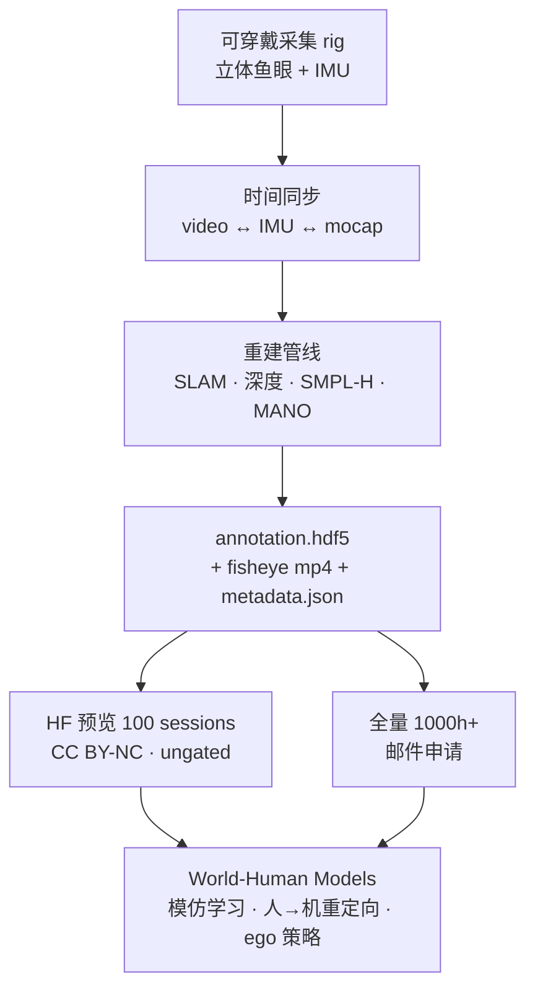
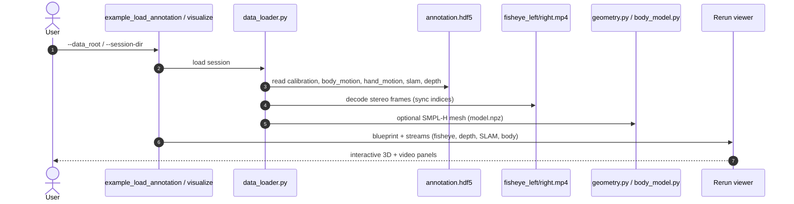

# HumanPlus-1000（同步第一人称 + 全身运动数据集）

**HumanPlus-1000**（[项目页](https://humanplus-ai.github.io/HumanPlus1000.github.io/) · [HF 预览](https://huggingface.co/datasets/humanplus-ai/humanplus-1000) · [viewer 仓](https://github.com/humanplus-ai/humanplus-1000)）是 HumanPlus 团队面向 **World-Human Models** 与具身智能发布的 **大规模同步人类行为** 基础设施：把「人看到什么、身体怎么动、手如何交互、如何在 3D 世界里移动」对齐到同一条 session 时间轴。

## 一句话定义

**在真实世界长程活动中，用立体鱼眼 + IMU + SLAM + SMPL-H/MANO 重建，把 egocentric 视觉与度量全身/手部运动写入统一 `annotation.hdf5` 的 1000 小时级语料——预览 100 session 已 ungated，全量需邮件申请。**

## 英文缩写速查

| 缩写 | 英文全称 | 简要说明 |
|------|----------|----------|
| Ego | Egocentric Vision | 第一人称视觉；本集为立体鱼眼 + 校正/深度 |
| SMPL-H | Skinned Multi-Person Linear Model (Hands) | 带手部的参数化人体模型 |
| MANO | Mesh-based Anthropomorphic Hand Model | 参数化手部模型；左右手各 21 关节 |
| SLAM | Simultaneous Localization and Mapping | 同步定位与建图；提供相机/世界轨迹与点云 |
| IMU | Inertial Measurement Unit | 惯性测量；头/身加速度与姿态 |
| HF | Hugging Face | 预览数据托管平台 |
| WHM | World-Human Model | 项目页叙事：连接真实世界与人类行为建模 |

## 为什么重要

- **感知–动作对齐，而非纯 ego 视频：** 相对 [RekaDaily-10k](./rekadaily-10k-dataset.md) 等 **仅 RGB** 家务语料，本集在同一 session 内提供 **SMPL-H 全身、MANO 手、SLAM 轨迹与深度**——更接近「可重定向 / 可模仿」的监督形态。
- **长程真实活动 × 多地点多人：** 项目页标 **1000+ h / 200+ 人 / 500+ 任务 / 100+ 地点**，强调日常长程行为而非实验室短 clip。
- **与 HumanPlus 机器人线同品牌：** [HumanPlus 论文](./paper-loco-manip-161-012-humanplus.md) 走 **人形 shadowing → imitation**；本集是 **人类侧数据飞轮**，可为人→机管线提供参考运动与 ego 对齐监督。
- **开箱 loader + Rerun 可视化：** 官方 [humanplus-1000](https://github.com/humanplus-ai/humanplus-1000) 仓（MIT）可直接 inspect HDF5 并回放世界坐标下的身体/手/SLAM，降低格式试错成本。

## 核心信息

| 字段 | 内容 |
|------|------|
| 发布方 | HumanPlus（`humanplus-ai`） |
| 全量目标 | **1000+** 小时 |
| HF 预览 | **100** sessions · 约 **71.8 GB** · **ungated** |
| 模态 | 立体鱼眼、校正/深度、SMPL-H、MANO、SLAM、IMU、行为标注 |
| 格式 | 每 session：`fisheye_*.mp4` + `annotation.hdf5` + `metadata.json` |
| 项目页 | <https://humanplus-ai.github.io/HumanPlus1000.github.io/> |
| HF | <https://huggingface.co/datasets/humanplus-ai/humanplus-1000> |
| 代码 | <https://github.com/humanplus-ai/humanplus-1000> |
| 数据许可 | **CC BY-NC 4.0** |
| 代码许可 | **MIT** |
| 全量获取 | 邮件 **info@humanplus.xyz** |

### 数据集速查

| 维度 | 内容 |
|------|------|
| **规模** | 目标 1000+ h；入库日 HF 预览 100 sessions |
| **模态** | Ego stereo + depth + SMPL-H + MANO + SLAM + IMU + NL 行为标注 |
| **许可证** | 数据 CC BY-NC 4.0；**商用需另议** |
| **重定向就绪度** | **中高（人类侧）**：有度量全身/手与 world 对齐；**无** 机器人关节 / 真机执行轨迹，上 G1 等仍需 [重定向](../concepts/motion-retargeting.md) |

## 流程总览

## 源码运行时序图

官方 viewer 的典型 **读取 → 可视化** 路径（对齐 [humanplus-1000 仓](../../sources/repos/humanplus-1000.md) README）：

缺省无 SMPL-H `model.npz` 时 `body_model` 回退 **SMPL-24 骨架**，mesh 不可用但关节/SLAM 仍可看。

## 工程实践

| 项 | 要点 |
|----|------|
| **下载预览** | `huggingface-cli download humanplus-ai/humanplus-1000 --repo-type dataset`；按 `data/session_*` 增量拉取 |
| **Inspect** | `python examples/example_load_annotation.py --data_root /path/to/session` 列出 HDF5 组与数组 shape |
| **可视化** | `pip install -e .` 后 `python -m visualize --session-dir …`；可选 `--output-rrd` |
| **坐标** | 展示系 **mocapworld Y-up**；SLAM/深度经 `T_mocapworld_slamworld` 对齐 |
| **SMPL-H** | 设置 `HUMANPLUS_SMPLH_MODEL` 或 `--smplh-model` 才渲染 mesh |
| **开源状态** | **预览数据 + viewer 已开源**；**全量 1000h 申请制** |
| **下游读法** | 适合 [数据金字塔](./paper-data-pyramid-embodied-manipulation.md) **第 ③ 层**（人 Ego + 度量运动）；接人形 IL 需与 [HumanPlus](./paper-loco-manip-161-012-humanplus.md) shadowing 栈或通用 retarget 联读 |

## 与相邻语料对比

| 对照 | HumanPlus-1000 的定位 |
|------|----------------------|
| **[Ego4D](./paper-ego4d.md)** | 大规模日常 ego + benchmark；本集强调 **同步 SMPL-H/MANO/SLAM/深度** 与 **1000h 级** 叙事 |
| **[RekaDaily-10k](./rekadaily-10k-dataset.md)** | **无** 原生手/全身 3D；本集 **HDF5 度量对齐** |
| **[Macrodata 手轨迹](../methods/macrodata-egocentric-hand-action.md)** | 从已有 ego **后处理** 21 关节；本集 **采集期即带 MANO + SLAM** |
| **[HumanPlus 论文](./paper-loco-manip-161-012-humanplus.md)** | **机器人** shadowing/IL 方法；本集是 **人类侧** 数据基础设施 |
| **[HIW-500](./hiw-500-dataset.md)** | **真机 G1** 家庭遥操作；本集是 **人类** 多模态，非机器人 DOF |

## 局限与风险

- **预览 ≠ 全量：** HF 100 sessions 仅演示格式与管线；勿按预览分布推断最终 1000h 任务/场景覆盖。
- **NC 许可：** CC BY-NC 4.0 限制商业训练；企业用途需单独授权。
- **全量门槛：** 完整集需联系 info@humanplus.xyz，工程排期应预留审批时间。
- **非机器人轨迹：** 无关节角/力矩/接触真值；做人→机仍需 retarget 与 sim/real 对齐。
- **SMPL-H 依赖：** 网格可视化依赖官方 SMPL-H 资产，分发受 SMPL 许可约束。
- **重建误差：** SLAM/深度/MANO 为估计量；长程 drift 与遮挡需下游鲁棒处理。

## 关联页面

- [HumanPlus（CoRL 2024 shadowing）](./paper-loco-manip-161-012-humanplus.md) — 同品牌机器人方法
- [Ego 分类 01：数据采集](../overview/ego-category-01-data-collection.md) — 人类作分布式采集者
- [人形训练数据管线选型](../queries/humanoid-training-data-pipeline.md) — 人体视频 → 重定向决策树
- [具身数据金字塔](./paper-data-pyramid-embodied-manipulation.md) — 第 ③ 层 Ego/Exo
- [Teleoperation](../tasks/teleoperation.md) — 遥操作与 human demo 生态
- [Macrodata Egocentric Hand-Action](../methods/macrodata-egocentric-hand-action.md) — 手轨迹后处理对照

## 参考来源

- [HumanPlus-1000 项目页归档](../../sources/sites/humanplus-1000.md)
- [HumanPlus-1000 HF 数据卡归档](../../sources/datasets/humanplus-1000.md)
- [humanplus-ai/humanplus-1000 仓归档](../../sources/repos/humanplus-1000.md)

## 推荐继续阅读

- 项目页：<https://humanplus-ai.github.io/HumanPlus1000.github.io/>
- Hugging Face：<https://huggingface.co/datasets/humanplus-ai/humanplus-1000>
- GitHub viewer：<https://github.com/humanplus-ai/humanplus-1000>
- HumanPlus 论文项目页：<https://humanoid-ai.github.io>
