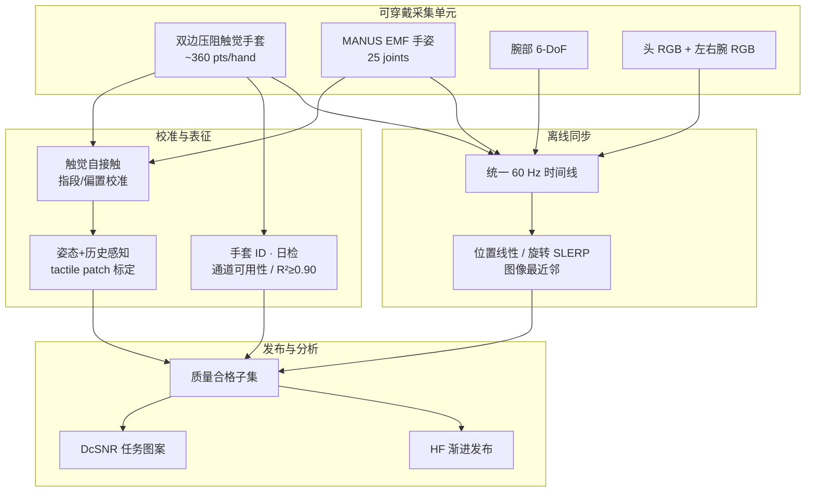

# HumanTouch（可规模化人手触觉采集系统）

**HumanTouch**（*A Multimodal System for Scalable Human-Hand Tactile Acquisition*，[项目页](https://xsparkai.com/sparklab/humantouch/)，2026-08-07）由 **Xspark AI · SparkLAB** 发布：用双手套压阻触觉、MANUS EMF 手姿、腕部 6-DoF 与头/腕多视角 RGB，采集**可校准、可质控、可跨站对齐**的人手接触数据，服务机器人接触丰富学习。

## 一句话定义

**HumanTouch 把「规模化人手触觉」定义为：在自然手运动下同步采接触–运动–视觉，并用姿态/历史感知标定、手套生命周期质控与 60 Hz 离线同步，保证数据可解释、可追溯，而不是只堆录制小时数。**

## 英文缩写速查

| 缩写 | 英文全称 | 简要说明 |
|------|----------|----------|
| HumanTouch | Human-Hand Multimodal Tactile Acquisition | 本系统/数据集项目名 |
| DcSNR | Dynamic Contact Signal-to-Noise Ratio | 任务动态接触图案相对重复试验变异的信噪比（dB） |
| EMF | Electromagnetic Field tracking | MANUS 电磁场手姿跟踪，避免 IMU 积分漂移 |
| SLERP | Spherical Linear Interpolation | 同步层对旋转的插值方式 |
| RGB | Red-Green-Blue | 头戴场景相机 + 左右腕部近距相机 |
| HF | Hugging Face | 宣称的数据集渐进发布宿主 |

## 为什么重要

- **视觉≠接触：** 遮挡、透明/反光/可变形物体下，同姿可对应不同接触状态；触觉是交互的直接观测。
- **机器人上硬采触觉贵且慢：** 传感器形态不一、动作库受限；人手示范是更自然的接触丰富数据源——前提是手套不严重束缚运动，且伪迹可与真接触区分。
- **规模≠可信：** OpenTouch / World In Your Hands 等已有人手触觉集，但 HumanTouch 把力标定流程、多站点部署、手套健康监控与 DcSNR 写进发布叙事，适合作为「采数协议」而不仅是「又一个小时数」。
- **选型对照：** 相对 [OSMO](./paper-notebook-osmo-open-source-tactile-glove-for-human-to-robo.md)（人机共用 12-taxel 磁触觉、硬件已开源），本项目强调 **全掌稠密压阻 + 多站点质控**；相对 [HRDexDB](./hrdexdb-dataset.md)（人–机配对抓取），本项目聚焦 **人侧接触地图与任务动态图案**。

## 核心信息

| 项 | 内容 |
|----|------|
| 机构 | 星火人工智能（Xspark AI）· SparkLAB |
| 负责人 | Chuqiao Lyu |
| 核心成员 | Chenze Yu, Eric J Chen, Wenxuan Zhu |
| 通讯作者 | Wenbo Ding, Tianxing Chen, Qi Xiong |
| 平台 | 人手可穿戴（非机器人夹爪） |
| 触觉 | 柔性压阻手套；指面+手掌；约 **360** 点/手 |
| 手姿 | MANUS EMF · **25** 关节；腕部 **6-DoF** |
| 视觉 | 头 RGB + 左右腕 RGB |
| 时间基准 | 离线统一 **60 Hz** |
| 初版切片 | 约 **100 h** · 10 规范任务 · **13,469** episode（约 10 h/任务） |
| 全库目标 | **1000+ h** · **100+** 任务（项目页对比表口径） |
| 发布计划 | HF 渐进；首批约 100 h 目标 **2026-08-15**；另预告 AIGC 版 |
| 开源核查 | **数据：宣称待发**；**代码：截至 2026-08-07 项目页未列**（见下） |

### 开源状态

| 资产 | 状态（入库日 2026-08-07） |
|------|---------------------------|
| 项目页 | <https://xsparkai.com/sparklab/humantouch/> |
| 代码仓 | **未列**；org <https://github.com/XsparkAI> 无 HumanTouch 仓 |
| 数据集 | **待发布** → [HF XsparkAI](https://huggingface.co/XsparkAI)（公开 datasets=0） |
| 源码运行时序图 | **不适用**（无可运行官方实现） |

## 流程总览

## 核心原理

### 1）传感与干扰权衡

- 视触觉指尖、磁触觉、电容阵列各有体积/EMI/布线代价；HumanTouch 选 **柔性压阻** 以覆盖全掌并保持可穿戴。
- 手套会改变摩擦与顺应性；系统目标是 **观测交互** 而非主动力反馈，故不做外骨骼式力渲染。
- 弯曲/拉伸/褶皱产生 **姿态依赖伪迹**；须与真接触解耦。

### 2）触觉–手姿联合

- 仅知「sensor 17 激活」不够——须同步关节与腕姿，把活动投到动态手模型上的位置、朝向与法向。
- 纯视觉手姿在戴黑手套时易失败；肤色手套有改善但仍不如裸手。故采用 **EMF** 穿戴跟踪，并尽量清空跟踪体积内金属。
- **触觉自接触校准：** 拇指垫与其他指尖同时接触，用接触 onset（非峰值力）约束指段长度与传感区对齐。

### 3）柔性手套标定输出

对每个解剖 patch 估计：**接触置信度、相对强度、响应中心、不确定性**。明确 **不是** 物理压力/物体载荷。输入含当前触觉、当前手姿与速度、近期触觉历史（上升/维持/下降/恢复）。

### 4）生命周期与同步

- 每副手套唯一 ID，关联校准史、日检、会话与状态；日检含通道可用性与响应一致性（文中门槛含 **R² ≥ 0.90** 等）。
- 异构流映射到语义流（左/右手姿、腕姿、头相机等）；超大间隙或缺模态 **拒收** 而非长程外推。

### 5）DcSNR

将文件级动态接触向量（手内百分位幅度归一 → 固定网格）相对匹配条件重复试验变异，得到任务级 **Dynamic Contact SNR**。十规范任务约 **3.61–7.19 dB**；32 操作者小时级轨迹中位数稳定在约 **7–8 dB** 带，无持续下滑。

## 工程实践

| 项 | 建议读法 |
|----|----------|
| 选型问题 | 要人侧全掌接触地图 + 多视角 RGB 预训练/分析数据时优先关注；要人机同构触觉迁移先看 [OSMO](./paper-notebook-osmo-open-source-tactile-glove-for-human-to-robo.md) |
| 勿当力标签 | patch 相对强度 ≠ 牛顿力；下游监督应使用接触置信/区域活动，勿直接当 F/T |
| 部署前核对 | HF 是否已挂数据集卡、许可、同步与标定元数据；入库时仍为空 |
| 复现边界 | 无公开采集固件/同步代码 → 现阶段只能消费未来数据卡，不能自建同款单元 |
| 指标用途 | DcSNR 衡量「任务接触图案是否可重复」；不替代策略成功率 |

## 局限与风险

- **开源未落地：** 截至 2026-08-07 仅有技术说明页与发布时间表；代码未列、HF 公开集为空——选型时按 **待核实承诺** 处理。
- **手套仍改接触界面：** 摩擦/顺应性偏移可能改变策略分布；与裸手或刚性指尖传感器存在域差。
- **压阻老化非单调：** 任务与操作者比「使用时长」更能解释检验指标波动；不能用录制小时数推断手套健康。
- **EMF 对环境敏感：** 金属与 EMI 会扭曲场；多站点部署须统一场控规程。
- **非机器人 embodiment：** 输出是人手接触–运动–视觉；跨灵巧手迁移仍需重定向或同构传感（对照 OSMO / HRDexDB）。

## 关联页面

- [Tactile Sensing](../concepts/tactile-sensing.md) — 压阻阵列路线与迟滞/漂移背景
- [Visuo-Tactile Fusion](../concepts/visuo-tactile-fusion.md) — 视觉遮挡下接触模态角色
- [Contact-Rich Manipulation](../concepts/contact-rich-manipulation.md) — 接触过程控制任务域
- [触觉知识链汇总](../overview/hub-tactile.md) — 传感→融合→力控入口
- [灵巧操作数据采集指南](../queries/dexterous-data-collection-guide.md) — 手套/视觉/仿真采数选型
- [数据手套 vs 视觉遥操作](../comparisons/data-gloves-vs-vision-teleop.md) — 穿戴跟踪权衡
- [OSMO 触觉手套](./paper-notebook-osmo-open-source-tactile-glove-for-human-to-robo.md) — 人机共用开源磁触觉对照
- [HRDexDB](./hrdexdb-dataset.md) — 人–机配对抓取多模态集对照
- [Manipulation](../tasks/manipulation.md) — 操作任务总览

## 参考来源

- [HumanTouch 项目页归档](../../sources/sites/humantouch-xsparkai.md) — <https://xsparkai.com/sparklab/humantouch/>（2026-08-07 核查）

## 推荐继续阅读

- [HumanTouch 项目页](https://xsparkai.com/sparklab/humantouch/) — 系统视频、对比表、DcSNR 与发布计划
- [Hugging Face · XsparkAI](https://huggingface.co/XsparkAI) — 宣称数据宿主（发布后跟进）
- [OSMO 项目页](https://www.jessicayin.com/osmo_tactile_glove/) — 人机共用开源触觉手套对照
