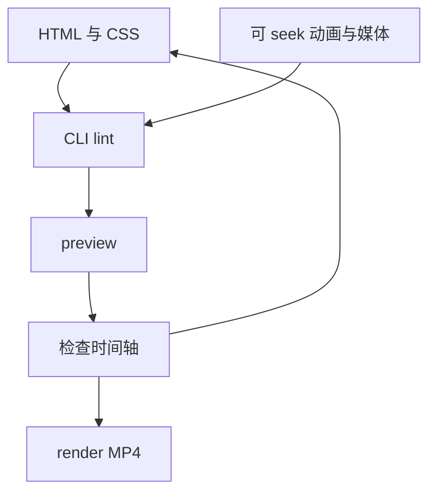

# HyperFrames

**HyperFrames**（[heygen-com/hyperframes](https://github.com/heygen-com/hyperframes)，npm `hyperframes`，Node ≥22）是 HeyGen 开源的 **Agent 向视频生产框架**：代理编写 **HTML/CSS + 可 seek 动画 + 媒体**，CLI **lint → preview → render** 成 **确定性 MP4**。

## 一句话定义

**Write HTML. Render video.** — 把视频当成 **可版本化的 Web 文档**，由 Agent skills 教会 **生产环**，而不是手工时间轴剪辑。

## 英文缩写速查

| 缩写 | 英文全称 | 简要说明 |
|------|----------|----------|
| MP4 | MPEG-4 Part 14 | 默认渲染输出容器 |
| CLI | Command-Line Interface | 本地渲染与 `hyperframes skills` 管理 |
| CSS | Cascading Style Sheets | 与 HTML 一并驱动画面 |
| API | Application Programming Interface | 可选托管 authoring（HeyGen 生态） |

## 流程总览

以下按本页已归纳的机制与资料绘制，表示模块或阅读路径关系。

## 核心信息

| 字段 | 内容 |
|------|------|
| 许可 | Apache-2.0 |
| Stars（2026-10-01） | ~54.8k（Trendshift 约 +11.3k/月） |
| Skills | 21 个发布技能；`/hyperframes` 路由 |

## 为什么重要（对本知识库读者）

- **Demo 与教学：** 机器人实验、policy 对比、wiki 路线 **10 秒概览片** 可由 Agent 从 HTML 模板生成，优于纯 GIF 录屏（可 diff）。
- **与 Archify 分工：** [Archify](archify.md) → **类型化 JSON → 校验静态架构 HTML**；HyperFrames → **时间轴视频**；[Manim](manim.md) → **数学动画代码**；[GSAP skills](gsap-skills.md) → **Web 动效技能**。
- **OpenMAIC / 课程导出：** [OpenMAIC](openmaic.md) 强调 MP4 导出；HyperFrames 是 **Agent-native** 的同类能力栈。

## Agent 集成要点

| 路径 | 命令 |
|------|------|
| Claude 插件 | `claude plugin marketplace add heygen-com/hyperframes` |
| 通用 skills | `npx skills add heygen-com/hyperframes`（Core Skills 组） |
| 同步 main | `npx hyperframes skills update`（避免 registry 滞后） |

## 局限

- 复杂 3D 仿真视频仍宜用 **专用引擎录屏** 或 Manim；HyperFrames 擅长 **motion graphics + 合成**。
- skills 过多会膨胀 context — 默认 **core set + on-demand workflow**。

## 关联页面

- [Archify](archify.md) — 静态可校验系统图
- [Manim](manim.md) — 数学/技术动画
- [OpenMAIC](openmaic.md) — 多 Agent 课堂与视频导出

## 参考来源

- [HyperFrames 仓库归档](../../sources/repos/hyperframes.md)
- [heygen-com/hyperframes（GitHub）](https://github.com/heygen-com/hyperframes)

## 推荐继续阅读

- [HyperFrames Quickstart](https://hyperframes.heygen.com/quickstart)
- [Playground](https://www.hyperframes.dev/)
