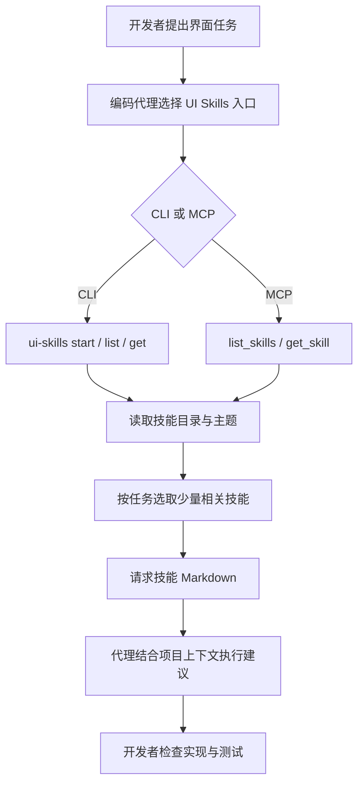
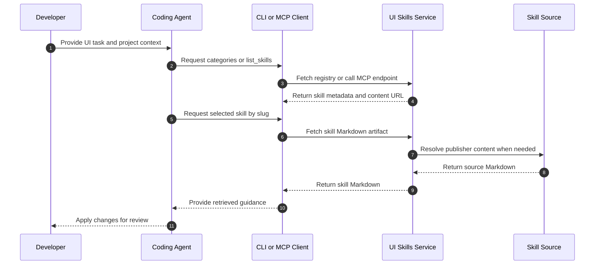

# UI Skills（ibelick/ui-skills）

**UI Skills** 是一个面向设计工程的策展型 Agent Skills 目录：通过站点、CLI 和 MCP，让编码代理按任务查找、筛选并读取 UI 相关的技能说明；它提供目录与内容传递，不替代代理本身的代码执行能力。

## 英文缩写速查

| 缩写 | 英文全称 | 简要说明 |
|------|----------|----------|
| UI | User Interface | 用户界面；本项目聚焦界面实现与设计工程 |
| CLI | Command-Line Interface | 在终端列出类别、查询技能并输出技能正文 |
| MCP | Model Context Protocol | 让兼容客户端通过工具调用读取目录与技能正文 |
| MIT | Massachusetts Institute of Technology License | 仓库采用的宽松开源许可证名称 |

## 核心信息

| 项目 | 内容 |
|------|------|
| 维护者 / 仓库 | [ibelick/ui-skills](https://github.com/ibelick/ui-skills) |
| 官方站 | [ui-skills.com](https://www.ui-skills.com/) |
| 定位 | 为设计工程师和编码代理策展 UI、前端、动效、可访问性、视觉细节等技能 |
| 访问接口 | 网站目录、`ui-skills` CLI、`/mcp` MCP 端点 |
| 目录与内容 | registry 提供名称、说明、主题、来源仓库和内容路径；技能正文以 Markdown 提供 |
| 授权 | 仓库 package metadata 标为 MIT；目录中收录的第三方技能仍需分别遵循其各自来源许可 |
| 核查版本 | 仓库 `package.json` 于 2026-10-07 查看为 `0.2.4`；目录会持续变化 |

## 目录如何组织

仓库将每个目录项整理成可检索的 registry 记录，包含 slug、发布者、上游仓库、原始文件地址、GitHub 页面、显示名称、描述和可选主题。主题覆盖 accessibility、motion、systems、visual、interaction、performance，以及多种前端框架和工具方向。

目录同时包含 ibelick 自有技能及从其他发布者仓库整理的内容。它是一个策展与分发层：不能把目录内所有技能都视作由 ibelick 编写，也不能仅凭目录收录推断上游技能经过独立质量或安全审计。

### 发现与取回流程

以下流程概括 CLI / MCP 消费者如何取得技能文本。目录接口负责发现和定位；技能正文由服务按 registry 中的映射提供，随后由调用方的编码代理解释和应用。

关键边界是目录返回可供代理使用的技能文本和定位信息；最终实现仍取决于代理、应用仓库上下文及开发者验证。

## 使用方式

### CLI

README 给出的调用形式包括：

| 命令 | 用途 |
|------|------|
| ``npx ui-skills start` | 输出目录入口技能，用于引导路由 |
| ``npx ui-skills categories` | 列出可用主题 |
| ``npx ui-skills list --category motion` | 按主题筛选目录 |
| ``npx ui-skills get baseline-ui` | 输出指定技能的完整 Markdown |

CLI 先获取站点 registry，再根据路径或 slug 定位技能，通过站点的技能内容 URL 取回正文。CLI 也支持 `UI_SKILLS_SITE_URL` 环境变量覆盖站点地址，方便测试或接入兼容环境。

### MCP

MCP 服务运行在 [`https://www.ui-skills.com/mcp`](https://www.ui-skills.com/mcp)，提供两个工具：

- `list_skills(query?)`：列出目录；传入 query 时按 slug、路径、名称或描述筛选。
- `get_skill(name)`：按 discovery name、slug 或 pathSlug 读取技能 Markdown。

因此，它适合作为已支持 MCP 的编码代理的技能检索入口。客户端仍需自行处理 MCP 会话与工具调用；调用结果也不会自动证明某条建议适合当前项目。

### 适合的任务

- 依据任务按需发现视觉、排版、布局、动效、交互、可访问性和性能类指导。
- 在现有项目里做针对性的 UI polish 或建立 / 更新 `DESIGN.md`。
- 为常见前端框架、Three.js、Remotion 等工作查找特定技能。
- 将代理已有上下文限制在少数相关技能，减少一次性装入完整目录带来的噪声。

## 运行时序

CLI 和 MCP 共用目录与技能内容路径。服务端对仓库自有的部分技能可读取本地打包内容；其它条目通过上游地址取回，因此取用过程依赖目录记录和来源可用性。

## 与相近工具的区别

| 项目 | 主要角色 | 与 UI Skills 的关系 |
|------|----------|--------------------|
| [find-skills（Vercel）](find-skills-skill.md) | 指导代理在 skills.sh 等生态中发现和安装技能 | 更像通用发现规约；UI Skills 提供聚焦设计工程的策展目录和直接读取接口 |
| [frontend-design（Anthropic）](anthropic-frontend-design-skill.md) | 单项 UI 设计技能 | UI Skills 将此类技能和其他发布者技能放入可筛选目录 |
| [Skills For Real Engineers（mattpocock）](mattpocock-skills.md) | 编码工程习惯与反馈环 | 主要面向工程工作流；UI Skills 聚焦 UI 与设计工程任务 |
| [Agent Skills（Addy Osmani）](agent-skills-addyosmani.md) | 覆盖开发生命周期的工程技能包 | 与 UI Skills 都以技能文本供代理使用，但目录策展范围不同 |

这些工具解决的问题相邻但不相同：通用技能安装器负责跨仓分发；单项技能提供特定规约；UI Skills 负责把设计工程相关技能集中组织，并暴露机器可调用的检索接口。

## 局限与风险

- **目录不等于质量评级。** registry 的收录和主题标签提升发现效率，但不能替代对具体技能内容、适用范围和来源的审阅。
- **上游依赖。** 外部技能正文取决于发布者仓库可访问性及其内容变化；目录中的地址、名称和说明也可能随项目更新。
- **内容许可需逐项核对。** 仓库自身的 MIT metadata 不自动改变第三方技能的许可证或使用条款。
- **代理执行效果未被目录保证。** Skill 文本是指导材料；实现正确性、可访问性和性能仍需通过项目测试、浏览器检查及人工评审。
- **没有可比的实证基准。** 该项目是工具与内容目录；仓库测试用于检查实现和内容约束，不能直接视作 UI 质量提升的独立效果评测。

## 结论

UI Skills 的价值在于把分散的设计工程技能整理成带主题、slug 和来源信息的机器可检索目录，并通过 CLI 与 MCP 接入编码代理。使用时应按具体任务选择少量技能，检查第三方来源与许可，再用项目测试和界面评审验证生成结果。

## 关联页面

- [find-skills（Vercel）](find-skills-skill.md) — 通用技能发现规约
- [frontend-design（Anthropic）](anthropic-frontend-design-skill.md) — 单项前端设计技能
- [Skills For Real Engineers（mattpocock）](mattpocock-skills.md) — 编码工程工作流技能库
- [Agent Skills（Addy Osmani）](agent-skills-addyosmani.md) — 全生命周期工程技能集合

## 参考来源

- [ibelick/ui-skills 仓库归档](../../sources/repos/ibelick-ui-skills.md)
- [UI Skills 官方站归档](../../sources/sites/ui-skills.md)

## 推荐继续阅读

- [UI Skills 官方站](https://www.ui-skills.com/) — 浏览目录、CLI / MCP 接入与设计工程 Playbook
- [ibelick/ui-skills README](https://github.com/ibelick/ui-skills#readme) — 安装示例、命令与集成说明
