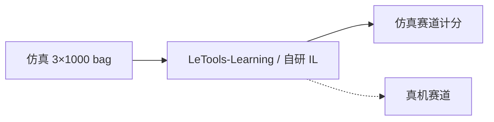

# ICRA 2026 REAL-I Challenge

**REAL-I**（1st Real-World Embodied-AI Learning Challenge）是 **ICRA 2026** 上由 **乐聚** 主办的工业具身赛：提供 **真机评测名额**、仿真+真机工业任务，以及 HF 数据集 [`LejuRobotics/kuavo_data_challenge_icra`](https://huggingface.co/datasets/LejuRobotics/kuavo_data_challenge_icra)。[OpenLET](./openlet.md) 将其列为社区赛事主线之一。

## 一句话定义

**Kuavo 4 Pro 上的「仿真先训、真机再测」工业三任务赛：公开包目前几乎只有仿真 rosbag；真机 split 在数据卡里仍是占位。**

## 英文缩写速查

| 缩写 | 英文全称 | 简要说明 |
|------|----------|----------|
| REAL-I | Real-World Embodied-AI Learning Challenge | 本赛事名称；I 表示第一届 |
| ICRA | IEEE International Conference on Robotics and Automation | 会议背书 |
| IL | Imitation Learning | 参赛默认路线：rosbag → 策略 → sim/真机 |
| SLAM | Simultaneous Localization and Mapping | 数据卡给 4 Pro 的双足自主定位能力宣传 |

## 为什么重要

- **任务比「随便抓积木」更接近产线：** 传送带、软包称重、朝向随机的工业件，直接打 [Manipulation](../tasks/manipulation.md) 的接触与时序。
- **评测协议公开：** 仿真三任务均给出 100 分拆分（放置正确 vs 超时罚分），便于复现排行而不是只看宣传片。
- **和 LET-Base 分工：** [LET-Base](./let-base-dataset.md) 是广覆盖小时库；本包是 **固定任务、固定 episode 配额** 的竞赛集。

## 数据集速查

| 维度 | 内容 |
|------|------|
| **规模（数据卡）** | 每任务宣称 **1000 episodes**；sim 三任务 + real 三任务 |
| **规模（HF 2026-08-17）** | **3401** 个 `.bag`：sim 三任务各 **1000**；`vienna/{bottle,express,parts}` 另 **401**；`usedStorage` ≈ **1.49 TiB** |
| **模态** | 原始 rosbag 全传感器（与 LET-Base 同族 topic 叙事） |
| **许可证** | 卡上 **无 SPDX**；以竞赛手册为准 |
| **适配形态** | **Kuavo 4 Pro**（1.66 m / 55 kg / 40 DoF） |
| **重定向就绪度** | 无需人运动重定向；需自写 bag 解析或走 [LeTools](./letools.md) 转换 |

| 轨道 | 任务 | 成功判据（仿真卡） |
|------|------|-------------------|
| Sim | Toy Sorting | 动物右篮、车左篮；起始位姿/桌高随机 |
| Sim | Parcel Weighing | 传送带 → 秤 → 另一带 |
| Sim | Conveyor Belt Sorting | 随机朝向零件，完成 4 件 |
| Real | Rubbish / Weighing / Parts | 真机同构；**目录 not updated yet** |

HF Viewer 把配图当成 imagefolder（`n<1K`），**不能**当数据加载方式。

## 工程实践

1. 只拉需要的 `sim/TASK*` 前缀；全量 1.5 TiB 级。
2. 计分脚本以 **竞赛手册** 为准，数据卡只给分项权重。
3. 发现 `vienna/` 时当作 **未写入 README 的附加子集**，提交前确认是否计入官方 split。
4. 真机未上线前，不要把 sim 成功率写成 REAL-I 总冠军结论——[Sim2Real](../concepts/sim2real.md) 仍是显式缺口。

## 局限与风险

- **真机数据缺席：** 赛题最有区分度的 real split 在入库日仍为空。
- **许可不明：** 与 LET-Base 的 CC-BY-NC-SA 不同，本包卡上无 license 字段。
- **元数据质量低：** 空 YAML、viewer 误标，说明托管偏「文件桶」而非 Hub 标准数据集。
- **社区频道：** 数据卡提 Discord；细则与奖金以官网/手册为准，本页不固化奖金数字。

## 关联页面

- [OpenLET](./openlet.md) — 赛事在数据社区中的位置
- [LET-Base-Dataset](./let-base-dataset.md) — 更大规模真机小时
- [LeTools](./letools.md) — 官方训练/部署
- [乐聚机器人](./leju-robotics.md) — 主办与本体
- [LeRobot](./lerobot.md) — 转换目标格式
- [Imitation Learning](../methods/imitation-learning.md)
- [具身大模型评测基准选型闭环](../queries/embodied-eval-benchmark-selection-loop.md) — 本包属策略任务成功率 / sim↔real 评测层（工业真机赛，仿真 split 已公开）

## 参考来源

- [kuavo-data-challenge-icra.md](../../sources/datasets/kuavo-data-challenge-icra.md) — HF 数据卡与 bag 计数
- [openlet-openatom.md](../../sources/sites/openlet-openatom.md) — REAL-I 社区栏目

## 推荐继续阅读

- 数据集：<https://huggingface.co/datasets/LejuRobotics/kuavo_data_challenge_icra>
- 早期训练示例仓：<https://github.com/LejuRobotics/kuavo_data_challenge>
- OpenLET：<https://openlet.openatom.tech/>
