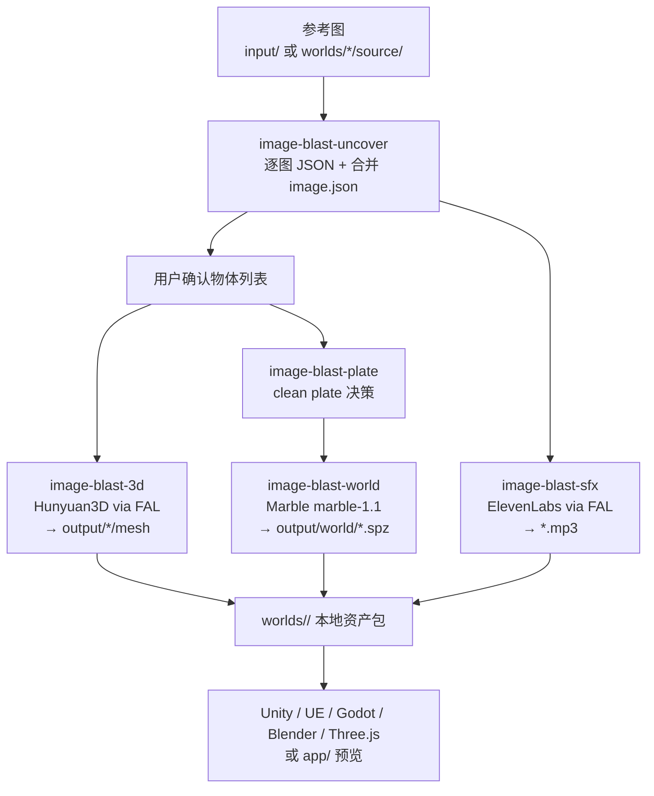
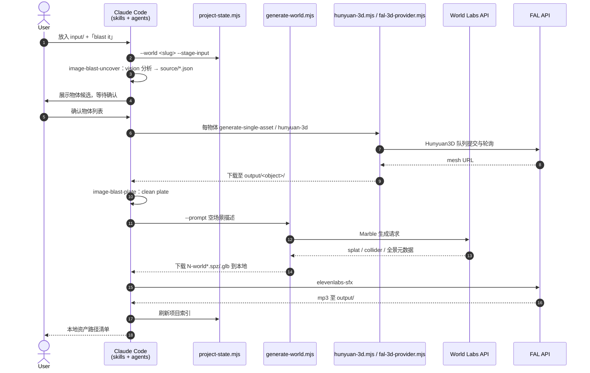

# image-blaster

**image-blaster** 是 [neilsonnn/image-blaster](https://github.com/neilsonnn/image-blaster)（MIT，2026 年高 star 仓库）分发的 **Claude Code Agent Skills** 工作区：把 **单张参考图** 编排成 **可拾取物体网格 + 静态环境 Gaussian splat + 环境/物体音效**，默认在 **5 分钟内** 产出可导入 Unity / Unreal / Godot / Blender / Three.js 的资产目录。README 自述 *An image-to-world skillset for Claude*，并列举 **机器人环境概念、建筑渲染、关卡原型** 等用例。

## 一句话定义

用 **可安装 `.claude/skills` + 确定性 Node 资产脚本 + fork 子代理**，把 **图像理解 → clean plate → Hunyuan3D 物体 + Marble 静态世界 + ElevenLabs 音效** 固化为 **本地 `worlds/<slug>/` 资产包**，而不是在聊天里零散调 API。

## 英文缩写速查

| 缩写 | 英文全称 | 简要说明 |
|------|----------|----------|
| 3DGS | 3D Gaussian Splatting | 静态环境高保真表示；本仓导出 `.spz` |
| SPZ | Splat compressed format | World Labs / Marble 原生压缩 splat 格式 |
| GLB | GL Transmission Format Binary | 物体网格与碰撞体常用容器 |
| API | Application Programming Interface | World Labs 与 FAL 的付费生成接口 |
| SFX | Sound Effects | 环境循环音与物体物理音效（ElevenLabs via FAL） |
| DCC | Digital Content Creation | Blender / Maya / 3ds Max 等内容创作软件 |
| PBR | Physically Based Rendering | Hunyuan3D 可选材质通道（`--enable-pbr`） |
| Real2Sim | Real to Simulation | 真实现场外观 → 仿真场景；本仓偏 **外观资产源** |

## 为什么重要

- **Agent Skills × 生成式 3D 世界的产品化样本：** 与 [img2threejs](./img2threejs.md)（**无外部 3D API**、输出可 diff 的 Three.js 工厂）、[CAD Skills](./cad-skills.md)（**STEP/URDF 制造链**）、[video-shotcraft](./video-shotcraft.md)（**Remotion 成片**）并列，代表 **「参考图 → 可交付资产包」** 垂直技能——把 **分阶段 `SKILL.md`、JSON 契约、Node 队列脚本** 写成可 clone 工作区，而不是一次性 prompt。
- **消费 [Marble](./marble-world-model.md) 的可编排前端：** 环境步显式调用 **`marble-1.1`**，合成 **空场景文本 prompt**（从 `image.json` 减去已确认物体）再生成 **`.spz` + collider `.glb`**，并 **强制下载到本地**（禁止前端直连 provider URL）。这是 Marble **API 侧** 的代理编排参照，不是 Marble 官方产品。
- **机器人读者的定位：** README 写明可为 **机器人环境** 快速搭视觉背景；但产物是 **生成式外观 + 粗网格**，**不等于** [SimFoundry](./paper-simfoundry-real2sim-scene-generation.md) 的 sim-ready 关节与物性，也不提供 URDF/MJCF（见 [Sim2Real](../concepts/sim2real.md)）。
- **开源边界清晰：** 编排层 **MIT 已开源**；Marble / Hunyuan3D / 图像编辑 / SFX **经 API 闭源调用**，需 `WORLD_LABS_API_KEY` 与 `FAL_KEY`。

## 核心结构

| 层次 | 内容 |
|------|------|
| **入口** | 在仓库根目录启动 Claude Code；图放入 `input/` 或 `worlds/<slug>/source/`。 |
| **主技能** | `image-blast-uncover` — 逐图 JSON 分析、合并 `image.json`、物体候选与 `object.json` 意图文件。 |
| **Clean plate** | `image-blast-plate` — 决策是否从源图移除物体以生成环境底板。 |
| **物体** | `image-blast-3d` + `hunyuan-3d.mjs`（FAL）；可调 face-count、PBR、LowPoly/Geometry。 |
| **环境** | `image-blast-world` + `generate-world.mjs`（World Labs）；下载 splat / collider / 全景图到 `output/world/`。 |
| **音效** | `image-blast-sfx` + `fal-elevenlabs-sfx.mjs` — 环境循环与物体物理音。 |
| **图像编辑** | `image-blast-image-edit` — 默认 `nano-banana`，可切换 `gpt-image-2`。 |
| **项目状态** | `project-state.mjs` — 索引 `worlds/<slug>/` 下 source/output，staging `input/`。 |
| **子代理** | `.claude/agents/image-blast-*` — 长任务 fork，与技能一一对应。 |
| **预览** | `app/` — React + Vite viewer（Bun workspace）；默认被 `.claudeignore` 排除。 |

### 后端模型（README Advanced）

| 模型 ID | 角色 |
|---------|------|
| `marble-1.1` | World Labs — 可探索静态环境（`.spz`） |
| `hunyuan-3d` | FAL — 动态物体 `.glb` / `.obj` |
| `nano-banana` | 默认图像编辑（clean plate、参考图） |
| `gpt-image-2` | 备选图像编辑 |
| `elevenlabs-sfx` | 环境 + 物体音效 |

## 流程总览

## 源码运行时序图

主仓 **已开源**（MIT）。下列时序对齐 `.claude/skills/` 与 `.claude/scripts/`：Claude 在分析/确认节点消耗 vision，**生成与轮询** 由 Node 脚本执行。

关键复现路径：配置 `.env` → `claude` 于仓根 → `blast it and confirm each step with me`；或分技能调用 `image-blast-uncover` → `image-blast-3d` → `image-blast-world` → `image-blast-sfx`。

## 工程实践

| 项 | 要点 |
|----|------|
| **安装** | `git clone https://github.com/neilsonnn/image-blaster`；目录内 `claude`（Claude Code CLI）。 |
| **密钥** | `WORLD_LABS_API_KEY`、`FAL_KEY`（见 `.env.example`）。 |
| **交互** | 建议 `blast it and confirm each step with me` — 默认逐步确认。 |
| **数据根** | `worlds/<world-name>/`：`source/` 分析 JSON、`output/` 生成物。 |
| **物体参数** | Hunyuan：`--face-count`（默认 50000）、`--enable-pbr`、`--generate-type Normal\|LowPoly\|Geometry`。 |
| **本地优先** | `image-blast-world` 要求 **全部 splat/collider 落盘**；`ensure-local-assets.mjs` 可补下载。 |
| **预览** | `bun run dev`（`app/` React viewer）；改 viewer 需从 `.claudeignore` 移除 `/app`。 |
| **开源状态** | 编排 **MIT 已开源**；生成模型 **API 闭源**（见 [sources/repos](../../sources/repos/image-blaster.md)）。 |

## 局限与风险

- **误区：image-to-world = sim-ready 场景。** 产出是 **生成式 splat + 网格 + 音效**；碰撞体来自 Marble **粗 collider**，物体网格来自 Hunyuan3D，**未校准尺度、惯性、关节与物性**。机器人训练须接 [SimFoundry](./paper-simfoundry-real2sim-scene-generation.md) / 专用 Real2Sim 或解析仿真。
- **误区：与 [img2threejs](./img2threejs.md) 可互换。** img2threejs 输出 **可 diff 的 TypeScript Three.js 工厂**、无付费 3D API；image-blaster 依赖 **World Labs + FAL 计费**，产物是 **文件资产包**。
- **误区：与 [CAD Skills](./cad-skills.md) 互补替代。** CAD Skills 走 **毫米制 STEP + URDF**；本仓走 **视觉世界 + splat**，不含制造公差链或 MoveIt 描述。
- **费用与配额：** Marble credits 与 FAL 按调用计费；技能内 **无 token/credit 估算**。
- **生成幻觉：** Marble 对未观测区域补全；clean plate 减法依赖语言 prompt，**不保证** 与真实现场几何一致（对照 [Marble](./marble-world-model.md)「生成 ≠ 孪生」）。
- **供应商锁定：** 模型名（`marble-1.1`、`hunyuan-3d` 等）变更需跟上游 API；本地 JSON 契约相对稳定。

## 关联页面

- [Marble（World Labs）](./marble-world-model.md) — 环境生成 API 与 splat/collider 导出语义
- [World Labs](./world-labs.md) — 公司与 Spark / Atlas 总览
- [Spark（Web 3DGS）](./spark-3dgs-renderer.md) — `.spz` 的 Web 运行时（Marble 生态）
- [img2threejs](./img2threejs.md) — 图像→程序化 Three.js；无外部 3D API
- [CAD Skills](./cad-skills.md) — 制造向 STEP/URDF Agent Skills
- [3D Gen Studio](./3dgenstudio.md) — ComfyUI 网格生产编排（Hunyuan3D 等）
- [video-shotcraft](./video-shotcraft.md) — 前端/成片向 Agent Skills 对照
- [Skills For Real Engineers（mattpocock）](./mattpocock-skills.md) — 通用编码 Agent Skills
- [生成式世界模型](../methods/generative-world-models.md) — 生成式环境与 splat 在机器人管线中的位置
- [Sim2Real](../concepts/sim2real.md) — 外观资产与动力学一致性提醒
- [SimFoundry](./paper-simfoundry-real2sim-scene-generation.md) — sim-ready Real2Sim 场景生成对照

## 参考来源

- [image-blaster 仓库源归档（本站）](../../sources/repos/image-blaster.md)
- [neilsonnn/image-blaster（GitHub）](https://github.com/neilsonnn/image-blaster)

## 推荐继续阅读

- [World Labs 文档](https://docs.worldlabs.ai/) — Marble API 与导出规格
- [Marble 产品](https://marble.worldlabs.ai/) — 创作者向环境生成
- [Spark](https://sparkjs.dev/) — Web 端 splat 渲染
- [Agent Skills 规范](https://agentskills.io/) — `SKILL.md` 约定
- [FAL Hunyuan3D](https://fal.ai/) — 物体网格 API 提供方（以官网当前模型页为准）
