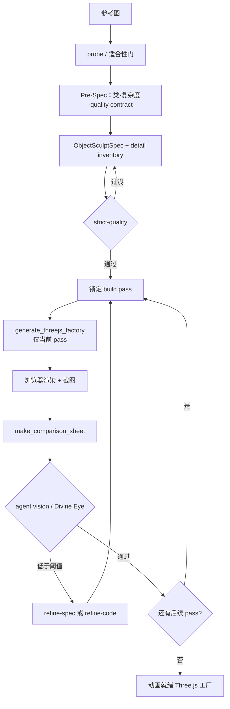
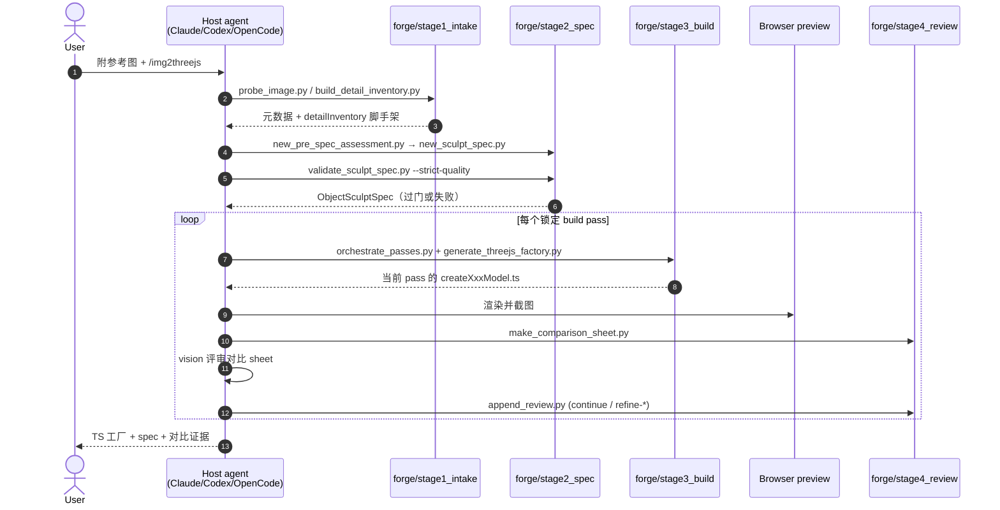

# img2threejs

**img2threejs**（[hoainho/img2threejs](https://github.com/hoainho/img2threejs)，MIT）是一套 **Agent Skill**：给定一张物体/角色参考图，按锁定的 sculpt 阶段写出 **纯代码程序化** 的 Three.js `Group` 工厂，并在浏览器里用截图对比做质量门控。官方叙事是 **reconstruction-by-code**，明确排除摄影测量、网格提取与艺术资源包下载。

## 一句话定义

用 **确定性 Python 脚本门控 + 宿主 agent 视觉评审**，把单图重建成 **diffable TypeScript Three.js 工厂**（含 pivots/sockets/colliders 运行时层级），而不是一次性黑盒 mesh。

## 英文缩写速查

| 缩写 | 英文全称 | 简要说明 |
|------|----------|----------|
| Three.js | — | 浏览器 WebGL 3D 库；本技能的运行时目标 |
| PBR | Physically Based Rendering | 基于物理的材质通道（金属度/粗糙度等），门控要求独立通道而非 albedo 冒充 |
| VLM | Vision-Language Model | 视觉-语言模型；仓库 `vlm_gate.py` 为 Divine Eye 的可选最后一层 |
| SKILL.md | Agent Skill Manifest | Agent Skills 约定下的技能入口与触发说明 |
| MCP | Model Context Protocol | 宿主可用的浏览器/工具协议；截图与预览常经此路径 |
| glTF | GL Transmission Format | 计划中的导出格式（roadmap v1.4）；当前主产物是 TS 工厂 |
| IoU | Intersection over Union | Divine Eye 中 silhouette 等硬门的几何一致性信号之一 |

## 为什么重要

- **Agent Skills 垂直样本：** 与 [CAD Skills](./cad-skills.md)（STEP/URDF/制造）、[GSAP Skills](./gsap-skills.md)（Web 动效 API）同属 **可安装 `SKILL.md` 规约**；本仓库把 **图像→程序化 WebGL 资产** 写成可重复管线，对本站维护者理解「脚本 enforce、模型 judge」有直接对照价值。
- **与仿真资产生成谱系对照：** [Articraft](./articraft.md) / [PhysForge](./paper-physforge-physics-grounded-3d-assets.md) 追求 **仿真就绪可关节网格**；img2threejs 追求 **浏览器可运行、可动画的代码模型**。选型时勿把「好看的 Three.js prop」当成 MuJoCo/Isaac 操作资产（参见 [Sim2Real](../concepts/sim2real.md) 几何一致性提醒）。
- **Token 成本模型可读：** `docs/TOKEN_COST.md` 给出 rough 量级（单物体约 ~80k–180k tokens，角色更高）；省 token 的杠杆是 **严格门控拦浅 spec** 与 **减少 review 循环**，而不是让模型手写 JSON 校验。
- **角色轨边界清晰：** 角色走解剖 landmark / likeness 路径，但 README 明确为 **stylized 重建**，不是 [Character Animation vs Robotics](../concepts/character-animation-vs-robotics.md) 意义上的物理可控人形策略数据。

## 核心原理

| 层次 | 内容 |
|------|------|
| **分发** | Clone 到 Claude Code / Codex / OpenCode 的 skills 目录；入口 `SKILL.md`（入库时 frontmatter `version: 1.3.0`）。 |
| **规约** | `grimoire/`：适合性、detail inventory、PBR/光照、attachment、action-ready、自校正等评审细则。 |
| **Forge 脚本** | `forge/stage1_intake` → `stage2_spec` → `stage3_build` → `stage4_review`；**纯 Python 3.10+ stdlib**，无 pip。 |
| **规格真值** | `ObjectSculptSpec` JSON：部件树、材料、重复系统、sockets、每 pass 评审历史。 |
| **代码产物** | `createXxxModel(spec, options)` → `THREE.Group`；`root.userData.sculptRuntime` 暴露 pivots / sockets / colliders / destruction groups。 |
| **评审** | 每 pass 一张 reference\|render 对比 sheet；agent vision 打分；`divine_eye.py` 等确定性信号优先，VLM 为门控后的最后一层。 |

### 流程总览

### 源码运行时序图

主仓 **已开源**（MIT）。下列时序对齐 README / `SKILL.md` 与 `forge/` 入口：脚本做机械步骤，宿主 agent 只在评审节点消耗 vision tokens。

关键复现路径：技能根目录下跑 `forge/...` 脚本（无需安装依赖）→ 在宿主里渲染当前工厂 → 用 `stage4_review` 打包对比图并写入评审。

## 工程实践

| 项 | 要点 |
|----|------|
| **安装** | `git clone https://github.com/hoainho/img2threejs.git ~/.claude/skills/img2threejs`（其它 harness 按各自 skills 目录放置）。 |
| **调用** | `/img2threejs Rebuild this object as a Three.js model, keep the proportions, angles, and colours.` |
| **主体路由** | `object` 硬表面；`character` / `hybrid` 走 `grimoire/character/`（landmark、可选 projection-first likeness）。 |
| **门控** | Suitability → Pre-spec / strict-quality → 截图反馈 → action-ready → attachment → 材质光照 realism。 |
| **自校正动作** | 每 pass 唯一动作：`continue` / `refine-spec` / `refine-code` / `request-input` / `stop`。 |
| **演示** | 画廊 <https://hoainho.github.io/img2threejs-showcase/> 内模型均为生成代码在浏览器中运行。 |
| **开源状态** | **已开源**（截至 2026-07-23）：主仓 MIT + 画廊仓；见 [sources/repos](../../sources/repos/img2threejs.md) 与 [sources/sites](../../sources/sites/img2threejs-showcase.md)。 |

## 局限与风险

- **误区：image-to-3D = 仿真就绪资产。** 本技能输出 **WebGL 程序化模型**；碰撞体是 `sculptRuntime` 语义，**不等于** URDF/MJCF 惯性、凸分解与关节限位。需要仿真资产时看 [Articraft](./articraft.md) / [PhysForge](./paper-physforge-physics-grounded-3d-assets.md) / [CAD Skills](./cad-skills.md)。
- **误区：单图可保证隐藏面与人物 likeness。** 官方明确 unseen faces 靠镜像推断；人物 likeness 为 opt-in 且报告 per-region confidence。
- **误区：与 Meshy / Hunyuan3D 等同。** 那些路线偏 **网格/纹理生成服务**；本仓产物是 **可 diff 的 TS + JSON**，便于版本控制与代码审阅（见 [Text-to-CAD](../concepts/text-to-cad.md) §「3D 资产 / 网格」对照）。
- **局限：** 强依赖宿主 vision 与浏览器预览工具；角色轨仍是 stylized；glTF / SkinnedMesh 仍在 roadmap。

## 关联页面

- [CAD Skills](./cad-skills.md) — **制造向 STEP + URDF** Agent Skills；同属 skill 分发，目标几何栈不同
- [Articraft](./articraft.md) — **仿真就绪可关节 3D** 的 agent + SDK + harness；对照「程序化但偏物理」
- [GSAP Skills](./gsap-skills.md) — **Web 动效** 官方 Agent Skills；同属前端垂直技能
- [Skills For Real Engineers（mattpocock）](./mattpocock-skills.md) — 通用编码工程技能对照
- [Superpowers（obra）](./superpowers-obra.md) — 重流程交付技能库
- [文字生成 CAD（Text-to-CAD）](../concepts/text-to-cad.md) — 制造 CAD vs 网格/Web 3D 工具谱系
- [Character Animation vs Robotics](../concepts/character-animation-vs-robotics.md) — 角色表演 vs 物理人形边界
- [Sim2Real](../concepts/sim2real.md) — 资产几何与动力学一致性总提醒
- [PhysForge](./paper-physforge-physics-grounded-3d-assets.md) — 学习式仿真就绪关节资产对照
- [LLM Wiki（Karpathy 模式）](../references/llm-wiki-karpathy.md) — 知识编译 vs skill 规约编译

## 参考来源

- [hoainho/img2threejs 仓库源归档（本站）](../../sources/repos/img2threejs.md)
- [img2threejs Live Demo Gallery 站点归档（本站）](../../sources/sites/img2threejs-showcase.md)
- [hoainho/img2threejs（GitHub）](https://github.com/hoainho/img2threejs)

## 推荐继续阅读

- [Live Demo Gallery](https://hoainho.github.io/img2threejs-showcase/) — 浏览器内 orbit 生成模型并读源码
- [docs/TOKEN_COST.md](https://github.com/hoainho/img2threejs/blob/main/docs/TOKEN_COST.md) — 分阶段 token 成本模型
- [Agent Skills 规范](https://agentskills.io/) — `SKILL.md` 约定
- [Three.js 文档](https://threejs.org/docs/) — `Group` / `MeshPhysicalMaterial` 等运行时 API
