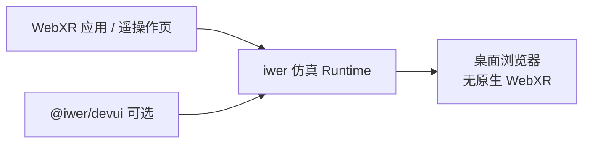
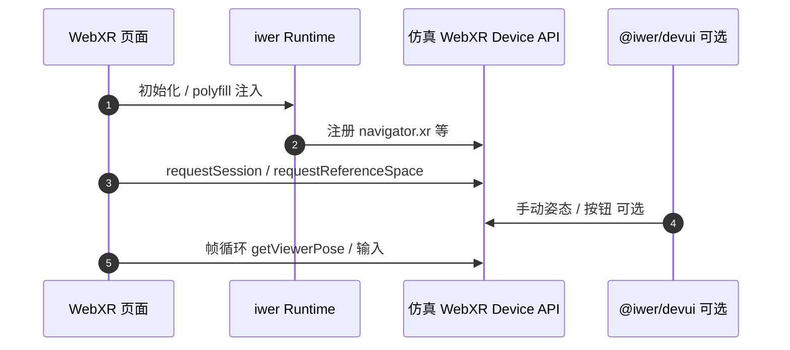

# Immersive Web Emulation Runtime（IWER）

## 一句话定义

**IWER**（[Immersive Web Emulation Runtime](https://github.com/meta-quest/immersive-web-emulation-runtime)，npm 包名 **`iwer`**）是 Meta Quest 维护的 **TypeScript WebXR 仿真运行时**：在 **不具备原生 WebXR** 的现代浏览器里 **模拟 WebXR Device API**，用于 WebXR 应用的桌面开发、跨浏览器测试，以及 XR 输入栈的跨平台复用。

## 英文缩写速查

| 缩写 | 英文全称 | 简要说明 |
|------|----------|----------|
| IWER | Immersive Web Emulation Runtime | 本页项目 |
| WebXR | Web Extended Reality | W3C 浏览器 XR API（JS） |
| XR | Extended Reality | AR/VR 统称 |
| SEM | Synthetic Environment Module | `@iwer/sem`，仿真 MR 平面/网格/命中测试等 |
| MR | Mixed Reality | 混合现实 |
| npm | Node Package Manager | `npm install iwer` 发布渠道 |

## 为什么重要

- **Web 遥操作与仿真客户端**：Isaac Teleop / CloudXR.js 等栈在 Quest 上走 **WebXR**；桌面工程师若无头显，可用 IWER **先跑通 WebXR 会话与输入**，再切真机（见 [Isaac Teleop](./isaac-teleop.md) 设备表）。
- **与原生 OpenXR 分层**：IWER 仿真 **浏览器 WebXR API**，不是 Quest 系统里的 **OpenXR C runtime**；与 [XRoboToolkit](./paper-xrobotoolkit.md) 一类 **OpenXR 中间层** 互补而非替代。
- **自动化测试**：官方强调 **action capture / playback**，适合 WebXR 遥操作页、内嵌 3D 仿真的 **回归测试**（无物理头显的 CI 仍受限，但可显著降低日常开发摩擦）。

## 核心原理

| 组件 | 作用 |
|------|------|
| **`iwer` 核心** | 注入/替换 WebXR Device API，使页面认为存在 XR 设备 |
| **`@iwer/devui`** | Overlay UI，手动驱动仿真设备姿态与按钮 |
| **`@iwer/sem`** | Synthetic Environment Module：plane detection、mesh、hit test 等 **MR 特性仿真** |
| **输入重映射** | 在 WebXR 项目之上映射键盘/鼠标/游戏手柄到 XR 控制器语义 |

## 核心信息

| 字段 | 内容 |
|------|------|
| 机构 | Meta Quest（meta-quest GitHub 组织；标签 `meta`） |
| 许可证 | MIT |
| 最新 npm | `iwer@2.5.0`（2026-09-24，一手 npm registry） |

## 工程实践

### 开源状态（2026-09-27）

- **已开源**：[meta-quest/immersive-web-emulation-runtime](https://github.com/meta-quest/immersive-web-emulation-runtime)，MIT。
- 安装：`npm install iwer`；文档：[meta-quest.github.io/immersive-web-emulation-runtime](https://meta-quest.github.io/immersive-web-emulation-runtime/)。

### 选型提示

1. **仅 WebXR 栈**（浏览器 Three.js / A-Frame / 自研 WebXR）→ IWER 适合 **桌面调试**。
2. **Unity OpenXR / 原生 Quest 应用** → 不用 IWER；走 OpenXR 或 Meta SDK。
3. **真机延迟 / 手追踪标定** → 必须在 Quest 浏览器或 CloudXR 真机复测；IWER 不保证与设备 runtime 行为 bit-identical。
4. 浏览器 RL demo（如 [mjswan](./mjswan.md) WebXR 施力）可用 IWER 做 **无头显** 冒烟。

### 源码运行时序图

## 局限与风险

- **语义仿真 ≠ Quest 真机**：控制器追踪、透视、性能与 WebXR layers 行为可能与 Quest Browser 不一致。
- **非机器人专用**：仓库面向通用 WebXR；与 ROS / 机器人中间层集成需自建桥（对比 XRoboToolkit PC Service）。
- **依赖浏览器安全上下文**：WebXR 仍要求 HTTPS / localhost 等；IWER 不绕过浏览器安全模型。

## 关联页面

- [遥操作（任务）](../tasks/teleoperation.md)
- [Isaac Teleop](./isaac-teleop.md) — CloudXR / WebXR 真机遥操作
- [mjswan](./mjswan.md) — 浏览器 MuJoCo + WebXR 交互
- [XRoboToolkit（论文实体）](./paper-xrobotoolkit.md) — OpenXR 原生栈对照

## 参考来源

- [meta-quest/immersive-web-emulation-runtime 归档](../../sources/repos/meta_quest_immersive_web_emulation_runtime.md)
- [IWER 官方文档站归档](../../sources/sites/meta-quest-iwer-docs.md)

## 推荐继续阅读

- 文档：<https://meta-quest.github.io/immersive-web-emulation-runtime/>
- 仓库：<https://github.com/meta-quest/immersive-web-emulation-runtime>
- npm：<https://www.npmjs.com/package/iwer>
