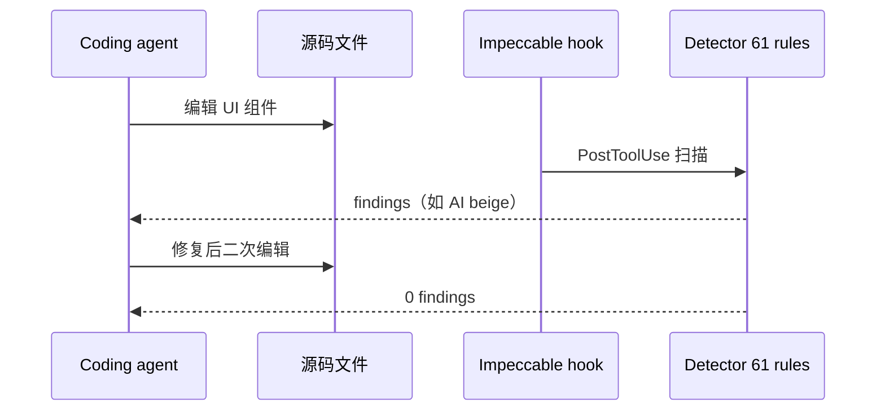

# Impeccable

**Impeccable**（[pbakaus/impeccable](https://github.com/pbakaus/impeccable)，[impeccable.style](https://impeccable.style)）给 coding agent 与用户一套 **共享设计词汇表**：用 **`/impeccable <command>`** 驱动 polish、typeset、distill、audit 等 **24 条命令**，把 **产品真相** 写入 `PRODUCT.md`、把 **视觉系统** 写入 `DESIGN.md`，并用 **61 条确定性 detector** 在编辑循环中抓 AI slop（无需 LLM、无需 API key）。

## 一句话定义

**设计语言 + 命令面 + 检测器**：既能 **从零 shape/craft**，也能 **迭代已有 UI**（polish/distill），并让 hook/PR/Chrome 扩展 **实证** 是否仍带 Inter、卡片套卡片、AI beige 等 tell。

## 英文缩写速查

| 缩写 | 英文全称 | 简要说明 |
|------|----------|----------|
| UX | User Experience | `critique` / `clarify` / `onboard` 等命令覆盖 |
| UI | User Interface | polish、layout、typeset 针对视觉与排版 |
| a11y | Accessibility | `audit` 含可访问性检查维度 |
| LCP | Largest Contentful Paint | `optimize` 可对照性能指标 |
| CLI | Command-Line Interface | `npx impeccable install` / `update` |
| PR | Pull Request | CLI 可对 UI diff 返回 exit code 供 CI |

## 为什么重要（对本知识库读者）

- **Cloud Agent 改 docs/：** 与本仓库 `make ci-preflight` 类似，Impeccable 把 **质量栏外置为文件 + 自动检查**；适合 PR 上「代理改 HTML/CSS」后的 **二次扫 slop**。
- **相对 Anthropic frontend-design：** 官方 skill 教 **计划与 tell 清单**；Impeccable 追加 **可重复命令** 与 **可运行 detector**（README 明示血缘）。
- **相对 Taste Skill：** Taste 在 **SKILL 内旋钮 + 禁令**；Impeccable 在 **项目级 MD + hook 闭环** — 长期产品更合适 Impeccable 作主架，Taste 作生成风格 boost。

## 核心结构

| 层次 | 内容 |
|------|------|
| **安装** | `npx impeccable install`；或 `npx skills add pbakaus/impeccable`；Claude marketplace |
| **初始化** | `/impeccable init` → `PRODUCT.md`；`/impeccable document` → `DESIGN.md` |
| **命令（24）** | craft, init, document, extract, shape, critique, audit, polish, distill, typeset, layout, animate, colorize, bolder, quieter, harden, onboard, clarify, adapt, optimize, delight, overdrive, live, generate |
| **Detector** | 61 规则；PostToolUse / Stop **hooks**；Chrome DevTools 扩展 |
| **Live** | `/impeccable live` — 浏览器点选元素迭代 |
| **Design directions** | 站点 curation（如 Neo Mirai case study） |
| **协议** | Apache-2.0 |

### 编辑闭环（hook + detector）

## 常见误区或局限

- **误区：有 detector 就不需人眼。** LLM-only 的 **critique** 与确定性规则 **互补**； hierarchy 仍可能需设计师判断。
- **误区：init 一次 PRODUCT.md 够 forever。** 产品阶段变化应更新 `PRODUCT.md`，否则 polish 会错读用户。
- **局限：** 引擎 binary 首次下载 —  air-gapped 环境需预置 `~/.impeccable/bin/`。
- **局限：** 机器人研究页（纯文档型）收益小于 **交互 dashboard / 营销站**；Sim 可视化若用 React 则仍适用。

## 关联页面

- [Taste Skill](taste-skill.md) — SKILL 层约束
- [Skillry](skillry.md) — 商业 Skill 市场
- [frontend-design（Anthropic）](anthropic-frontend-design-skill.md) — 上游灵感
- [find-skills](find-skills-skill.md) — 安装路径之一
- [选型对比](../comparisons/skillry-taste-skill-impeccable.md)
- [前端体验优化清单](../../docs/checklists/frontend-optimization-v1.md)

## 参考来源

- [impeccable 仓库归档（本站）](../../sources/repos/pbakaus-impeccable.md)
- [impeccable.style 核查](../../sources/sites/impeccable-style.md)
- [GitHub pbakaus/impeccable](https://github.com/pbakaus/impeccable)

## 推荐继续阅读

- [Neo Mirai case study](https://impeccable.style/cases/neo-mirai) — polish/distill 前后对照
- [Anthropic frontend-design SKILL](https://github.com/anthropics/skills/tree/main/skills/frontend-design) — 基线 skill 文本
