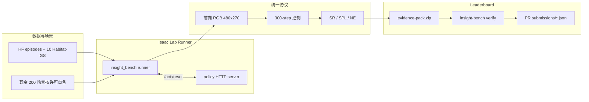
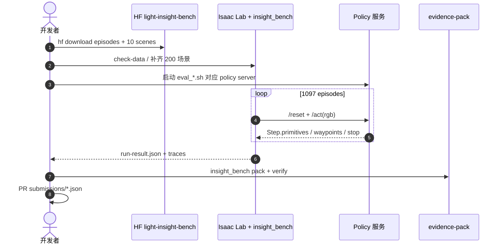

# INSIGHT-Bench

**INSIGHT-Bench**（[项目页](https://lightorigins.github.io/Light-INSIGHT-Bench/)，[代码](https://github.com/lightorigins/Light-INSIGHT-Bench)）是 **亮源新创（Light Origins）** 为 [LightNav-0](./paper-lightnav-0.md) 发布的 **object-goal 导航诊断评测**：在 **NVIDIA Isaac Sim** 中，用 **5 场景类 × 5 指令类型** 的固定标签，把 aggregate success rate 拆成「布局敏感 / 语言机制 / 二者交互」。

## 一句话定义

**当导航模型失败时，INSIGHT-Bench 告诉你失败的是理解目标、空间关系还是纯导航——而不是只给一个 SR。**

## 英文缩写速查

| 缩写 | 英文全称 | 简要说明 |
|------|----------|----------|
| OGN | Object-Goal Navigation | 按语言描述寻找并到达目标物体 |
| VLN | Vision-and-Language Navigation | 视觉-语言导航 |
| SR | Success Rate | 任务成功率 |
| SPL | Success weighted by Path Length | 路径长度加权成功率 |
| NE | Navigation Error / distance_to_goal | 终止时到目标的直线距离 |
| Isaac Lab | NVIDIA Isaac Lab | Isaac Sim 上的机器人学习框架 |

## 为什么重要

- **诊断而非排行榜：** 传统 OGN/VLN 只报一个 SR；INSIGHT-Bench 在 episode 构建时固定 **场景类** 与 **指令类型** 双标签，5×5 单元格暴露 aggregate 掩盖的短板。
- **统一可比协议：** 所有策略走同一部署设定（单目前向 RGB、无 depth/odometry），避免「每模型一套传感器栈」污染对比。
- **可验证提交：** Leaderboard 行来自 **evidence pack** + CI `insight-bench verify`，区分 `published`（论文誊录）与 `verified`（仓库复算）。
- **LightNav 数据引擎出口：** Tech Blog 口径的训练侧 **1683 场景 / 53090 片段** 与本 **1097-episode held-out split** 同属 Real2Sim2Real 管线；评测 release 与训练全集 **边界不同**（见开源状态）。

## 核心信息

| 项 | 内容 |
|----|------|
| **机构** | 亮源新创（Light Origins） |
| **仿真** | NVIDIA Isaac Sim 5.1 + Isaac Lab 2.3.2 |
| **评测规模** | 210 held-out 场景，1097 episodes |
| **观测** | 前向单目 RGB 480×270，120° HFOV，相机高 1.0 m |
| **动作预算** | 300 actions / episode |
| **成功条件** | stop 于半径内 **且** 目标在最终帧 120° FOV 内（室内 2 m / 室外 3 m） |
| **指标** | SR、SPL、terminal NE（`distance_to_goal`） |
| **开源** | **评测已开源** [lightorigins/Light-INSIGHT-Bench](https://github.com/lightorigins/Light-INSIGHT-Bench)；HF 数据集 [LightOriginsHQ/light-insight-bench](https://huggingface.co/datasets/LightOriginsHQ/light-insight-bench) |

### 5×5 诊断矩阵

**场景类（行）** — 功能布局，与源数据集解耦：

| 场景类 | 布局特征 |
|--------|----------|
| Apartment | 紧凑房间、门频繁 |
| House | 多房间、较长拓扑 |
| Commercial | 开放平面、重复实例 |
| Institution | 走廊、重复工位 |
| Outdoor | 开阔可通行、地标稀疏 |

**指令类型（列）** — 解析目标的 language mechanism：

| 类型 | 机制示例 |
|------|----------|
| Base | 可唯一命名的目标 |
| Direction | 自我中心方位（如「向左」） |
| Relation | 相对锚点物体 |
| Extremum | 最近 / 最左等 argmin/argmax |
| Ordinal | 有序集合中的第 k 个实例 |

Episode 分布（官方站）：Apartment 239、House 216、Commercial 195、Institution 219、Outdoor 228；指令列 Base 237、Direction 239、Relation 193、Extremum 250、Ordinal 178。

### 流程总览

## 评测与 Leaderboard

| 维度 | 读法 |
|------|------|
| 全 split Avg. SR | 1097 episodes 聚合；LightNav-0 论文表 **43.7%**（published） |
| 按指令列 | Direction / Base 通常高于 Relation / Extremum（基线间有差异） |
| 按场景行 | Apartment 往往最高；Institution / Outdoor 对多基线更难 |
| verified vs published | 仓库 README 自测 LightNav-0 Avg. **44.9%**；采样随机性会导致 episode 级波动 |

内置 **7 策略 adapter**（JanusVLN、NaVid、Uni-NaVid、Embodied-Navigator、InternVLA-N1、StreamVLN、LightNav-0）；自定义策略复制 `policies/template` 实现 `Policy` 接口。

**提交路径：** 全量跑 `scripts/eval_*.sh` → 本地 `insight-bench verify` → 托管 evidence pack → PR 添加 `submissions/<method>.json`（含 `evidence.url` + `sha256`）。

## 结论

**INSIGHT-Bench 把 object-goal 导航从「一个 SR 数字」推进到「可定位的能力剖面」，并配套可复现、可验证的 Isaac 评测栈。**

- 5×5 固定双标签让失败可归因到布局、语言机制或交互单元格
- 统一单目 RGB 协议降低跨模型对比噪声
- 1097-episode split + HF 数据 + Apache-2.0 harness **已可复现评测**
- evidence-pack + CI verify 的 leaderboard 设计可审计、防手工改分
- 200/210 场景需自行按 HM3D/MP3D/InteriorGS 等许可准备——复现前先 `check-data`
- 训练侧 1683 场景大规模引擎数据 **未**随本 release 完整公开；勿与评测 split 混读
- LightNav-0 在该 bench 上相对 6 基线有明显领先，但 Institution–Extremum 等单元格仍是短板

## 源码运行时序图

## 工程实践

| 主题 | 说明 |
|------|------|
| GPU | 需 RTX 级（渲染要 RT core）；sim ~13 GB VRAM + 模型显存 |
| 场景数据 | HF 包含 10 个 Habitat-GS；其余见 `guides/scenes.md` |
| 策略隔离 | 模型跑独立 venv + HTTP；**不要**把模型依赖装进 Isaac Lab |
| EULA | `OMNI_KIT_ACCEPT_EULA=YES` 每次运行都必须设置 |
| 源码运行时序图 | 见上节；无可运行官方代码时不适用——**本页适用** |

## 局限与风险

- **场景许可：** 完整 210 场景需多源数据集授权，非「clone 即跑全量」。
- **训练数据边界：** 博客中的 53090 训练片段 **不等于** 本仓库发布的 episode 包。
- **随机性：** 策略采样导致 verified 数字与 published 表可能 per-episode 不一致。
- **仿真—真机：** Bench 在 Isaac Sim；真机泛化需另看 LightNav-0 真机 demo 与部署栈。

## 关联页面

- [亮源新创（Light Origins）](./light-origins.md)
- [LightNav-0](./paper-lightnav-0.md)
- [lightorigins-3blogs-technology-map](../overview/lightorigins-3blogs-technology-map.md)
- [Vision-Language Navigation](../tasks/vision-language-navigation.md)
- [Zero-Shot Object Navigation](../tasks/zero-shot-object-navigation.md)
- [仿真评测基础设施](../concepts/simulation-evaluation-infrastructure.md)

## 参考来源

- [insight_bench_lightorigins_2026.md](../../sources/papers/insight_bench_lightorigins_2026.md)
- [light-insight-bench.md](../../sources/sites/light-insight-bench.md)
- [lightorigins-light-insight-bench.md](../../sources/repos/lightorigins-light-insight-bench.md)
- [lightorigins_lightnav_0_2026-09-01.md](../../sources/blogs/lightorigins_lightnav_0_2026-09-01.md)

## 推荐继续阅读

- [INSIGHT-Bench 项目页](https://lightorigins.github.io/Light-INSIGHT-Bench/)
- [GitHub 仓库 README](https://github.com/lightorigins/Light-INSIGHT-Bench)
- [HF 数据集](https://huggingface.co/datasets/LightOriginsHQ/light-insight-bench)
- [LightNav-0 论文](https://arxiv.org/abs/2608.30935)
