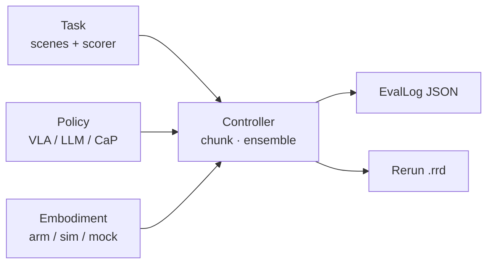
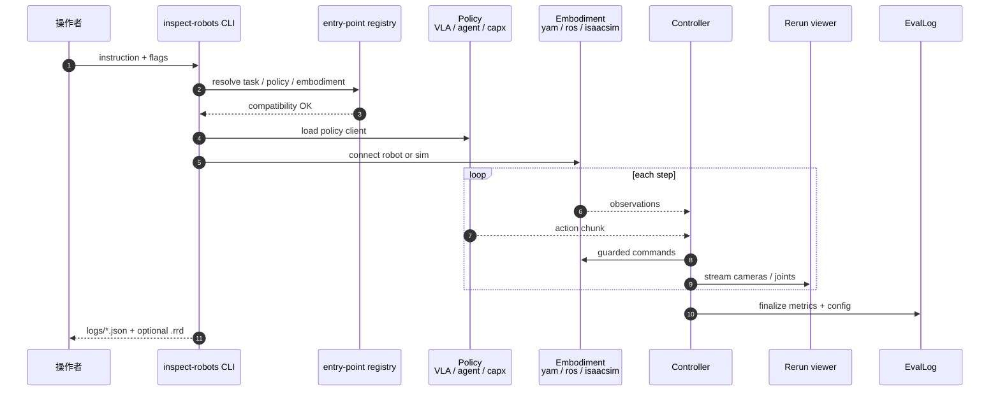

# Inspect Robots

**Inspect Robots**（[GitHub](https://github.com/robocurve/inspect-robots)，[文档](https://docs.inspectrobots.org/)，MIT）是 [Robocurve](./robocurve.md) 发布的 **开源 physical AI 评测框架**。若熟悉 [Inspect AI](https://inspect.aisi.org.uk/)，可把它理解为 **「Inspect AI for robotics」**：一次定义 benchmark，然后在任意兼容 **Policy × Embodiment** 组合上跑 rollout，产出 **可审计 EvalLog** 与 **Rerun** 流式可视化。

## 一句话定义

**真机优先的 robotics eval()** —— 把 VLA、WAM、LLM agent、CaP agent 接到任意臂/人形或 Isaac Lab 仿真，**跑前校验动作契约**，**跑后留下不可变日志**，默认 **Rerun** 看 policy 所见即所得。

## 英文缩写速查

| 缩写 | 英文全称 | 简要说明 |
|------|----------|----------|
| VLA | Vision-Language-Action | `--policy` 槽位常见输入（经 XPolicyLab/OpenPI 等） |
| WAM | World-Action Model | 与 VLA 并列的可评测策略族 |
| CaP | Code-as-Policy | `capx` 插件：LLM 写 Python 调感知/规划 helper |
| ROS | Robot Operating System | `ros` embodiment 经 rosbridge 接真机 |
| EvalLog | Evaluation Log | schema 版本化 JSON 日志；含 config、git rev、指标 |
| RRD | Rerun Recording Data | Rerun 录制文件；与 EvalLog 并列保存 |

## 为什么重要

- **真机评测缺标准「eval harness」：** [LeRobot](./lerobot.md) `lerobot-eval` 强在 Hub 仿真与数据集；Inspect Robots 补 **真机 reset、墙钟控制率、人机在环** 与 **无特权 oracle** 的一等假设。
- **Policy 与 Embodiment 解耦：** 同一 `Task` 可换 VLA、LLM agent 或 CaP；同一 `agent` policy 可换 YAM、Franka、ROS 臂或 `cubepick` mock——**兼容性问题在 rollout 前 fail-fast**。
- **审计友好：** EvalLog 固化 resolved config、包版本、git revision；支持 `summarize` → learnings、`view` HTML 报告、离线 re-score。
- **生态接线而非重造模型：** 通过插件对接 [XPolicyLab](./xpolicylab.md)（40+ VLA）、[Isaac Lab](./isaac-lab.md) 仿真、ROS、Cap-X；benchmark 任务在 [WorldEvals](https://github.com/robocurve/worldevals) 等独立仓。

## 核心架构

### Inspect AI 概念映射

| Inspect AI | Inspect Robots |
|------------|----------------|
| `Model` | `Policy` **+** `Embodiment` |
| `Task = dataset + solver + scorer` | `Task = scenes + controller + scorer` |
| `Sample` | `Scene` |
| `Solver` chain | `Controller` middleware（chunking、ensembling） |
| `eval()` → `EvalLog` | `eval()` → `EvalLog` |

### 数据流（CLI 一次 instruction run）

### 源码运行时序图

对齐 [robocurve/inspect-robots](https://github.com/robocurve/inspect-robots) CLI `inspect-robots "instruction"` 路径：

## 工程实践

| 步骤 | 做法 |
|------|------|
| **安装** | `uv pip install "inspect-robots[rerun]"`；rig 插件如 `inspect-robots-yam` 单独装 |
| **首次配置** | `inspect-robots setup` → `~/.config/inspect-robots/config.ini` |
| **LLM agent** | `uv pip install inspect-robots-agent`；`.env` 放 `ANTHROPIC_API_KEY`；`--policy agent` |
| **XPolicyLab VLA** | `inspect-robots-isaacsim` + `inspect-robots-xpolicylab`；`-P url=ws://gpu:19000` |
| **ROS 真机** | `inspect-robots-ros`；`-E url=ws://robot:9090` + joints/topics |
| **无硬件试跑** | `--embodiment cubepick --policy scripted` 或 Python API mock |
| **失败复盘** | `inspect-robots summarize logs/fail.json` → `--policy agent -P prior_learnings=...` |
| **浏览历史** | `inspect-robots view logs/ --serve --open` |

开源结论（2026-09-06）：**框架与 first-party 插件 MIT 已开源**；被测 Claude/GPT/π0 等 **权重与 API** 仍按各自许可。

## 局限与风险

- **Alpha API：** README 警告版本间 API 可能变；CI 依赖 pin lockfile。
- **插件矩阵仍在扩展：** 新 rig 需自写 embodiment adapter 或走通用 `ros`。
- **Guardrails 默认开：** `--disable-guardrails` 需显式；真机仍要 embodiment 级安全 envelope。
- **Rerun 非阻塞但会丢帧：** viewer 慢时优先丢相机帧，不拖控制环——分析长 run 时以 EvalLog 为准。
- **Benchmark 不在主仓：** 具体任务定义见 WorldEvals；勿把框架 install 误当完整 benchmark suite。

## 关联页面

- [Robocurve（机构）](./robocurve.md)
- [XPolicyLab](./xpolicylab.md)
- [Isaac Lab-Arena](./isaac-lab-arena.md)
- [LeRobot](./lerobot.md)
- [具身评测基准选型闭环](../overview/hub-embodied-eval-benchmark.md)
- [仿真评测基建](../concepts/simulation-evaluation-infrastructure.md)

## 参考来源

- [inspect-robots 源码归档](../../sources/repos/robocurve_inspect_robots.md)
- [Robocurve 站点归档](../../sources/sites/robocurve-org.md)

## 推荐继续阅读

- 文档 Quickstart：<https://docs.inspectrobots.org/guide/quickstart/>
- Concepts：<https://docs.inspectrobots.org/guide/concepts/>
- WorldEvals benchmark 仓：<https://github.com/robocurve/worldevals>
