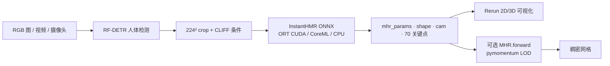
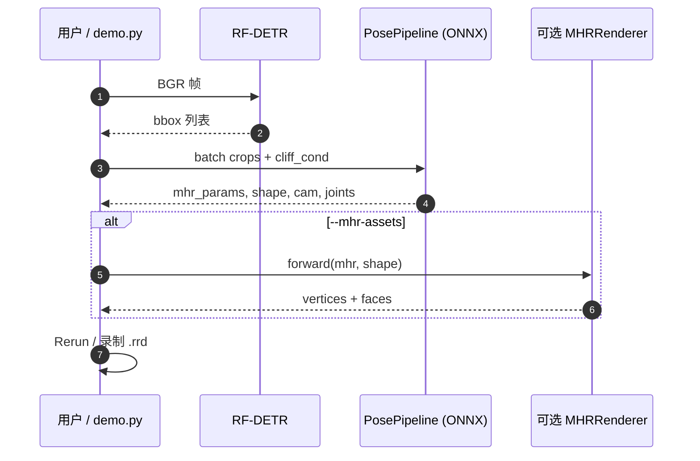

# InstantHMR

**InstantHMR**（[mohamdev/InstantHMR](https://github.com/mohamdev/InstantHMR)，Apache-2.0）是面向 **部署与实时动捕** 的 **MHR 人体网格回归** 实现：在 **224×224 人体 crop** 上直接预测 **204 维 MHR 姿态参数、45 维形状、相机平移与 70 关键点**。默认权重在 **SAM 3D Body 数据集已发布的 GT MHR 拟合** 上训练（非 teacher 蒸馏）；与 [SAM 3D Body](./sam-3d-body.md) 共享 **同一 MHR 语义**，但用 **RepViT-M1.5 + 9-token decoder** 换 **单文件 ONNX** 与 **数量级更低延迟**。

## 一句话定义

**SAM 3D Body 生态的轻量 ONNX 学生**：单 crop → MHR 参数 + 70 关键点，GPU 上 HMR 阶段约 **~5 ms/帧**，适合边缘实时管线。

## 英文缩写速查

| 缩写 | 英文全称 | 简要说明 |
|------|----------|----------|
| HMR | Human Mesh Recovery | 从图像恢复人体网格/骨架参数 |
| MHR | Momentum Human Rig | Meta 人体参数化（身体+手脚），与 SMPL 族不同 |
| ONNX | Open Neural Network Exchange | 跨框架部署格式；InstantHMR 以单 `.onnx` 分发 |
| CLIFF | 相机条件 HMR 范式 | 用 bbox 与焦距相关量条件化根深度/平移 |
| RF-DETR | Roboflow DETR 检测族 | demo 默认人体检测器，常为端到端瓶颈 |

## 为什么重要

- **机器人感知「快路径」**： [Motion Retargeting Pipeline](../concepts/motion-retargeting-pipeline.md) 需要 **稳定 3D 人体姿态**；重型 [SAM 3D Body](./sam-3d-body.md) 精度高但算力大，InstantHMR 把 **MHR 输出接口** 压到 **ONNX Runtime / CoreML**，便于 ROS、嵌入式或 **禁止 PyTorch** 的现场。
- **与官方数据对齐**：训练标签来自 [`facebook/sam-3d-body-dataset`](https://huggingface.co/datasets/facebook/sam-3d-body-dataset) 的 **released GT**，避免「只蒸馏 teacher」带来的精度天花板；仍可用 [`sam-3d-body-dinov3`](https://huggingface.co/facebook/sam-3d-body-dinov3) 做 **自采图像伪标注**（可选）。
- **可观测延迟**：demo 分计 **RF-DETR / InstantHMR / 总延迟**；`--detector-stride` 在慢动作场景可 **2–3× 提 FPS**，HMR 本身仍 ~5 ms（RTX 4070 量级，README 基准）。
- **与 SAM3DBody-cpp 分工**：[SAM3DBody-cpp](./sam3dbody-cpp.md) 复刻 **完整 DINOv3 + PromptableDecoder** 并导出 BVH；InstantHMR 更 **轻、Python 友好**，网格需 **pymomentum** 二次解码，BVH 需自建或接 cpp 仓。

## 核心结构

| 模块 | 作用 |
|------|------|
| **RF-DETR** | 多人 bbox；`--detector-stride N` 隔帧重检 |
| **RepViT-M1.5 backbone** | crop 特征 |
| **9-token cross-attention decoder** | 回归 MHR / 形状 / 相机 |
| **CLIFF 条件** | `cliff_cond (3)`；`--focal` 可传入真实焦距（像素） |
| **可选 MHRRenderer** | `mhr_params` + `shape_params` → 稠密顶点（LOD 0–6） |

### 与 SAM 3D Body / SAM3DBody-cpp 选型

| 维度 | SAM 3D Body（官方） | InstantHMR | SAM3DBody-cpp |
|------|---------------------|------------|---------------|
|  backbone | DINOv3-H+ / ViT-H | RepViT-M1.5 | DINOv3 ONNX |
| 可提示 | 2D 关键点 / mask | 无 | 部分（decoder 提示） |
| 运行时 | PyTorch + HF | **单 ONNX** + ORT | C++ ORT + ggml |
| 典型延迟 | 重型基础模型 | **~5 ms HMR**（不含检测） | GPU 近实时 |
| 训练 | Meta 官方 | 开源 notebook + GT 数据 | 无（导出权重） |

## 流程总览（demo 端到端）

## 源码运行时序图

运行时入口对齐仓库 README：`demo.py`、`instanthmr.PosePipeline`；网格路径需 `requirements-mhr.txt` 与 [MHR assets](https://github.com/facebookresearch/MHR/releases)。

## 工程实践

| 步骤 | 说明 |
|------|------|
| 安装 | `git clone` → `python install.py`（Blackwell 自动 cu128） |
| 权重 | HF [`momolesang/InstantHMR`](https://huggingface.co/momolesang/InstantHMR) → `models/instanthmr.onnx` |
| 快速跑通 | `python demo.py --image photo.jpg` |
| 实时视频 | `--detector-stride 2~3`；单人场景 `--max-persons 1` |
| 训练 | 申请 `sam-3d-body-dataset` → `parquet_to_npz.py` → notebook |
| 网格 | Python **3.12+**，`pip install -r requirements.txt -r requirements-mhr.txt`（**勿**误装 PyPI 错误 `pymomentum`） |

## 局限与风险

- **精度–速度权衡**：轻量学生 **不等价** DINOv3 教师；极限精度仍用官方 SAM 3D Body 或 SAM3DBody-cpp 全管线。
- **检测瓶颈**：端到端 FPS 常受 RF-DETR 限制，而非 InstantHMR 本身。
- **无官方可提示**：缺少 2D 关键点 / mask 纠错，遮挡帧需检测质量或换重型模型。
- **MHR→SMPL/GMR**：与 [SAM 3D Body](./sam-3d-body.md) 相同——下游 [GMR](../methods/motion-retargeting-gmr.md) 若只吃 SMPL，需 **BVH 或显式转换**。
- **数据集门控**：复现训练需 HF 批准 **SAM 3D Body Dataset** 并自备 COCO/MPII 等原图。

## 关联页面

- [机器人视觉感知栈选型闭环](../queries/robot-perception-stack-selection-loop.md) — 单目 HMR 在感知输入链中的位置
- [SAM 3D Body](./sam-3d-body.md) — 教师模型、MHR 定义与基准
- [SAM3DBody-cpp](./sam3dbody-cpp.md) — 全尺寸 ONNX + BVH 的 C++ 路径
- [Motion Retargeting Pipeline](../concepts/motion-retargeting-pipeline.md) — 视频→机器人参考运动
- [Whole-Body Tracking Pipeline](../concepts/whole-body-tracking-pipeline.md) — 参考运动采集
- [RF-DETR](./rf-detr.md) — demo 检测栈（仓库内嵌 Roboflow 变体）

## 推荐继续阅读

- 仓库 README：<https://github.com/mohamdev/InstantHMR>
- ONNX 权重：<https://huggingface.co/momolesang/InstantHMR>
- SAM 3D Body 论文：<https://arxiv.org/abs/2602.15989>

## 参考来源

- [InstantHMR 官方仓库](../../sources/repos/instanthmr.md)
- [SAM 3D Body 官方仓库](../../sources/repos/sam-3d-body.md)
