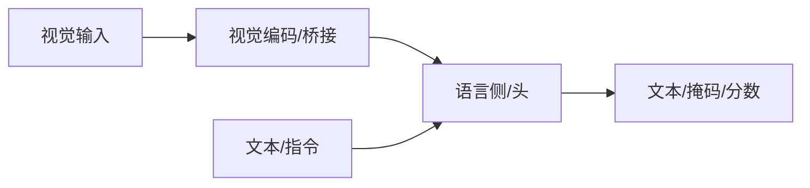

# InstructBLIP

## 一句话定义

InstructBLIP 在 BLIP-2 上做视觉指令调优：用指令感知 Q-Former 抽取与任务相关的视觉特征，提升零样本与指令跟随。

## 英文缩写速查

| 缩写 | 英文全称 | 简要说明 |
|------|----------|----------|
| InstructBLIP | InstructBLIP | 指令调优的 BLIP-2 |
| Q-Former | Querying Transformer | 指令条件化视觉查询 |
| IT | Instruction Tuning | 指令微调 |
| VQA | Visual Question Answering | 评测 |
| LLM | Large Language Model | 冻结或轻触语言塔 |

## 为什么重要

- 课程第 5–6 章多模态主线节点；与机器人 VLM/VLA 选型直接相关。
- 理解其输入输出接口，才能正确接到检测、分割或策略模块。

## 核心原理

把指令文本送入 Q-Former，使抽取的视觉 token 更贴合问题，再交给 LLM 生成答案。

## 工程实践

| 项 | 建议 |
|----|------|
| 权重 | 优先官方或 Hugging Face 发布 |
| 微调 | 指令数据质量优先；可用 LoRA |
| 机器人 | 明确延迟预算；重模型可云端核验 |

## 局限与风险

幻觉、错误 grounding、许可与安全过滤必须单独评估；开源状态以项目页为准，部署前核查权重协议。

## 关联页面

- [多模态基础](../concepts/multimodality-basics.md)
- [多模态 LLM 路线](../overview/multimodal-llm-development.md)
- [BLIP-2](./paper-blip2.md)
- [Transformer CV 课程策展](../entities/transformer-cv-curriculum.md)

## 参考来源

- [Transformer 视觉应用课程大纲](../../sources/courses/transformer_cv_applications_syllabus.md)

## 推荐继续阅读

- [论文 / 项目](https://arxiv.org/abs/2305.06500)
