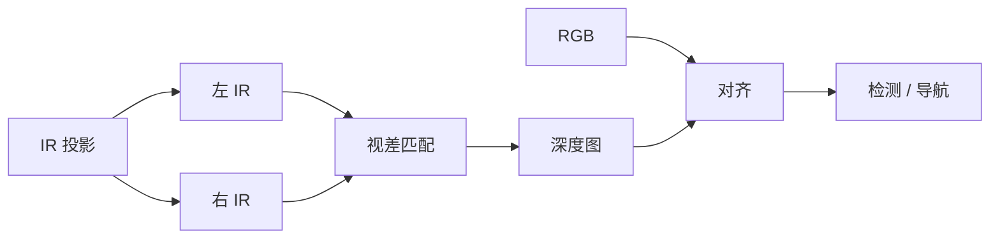

# Intel RealSense 深度相机

## 一句话定义

**Intel RealSense** 是一族消费级 **RGB-D 深度相机**（主动红外立体等方案），输出对齐的彩色与深度，是人形系统课感知章与大量 [G1](./unitree-g1.md) 真机论文的默认视觉传感器之一。

## 英文缩写速查

| 缩写 | 英文全称 | 简要说明 |
|------|----------|----------|
| RGB-D | RGB + Depth | 彩色与深度对齐帧 |
| D435 / D455 | Depth Camera models | 常见机载型号 |
| D405 | Short-range model | 腕部近距常见 |
| FOV | Field of View | 视场，影响场线可见范围 |
| SDK | `librealsense` | 驱动、内参、对齐工具 |
| IR | Infrared | 主动投影辅助立体匹配 |
| Stereo | Stereo matching | 视差 → 深度 |

## 为什么重要

- 课程第 6 章视觉作业以 RealSense 为输入；[YOLO](../methods/object-detection.md) 与 [场地线检测](../methods/soccer-field-line-detection.md) 假设可知内参，深度可选。
- 相对激光：成本低、语义友好、易上仿真对齐。
- 相对纯 RGB：多了尺度，便于球距与平面求交（见 [坐标变换](../concepts/perception-coordinate-postprocessing.md)）。

## 核心原理

### 主动立体（D400 系列直觉）

1. 红外投影器投射纹理，改善弱纹理匹配。
2. 左右 IR 相机算视差 → 深度图。
3. RGB 传感器经工厂外参与深度对齐（`align` 到 color 或 depth）。

### 输出与坐标系

| 流 | 用途 |
|----|------|
| Color | 检测、线特征 |
| Depth | 尺度、点云、高度图 |
| IR | 调试/部分算法 |
| IMU（部分型号） | 短时姿态辅助 |

相机光学系 → 机器人 `base`/`head` 的 TF 必须进 URDF，摆头时同步更新。

## 工程实践

### 型号选型（机器人常见）

| 型号 | 特点 | 典型安装 |
|------|------|----------|
| D435 / D435i | 广 FOV，综合 | 头/胸 |
| D455 | 基线更长，中远更稳 | 头/导航 |
| D405 | 近距 | 腕部操作 |

以当时 Intel/代理供货与 SDK 支持为准。

### 课程部署清单

1. 安装 `librealsense` 与 ROS/ROS 2 wrapper。
2. 确认 `camera_info` 内参与分辨率和训练时一致。
3. 标定头–相机外参；足球任务检查 **俯仰是否看到足够场线**。
4. 户外/强光：准备 RGB-only 回退（深度空洞时）。
5. 与仿真相机内参对齐，降低 [Sim2Real](../concepts/sim2real.md) 视觉差。

### 质量检查

| 检查 | 方法 |
|------|------|
| 对齐 | 彩色边缘与深度边缘是否重合 |
| 量程 | 球在工作距离内深度是否有效 |
| 时延 | `rostopic delay` / 时间戳差 |
| 曝光 | 白线不过曝、暗处分得出球 |

## 局限与风险

- 阳光、玻璃、黑色/反光物体深度失效常见。
- 多机同场 IR 互干扰（多机器人足球需注意）。
- 产品线迭代导致型号停产——文档中写清替代型号。
- **误区**：以为有深度就不必标定外参——头关节运动时外参链更重要。

## 关联页面

- [足球场仿真](../concepts/soccer-field-simulation.md)
- [场地线检测](../methods/soccer-field-line-detection.md)
- [感知后处理与坐标变换](../concepts/perception-coordinate-postprocessing.md)
- [Unitree G1](./unitree-g1.md)
- [人形系统课程策展](./humanoid-system-curriculum.md)

## 参考来源

- [深蓝学院人形系统课程大纲](../../sources/courses/shenlan_humanoid_system_theory_practice.md)

## 推荐继续阅读

- Intel RealSense SDK 2.0 与型号手册：<https://www.intelrealsense.com/>
- `realsense-ros` 包装文档（话题与对齐参数）
