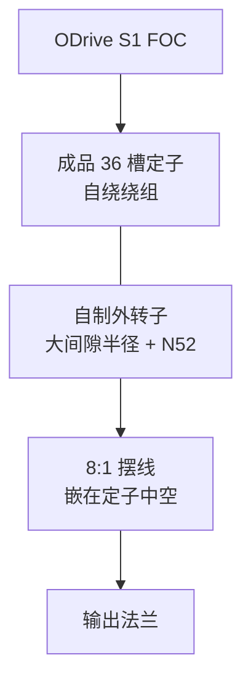

# Internal Cycloidal Actuator（内嵌摆线一体执行器）

## 一句话定义

**Internal Cycloidal Actuator** 是 Aaed Musa 的开源一体关节：[GitHub CAD/BOM](https://github.com/aaedmusa/Internal-Cycloidal-Actuator) + [项目页](https://www.aaedmusa.com/projects/internalcycloidalactuator)——自制外转子无刷电机，并把 **摆线减速器嵌进定子中心**，典型 QDD 思路。

## 英文缩写速查

| 缩写 | 英文全称 | 简要说明 |
|------|----------|----------|
| QDD | Quasi-Direct Drive | 准直驱，低减速比、高背驱动性的作动方案 |
| BLDC | Brushless DC Motor | 无刷直流电机 |
| FOC | Field-Oriented Control | 无刷电机的磁场定向控制 |
| BOM | Bill of Materials | 物料清单，硬件零部件列表 |
| CAD | Computer-Aided Design | 计算机辅助设计，硬件结构建模 |

## 为什么重要

- 在「电机本体也开源」一类里，这是最值得优先学的项目之一：不只开减速器，还公开绕组、转子与中空集成。
- 直接回答：为什么外转子适合关节、气隙半径与力矩密度、槽极绕组、如何把摆线放进定子内部。

## 核心信息

| 项 | 内容（项目页摘录） |
|----|-------------------|
| 槽极 | 36 槽定子 / 42 极（36N42P） |
| 减速 | **8:1** 摆线，固定环嵌入定子中心 |
| 尺寸 / 质量 | ⌀125×84 mm / ~1023 g |
| 输出 | ~16.17 N·m；209 RPM @ 22.2 V |
| 电气 | 相电阻 75 mΩ；相电感 41.05 µH |
| 驱动 | ODrive S1 FOC |
| 成本 | BOM ~$384 |

## 核心原理

- **外转子**：大间隙半径 → 高扭矩密度，支撑低减速比仍有可用输出力矩。
- **同轴集成**：偏心轴随转子转，减速器成为电机一部分（作者对标 Mini Cheetah「定子内行星」思路，此处换成摆线）。
- **绕组**：成品 10010 定子；6×26AWG、6 匝/槽（作者称有效 36 匝/槽）。

## 工程实践

| 学习点 | 做法 |
|--------|------|
| 气隙与力矩密度 | 对照外转子几何与报告力矩，再读 [反射惯量](../overview/humanoid-actuator-102-gear-reflected-inertia.md) |
| 槽极绕组 | 对照 36N42P 与自绕工艺记录 |
| 与 BHL 对照 | BHL 是成品电机 + 打印摆线；本项目是电机—减速一体 |
| 热 | 作者反馈 3D 打印件受线圈热易翘曲 → 金属减速器更稳 |

## 局限与风险

- **个人原型**：缺大量冲击、寿命与热循环工业验证。
- GitHub API 未标 SPDX；再分发前核对仓库许可。
- 不宜把本设计直接当作重型人形量产关节模板。

## 关联页面

- [开源 QDD 执行器项目对比](../comparisons/open-source-qdd-actuator-projects.md)
- [执行器驱动链选型闭环](../queries/actuator-drive-chain-selection-loop.md)
- [Berkeley Humanoid Lite](./berkeley-humanoid-lite.md)
- [ODRI Solo / Bolt](./odri-solo-and-bolt.md)
- [力矩电机设计纵深](../../roadmap/depth-torque-motor-design.md)

## 参考来源

- [sources/repos/internal_cycloidal_actuator.md](../../sources/repos/internal_cycloidal_actuator.md)
- [sources/sites/aaedmusa_internal_cycloidal_actuator.md](../../sources/sites/aaedmusa_internal_cycloidal_actuator.md)
- [开源 QDD 执行器学习策展](../../sources/personal/open_source_qdd_actuator_learning_curator.md)

## 推荐继续阅读

- 项目页：<https://www.aaedmusa.com/projects/internalcycloidalactuator>
- CAD/BOM：<https://github.com/aaedmusa/Internal-Cycloidal-Actuator>
