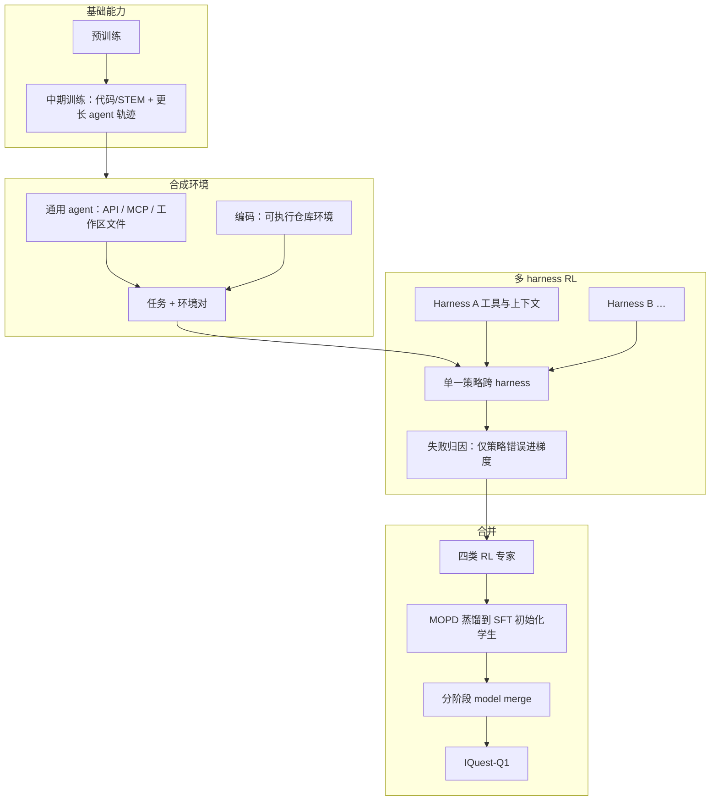
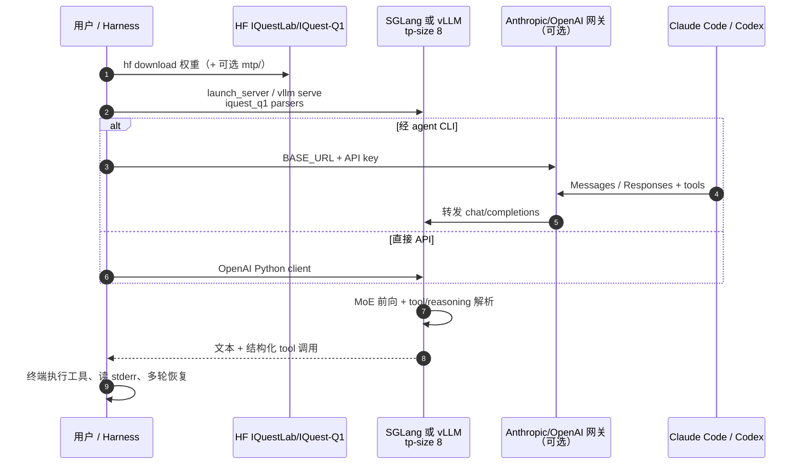

# IQuest-Q1

**IQuest-Q1** 是 [IQuest（IQuestLab）](https://iquestlab.github.io/) 发布的 **开放权重** 稀疏 **MoE** 大模型：**约 320B 总参数**、**约 15B 激活/token**、**524,288 token** 上下文，定位 **agentic CLI**：在命令行里读仓库、调工具、读反馈并在多步任务中纠错。对本知识库读者，其价值主要在 **研究工程 harness**（仿真脚本、训练配置、benchmark 复现）的 **coding backend**，与 [DeepSeek Harness](./deepseek-harness.md)、[Kimi K3](./kimi-k3.md) 等同层选型，**不**直接输出机器人关节或 VLA 动作。

## 一句话定义

以 **256/8 MoE + 混合 SWA/FA 注意力 + 超长上下文** 支撑 **Claude Code / Codex 类 harness** 下的多步工具调用；开放权重经 **SGLang 或 vLLM** 自托管，训练侧强调 **合成环境、多 harness RL 与 MOPD 专家合并**。

## 英文缩写速查

| 缩写 | 英文全称 | 简要说明 |
|------|----------|----------|
| MoE | Mixture of Experts | 稀疏路由；IQuest-Q1 为 256 专家、每 token 激活 8 |
| MOPD | Multi-teacher On-policy Distillation | RL 后多专家策略蒸馏回单一学生 checkpoint |
| MTP | Multi-Token Prediction | 训练 2 层独立 MTP；推理可递归 MTP + EAGLE 投机解码 |
| SWA | Sliding Window Attention | 与全注意力（FA）交替的局部窗口注意力 |
| FA | Full Attention | 全上下文注意力层（与 SWA 按 3:1 混合） |
| CLI | Command-Line Interface | 本模型主战场：终端 + agent harness，而非聊天网页 |
| HF | Hugging Face | 权重托管：`IQuestLab/IQuest-Q1` |

## 核心信息

| 字段 | 内容 |
|------|------|
| 机构 | 至知创新研究院（IQuest Research） |
| 类型 | 开放权重 MoE LLM（CLI / coding agent 后端） |
| 代码 | <https://github.com/IQuestLab/IQuest-Q1> |
| 权重 | <https://huggingface.co/IQuestLab/IQuest-Q1> |
| 项目页 | <https://iquestlab.github.io/> |
| 开源结论 | **已开源**：权重 + 推理/README + 官方 Docker；**训练栈未公开** |
| 许可 | **iquest-q1**（Hub `LICENSE`） |

## 为什么重要

- **CLI agent 专精：** 官方叙事与基准（Terminal-Bench、DeepSWE、CyberGym 等）均围绕 **真实 harness**（Claude Code、Codex、mini-SWE-agent），与机器人研究中「agent 改训练/仿真代码」同构（见 [autoresearch 闭环](../queries/real-robot-policy-autoresearch-harness.md)）。
- **超长上下文：** **512K** 级窗口 + 项目页推荐的 Claude Code auto-compact 配置，适合 **整仓级** 读写；`IQuest-Q1[1m]` 为客户端展示后缀，**不改变** 512K 实际上下文上限（README 说明）。
- **开放权重 MoE 规模：** 320B/15B 激活档与 [Kimi K3](./kimi-k3.md) 等同为「自托管门槛极高、API/集群 serving 为主」的一类 backend；可对照 [FreeToken](./paper-freetoken.md) 等 serving 叙事。
- **训练方法论可迁移：** 合成环境 + **多 harness 单策略 RL**（失败归因后再优化）+ **MOPD 合并专家**，对设计 **具身 multi-harness RL** 或 **research agent 数据合成** 有参考意义，但代码未随发布。

## 流程总览（后训练叙事）

## 源码运行时序图（推理 + agent）

官方路径：**Hub 权重 → SGLang/vLLM（OpenAI 兼容）→ Claude Code / Codex 或 Python client**。GitHub 仓**不含**自研推理二进制，运行时序对齐 README **Deployment** 与 **Quick Start**。

关键复现路径：拉取权重 → **8 路张量并行** 起服务 → 采样 **temperature=1.0, top_p=0.95, top_k=20** → agent 侧固定 **Claude Code 2.1.140** 或 **Codex 0.142**（Agents' Last Exam 评测用 **2.1.258**）。

## 评测要点（公开报告分）

官方在 agent 基准上报告的代表分数（完整对比见项目页图；此处摘录 **IQuest-Q1** 列）：

| 基准 | IQuest-Q1 | 读法提示 |
|------|-----------|----------|
| Terminal-Bench 2.1 | 89.1 | 长时程终端任务；官方 **8h** 上限 |
| CyberGym | 88.1 | 安全/攻防式 agent 环境；**6h** 上限 |
| DeepSWE v1.1 | 74.2 | mini-SWE-agent harness |
| NL2Repo | 75.3 | 从自然语言构建仓库 |
| IQuest-CLIBench | 58.5 | 自研 CLI 体验基准 |
| Humanity's Last Exam | 43.4 | **无工具** 报告 |
| Agents' Last Exam | 32.2 | Claude Code harness |

**注意：** 非多模态 checkpoint；含图像/视频的 agent 对话在评测中 **placeholder 化** 多模态字段。

## 工程实践

| 需求 | 建议 |
|------|------|
| **最小调用** | README Quick Start：`openai.OpenAI(base_url=…/v1)` + `model=IQuest-Q1` |
| **生产 serving** | 优先官方 Docker + **SGLang**（`tool-call-parser` / `reasoning-parser` = `iquest_q1`）或 **vLLM** 同等 parser |
| **吞吐** | 可选 **recursive MTP + EAGLE** 草稿（`$MODEL_ROOT/mtp`） |
| **Claude Code** | `ANTHROPIC_MODEL=IQuest-Q1[1m]`、`CLAUDE_CODE_AUTO_COMPACT_WINDOW=524288` 等；网关需支持 **Anthropic Messages + tool calling** |
| **Codex** | **OpenAI Responses API** 网关 + `Codex 0.142` |
| **机器人 autoresearch** | 与 [ENPIRE](../methods/enpire.md) 式 **reset/verify** 契约正交：Q1 只作 **改代码/backend**；真机仍须环境工程 |

## 局限与风险

| 局限 | 说明 |
|------|------|
| **纯文本** | 无原生图像/音频/视频；不宜作 VLM/VLA 后端 |
| **工具格式** | 依赖 **IQuest 专用** chat template 与 serving parser；换引擎须验证 tool/reasoning 解析 |
| **真实 CLI** | 可能漏约束、重复失败尝试；项目页要求 **人工 oversight** |
| **硬件** | README 示例 **tp-size 8**；320B MoE 自托管门槛远高于 API 型小模型 |
| **早期产品** | 项目页称能力仍在快速迭代，可靠性未达闭源旗舰 UX |
| **训练不可复现** | 权重已开，**合成环境 / RL / MOPD 代码与数据未发布** |
| **ModelScope** | 截至入库日 **pending** |

## 开源状态

| 项目 | 状态（2026-09-29） |
|------|-------------------|
| **HF 权重** | **已开源** — `IQuestLab/IQuest-Q1` |
| **GitHub** | **已开源** — 部署文档与示例 |
| **Docker 镜像** | **已发布** — SGLang / vLLM cu130 标签 |
| **项目页** | 在线 — 案例与命令片段 |
| **ModelScope** | **待发布** |
| **训练代码 / 数据** | **未开源** |

## 参考来源

- [GitHub IQuestLab/IQuest-Q1 归档](../../sources/repos/iquest-q1.md)
- [项目页 iquestlab.github.io 归档](../../sources/sites/iquest-q1-project.md)
- [HF IQuestLab/IQuest-Q1 归档](../../sources/sites/huggingface-iquestlab-iquest-q1.md)
- [IQuest-Q1 项目页](https://iquestlab.github.io/)
- [GitHub 仓库](https://github.com/IQuestLab/IQuest-Q1)
- [Hugging Face 模型](https://huggingface.co/IQuestLab/IQuest-Q1)

## 关联页面

- [Kimi K3](./kimi-k3.md) — 同档开放权重 MoE + 长程 coding agent 对照
- [DeepSeek Harness](./deepseek-harness.md) — 可挂自定义 OpenAI-compatible 端点的 agent 运行时
- [OpenClaw](./openclaw.md) — 另一类 coding agent 栈
- [真机策略 autoresearch 闭环](../queries/real-robot-policy-autoresearch-harness.md) — coding backend 选型语境
- [Agentic Coding 软件工程基础](../concepts/agentic-coding-software-fundamentals.md) — 有 agent 仍须工程化约束
- [Karpathy LLM Wiki 参考](../references/llm-wiki-karpathy.md) — 本库维护范式

## 推荐继续阅读

- [SGLang 项目](https://github.com/sgl-project/sglang)
- [vLLM 项目](https://github.com/vllm-project/vllm)
- [Terminal-Bench](https://github.com/laude-institute/terminal-bench) — 终端 agent 基准语境（具体版本以 IQuest 评测说明为准）
