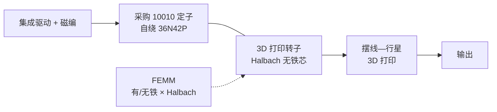

# Ironless QDD Actuator（无铁芯转子摆线—行星执行器）

## 一句话定义

**Ironless QDD Actuator**（[CKraft11/Ironless-QDD-Actuator](https://github.com/CKraft11/Ironless-QDD-Actuator)，项目长文 [cadenkraft.com](https://cadenkraft.com/ironless-cycloidal-planetary-actuator/)）是低成本、**全定制件可 3D 打印** 的准直驱关节：采购 **10010** 定子自绕 **36N42P** + **Halbach 无铁芯转子** + **摆线—行星** 组合减速 + 集成驱动与磁编；并公开可打开的 **FEMM** 与 CAD。

## 英文缩写速查

| 缩写 | 英文全称 | 简要说明 |
|------|----------|----------|
| QDD | Quasi-Direct Drive | 准直驱，低减速比、高背驱动性的作动方案 |
| BOM | Bill of Materials | 物料清单，硬件零部件列表 |
| FEMM | Finite Element Method Magnetics | 开源 2D 电磁有限元工具 |
| Halbach | Halbach Array | 单侧聚磁的永磁阵列布置 |
| BLDC | Brushless DC Motor | 无刷直流电机 |
| CAD | Computer-Aided Design | 计算机辅助设计，硬件结构建模 |

## 为什么重要

- 在「同时公开绕组/磁钢/FEM/可制造结构 + 真机关节样机」的开源项目里，目前完整度最高之一——见 [电磁设计完整度对比](../comparisons/open-source-torque-motor-em-design.md)。
- 用 FEMM 把 **有/无铁背 × Halbach/常规** 四象限静态转矩对照写清楚，是学磁路直觉的好教材。
- BOM 约 **$40（执行器）/ $70（含控制器）**；与 [Internal Cycloidal](./internal-cycloidal-actuator.md)（~$384）形成成本—成熟度对照。
- 硬课：**静态保持力矩 ≠ 连续行走力矩**；报告值还 **含减速器增益**，不能当裸电机电磁转矩。

## 核心信息

| 项 | 内容 |
|----|------|
| 定子 | 采购 **10010**（36 槽）；**非**自研硅钢模具开源 |
| 绕组 | **36N42P**；约 6 匝/槽 × 6 股 0.4 mm 并联（项目页） |
| 转子 | **Ironless + Halbach**；主极约 42×(12×5×3 mm) N52 + 辅助小磁钢 |
| 减速 | 3D 打印 **摆线—行星**；作者称零背隙叙事 |
| 驱动 | 集成驱动；仓库含 **MKS XDrive / ODrive** 配置 |
| 传感 | 磁编码器 |
| 力矩指标 | 报告 **~29.4 N·m 静态保持**（含减速；勿当连续/冲击额定） |
| 许可 | README 写 **MIT**（需署名 Caden Kraft） |
| 资产 | `FEMM/`、`CAD/`、`BOM.xlsx`、`36N42P Winding Scheme.png`；大文件 **Git LFS**（亦镜像 MakerWorld） |

## 核心原理

- **为何无铁芯：** 转子全打印时避免铁背板；Halbach 把磁通压向气隙侧。作者 FEMM 显示 Halbach 与有铁方案接近，二者叠加约 **+9%** 静态转矩量级（以项目页叙述为准）。
- **材料：** 工程塑料（PA6-GF/CF、PET-CF 等）；**PLA 转子会因磁力蠕变**；转子需 **100% 填充**。

## 工程实践

| 项 | 建议 |
|----|------|
| 克隆 | 先装 Git LFS；带宽不够用 MakerWorld 镜像 |
| 学电磁 | 打开 `FEMM/` 四类 `.FEM`，对照转矩结果图与 xlsx |
| 学绕线 | 对照根目录 `36N42P Winding Scheme.png` 与项目页绕线照片 |
| 打印 | 转子工程塑料 + 100% 填充；齿轮可用 CF-Core 类（作者称未充分验证） |
| 装配 | 行星架需 M3 攻丝；减速器内涂锂基脂 |
| 读指标 | 只把 29.4 N·m 当**保持能力上界**；自行测连续温升与动态力矩 |
| 下一步重设计 | 用 [PYLEECAN](./pyleecan.md) 改外径/叠长/冷却，再回 [力矩电机纵深 Stage 2](../../roadmap/depth-torque-motor-design.md) |

## 局限与风险

- **~30 N·m 是静态保持**（含减速），不是连续动态、额定、冲击或裸电机转矩。
- 个人 DIY：缺公开连续温升曲线、电磁—实测转矩系统对照、退磁/磁钢涡流/高频铁耗、转子超速与疲劳、人形冲击工况等工业验证。
- 全塑料传动在高冲击腿足上需自行评估齿瓣与蠕变。
- 定子冲片依赖市场 10010 供货与公差，不是完全「从硅钢模具到整机」开源。

## 关联页面

- [开源力矩电机电磁设计完整度对比](../comparisons/open-source-torque-motor-em-design.md)
- [开源 QDD 执行器项目对比](../comparisons/open-source-qdd-actuator-projects.md)
- [Internal Cycloidal Actuator](./internal-cycloidal-actuator.md)
- [FEMM-FOC-Simulation](./femm-foc-simulation.md) · [PYLEECAN](./pyleecan.md)
- [执行器驱动链选型闭环](../queries/actuator-drive-chain-selection-loop.md)

## 参考来源

- [sources/repos/ironless_qdd_actuator.md](../../sources/repos/ironless_qdd_actuator.md)
- [sources/sites/cadenkraft_ironless_cycloidal_planetary_actuator.md](../../sources/sites/cadenkraft_ironless_cycloidal_planetary_actuator.md)
- [开源 QDD 执行器学习策展](../../sources/personal/open_source_qdd_actuator_learning_curator.md)
- [开源力矩电机电磁设计策展](../../sources/personal/open_source_torque_motor_em_design_curator.md)

## 推荐继续阅读

- 项目长文：<https://cadenkraft.com/ironless-cycloidal-planetary-actuator/>
- 仓库：<https://github.com/CKraft11/Ironless-QDD-Actuator>
- MakerWorld 镜像（LFS 备援）：README 内链接
